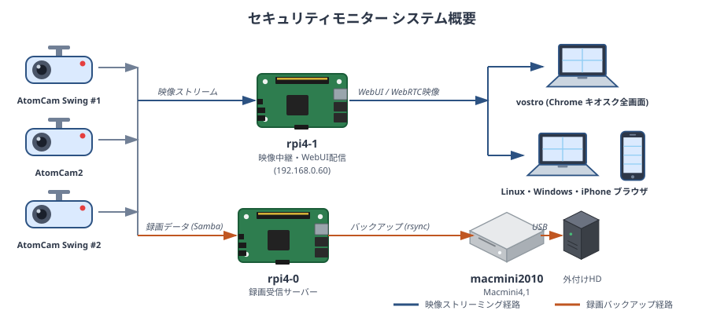

# security_monitor_2

自宅LAN内に設置した **AtomCam 3台** の映像を1画面に集約して閲覧するセキュリティモニターです。
映像中継には MediaMTX を使用し、WebRTC(WHEP) でブラウザに表示します（フェーズ4完成版）。

## 利用上の注意（セキュリティ）

本システムは **自宅 LAN 内での利用を前提に設計** されています。

- カメラ映像・メトリクスデータを外部に送信しない設計です（基本設計書 1.2「設計方針」参照）。
- 認証機構を持たないため、**インターネットに直接公開しないでください**。
- 利用にあたっては、自環境に合わせてホスト名・IP アドレス・ドメイン（`tsystem.gr.jp` 等）を置き換えて適用してください。
- 同梱の rpi4-1 ／ クライアント側スクリプトはローカルネットワークでの動作のみ検証しています。VPN や外部公開を伴う利用形態は未検証です。

OSS としての利用・改変・再配布は [LICENSE](LICENSE)（MIT）に基づきます。本リポジトリのコードを利用したことによる損害について、著作権者は責任を負いません。

## 主な機能

- **映像監視（主機能）** — AtomCam 3台のRTSPストリームを WebRTC(WHEP) でブラウザに集約表示（2×2グリッド）
- **リソース監視（副機能）** — rpi4-1・クライアントPCのCPU使用率／温度／ディスクI/O／メモリをリアルタイムにグラフ表示

## システム構成

### 概要図



### ノード一覧

| ノード | IPアドレス | 役割 |
|---|---|---|
| AtomCam Swing #1 / AtomCam2 / AtomCam Swing #2 | 192.168.0.12 / .7 / .16 | 防犯カメラ（RTSP配信） |
| rpi4-1 (raspberry pi 4b 4G raspberry pi OS) | 192.168.0.60 | 映像中継・WebUI・メトリクスサーバー |
| rpi4-0 (raspberry pi 4b 8G raspberry pi OS) | 192.168.0.58 | AtomCam録画受信サーバー（Samba） |
| macmini2010 (Macmini4,1 ubuntu 22.04) | 192.168.0.206 | 録画バックアップ（不定期起動） |
| vostro (DELL Vostro 1520 Debian 13.4) | 192.168.0.154 | 専用表示端末（Chromeキオスクモード） |

rpi4-1 上で MediaMTX（映像中継）・nginx（WebUI配信・APIプロキシ）・coturn（STUN）・push_daemon.py（メトリクス受信）が稼働します。

詳細は [docs/基本設計書.md](docs/基本設計書.md) を参照してください。

## ディレクトリ構成

```
security_monitor_2/
├── inventory/            デプロイ対象の設定ファイル・スクリプト
│   ├── rpi4-1/           映像中継サーバー（MediaMTX / nginx / coturn / push_daemon.py 等）
│   ├── client/lin/       Linuxクライアントのメトリクス送信スクリプト
│   ├── client/win/       Windowsクライアントのメトリクス送信スクリプト
│   ├── backup.sh         リモートホストから設定ファイルを取得
│   └── release.sh        リモートホストへ設定ファイルを配備
├── docs/                 プロジェクトドキュメント（設計書・手順書・テスト仕様書 等）
├── ut/                   各スクリプトの単体テストフレームワーク（shell / Python / PowerShell）
├── test/                 結合テスト用モックサーバー・Playwright テスト
├── test-log/             テスト実施ログ(手動)
└── tmp/                  一時ファイル・参照ファイル（git管理対象外）
```

## ドキュメント

| 文書 | ファイル |
|---|---|
| 基本設計書 | [docs/基本設計書.md](docs/基本設計書.md) |
| 詳細設計書 | [docs/詳細設計書.md](docs/詳細設計書.md) |
| 環境設定手順書 | [docs/環境設定手順書.md](docs/環境設定手順書.md) |
| テスト仕様書 | [docs/テスト仕様書.md](docs/テスト仕様書.md) |
| 用語集 | [docs/用語集.md](docs/用語集.md) |
| 文書一覧 | [docs/文書一覧.md](docs/文書一覧.md) |

## デプロイ

`inventory/release.sh` でリモートホストへ設定ファイルを配備し、`inventory/backup.sh` で取得します。
配備先のマッピングは各ディレクトリの `release.txt` に定義されます。
両スクリプトはカレントディレクトリの `release.txt` を既定で読むため、対象ディレクトリへ移動してから実行します。

```sh
# 配備例（rpi4-1 の設定ファイルを配備）
cd inventory/rpi4-1
../release.sh indo@rpi4-1

# 別のリストを指定する場合は -c オプション
../release.sh -c release.txt indo@rpi4-1
```

手順の詳細は [docs/環境設定手順書.md](docs/環境設定手順書.md) を参照してください。

## 免責事項(Disclaimer)

- 本リポジトリは個人の検証・学習を目的として公開しています。
- 本コードは **「現状のまま(AS IS)」** で提供され、明示・黙示を問わずいかなる保証も行いません。本コードの使用により生じたいかなる損害についても、作者は一切の責任を負いません。
- 商用環境・本番環境での使用前には、自己責任でセキュリティレビュー・コードレビューを実施してください。

## ライセンス

本プロジェクトは [MIT License](LICENSE) の下で公開されています。
利用する外部 OSS のライセンス帰属は [CREDITS.md](CREDITS.md) を参照してください。
