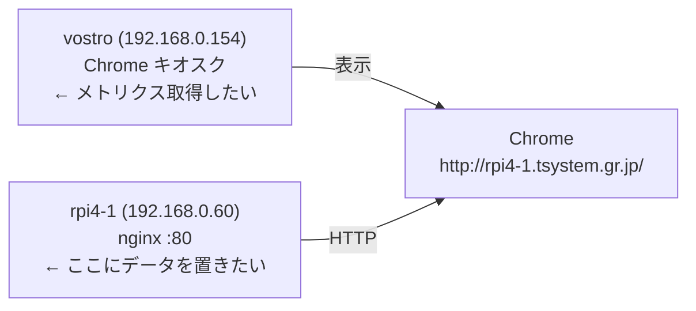
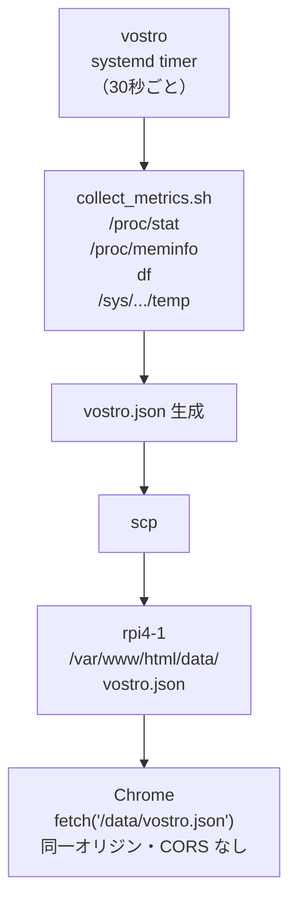
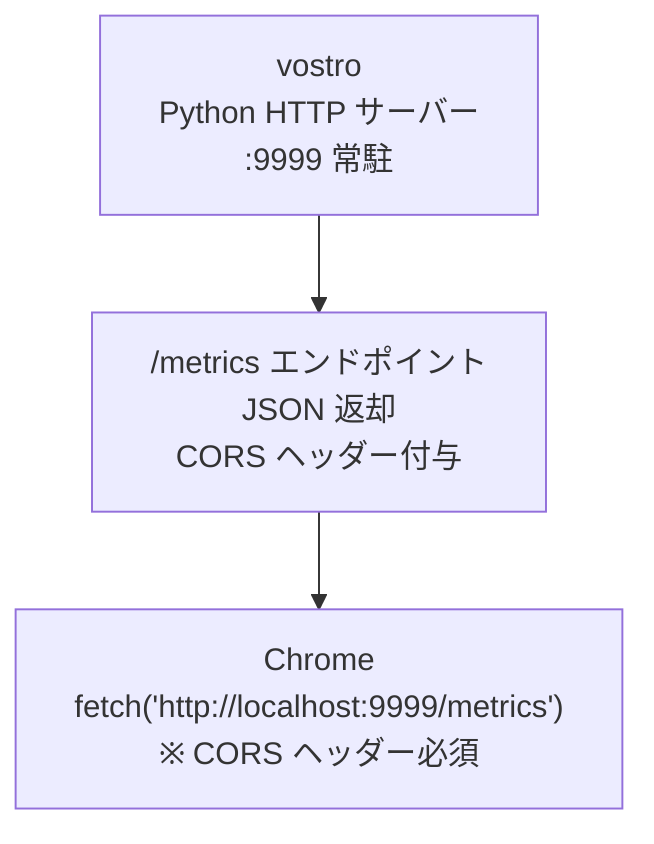
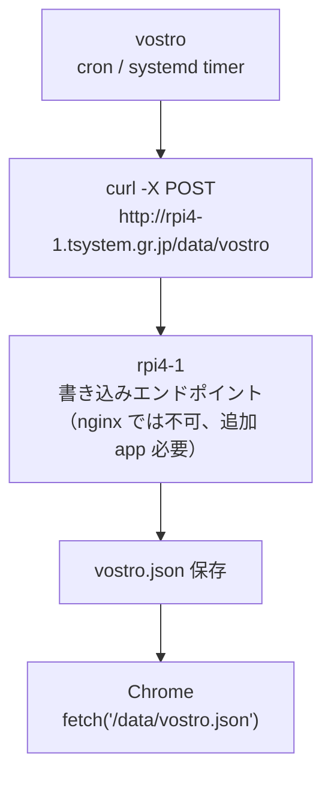

# vostro アクティビティ検出方法 検討

## 概要

フェーズ4（右下スロットへのリソース監視パネル追加）に向けて、  
表示端末 vostro（192.168.0.154）のリソース情報（CPU・メモリ・ディスク・CPU温度）を  
rpi4-1 の nginx を通じてブラウザに表示するための方式を検討する。

---

## 前提条件



- Chrome は `http://rpi4-1.tsystem.gr.jp/` を origin として動作する
- Chrome から `http://localhost:PORT/` を fetch すると **CORS が発生する**（別 origin 扱い）
- これが vostro のローカルリソースを直接取得する際の最大の障壁

---

## 取得対象メトリクス

| ホスト | 項目 | 取得元 |
|---|---|---|
| vostro | CPU 使用率 | `/proc/stat`（1秒間隔の差分計算） |
| vostro | メモリ使用率 | `/proc/meminfo` |
| vostro | ディスク使用率 | `df` コマンド |
| vostro | CPU 温度 | `/sys/class/thermal/thermal_zone*/temp` |

---

## 案1：vostro → scp → rpi4-1 静的 JSON ファイル（推奨）

### 方式

vostro 上のスクリプトがメトリクスを収集し、JSON ファイルを生成して  
`scp` で rpi4-1 の `/var/www/html/data/vostro.json` へ転送する。  
ブラウザは同一オリジンの `/data/vostro.json` を `fetch` する。



### 更新間隔の選択肢

| 方法 | 間隔 | 複雑さ |
|---|---|---|
| cron | 1分（最小） | 最も簡単 |
| systemd timer（`OnCalendar=*:*:0/30`） | 30秒 | やや手間 |
| systemd service（`while true; sleep 30`） | 30秒 | シンプル |

### メリット

- rpi4-1 側の変更は `/var/www/html/data/` ディレクトリ作成のみ（nginx 追加設定不要）
- 同一オリジン取得のため CORS 問題ゼロ
- 既存の `release.sh` / `backup.sh` と同じ SSH/scp 基盤をそのまま流用できる
- vostro が一時停止しても最後の JSON が残り、パネルに最終値が表示され続ける

### デメリット

- vostro → rpi4-1 方向の SSH 鍵設定が必要（現状は逆方向のみ）
- scp のオーバーヘッドが毎回発生する（ファイルサイズが小さいため実用上は問題なし）
- 更新間隔はネットワーク遅延に依存する（LAN 内のため通常は無視できる）

---

## 案2：vostro にローカル HTTP API を立てる

### 方式

vostro 上に軽量 HTTP サーバー（Python など）を常駐させ、  
ブラウザから `http://localhost:PORT/metrics` を fetch する。  
**CORS ヘッダーの付与が必須。**



### メリット

- fetch のたびに最新値を取得できる（リアルタイム性が高い）
- rpi4-1 側への通信が不要

### デメリット

- vostro に **常駐プロセスが必要**（Python Flask / uvicorn 等）
- CORS ヘッダー（`Access-Control-Allow-Origin`）の設定漏れでサイレントに失敗する
- Chrome キオスクモードが `localhost` への cross-origin fetch を許可するか **実機確認が必要**
- サービスが落ちると即座にデータ取得不能になる

---

## 案3：vostro が rpi4-1 へ HTTP POST で送信する

### 方式

vostro の cron/スクリプトが `curl` で rpi4-1 のエンドポイントへ JSON を POST する。  
rpi4-1 側にその JSON を受け取り保存するためのエンドポイントが必要。



### メリット

- vostro 側は `curl` コマンドのみで実装できる

### デメリット

- rpi4-1 に **書き込み受付エンドポイントが必要**（nginx 単体では受け取れない）
- OpenResty（nginx + Lua）または Python/Node 等の追加アプリサーバーが必要
- 案1と比べて rpi4-1 側の構成が複雑になる

---

## 案の比較

| 項目 | 案1: scp + 静的 JSON | 案2: ローカル HTTP API | 案3: HTTP POST |
|---|---|---|---|
| rpi4-1 側の追加構成 | ディレクトリ作成のみ | 不要 | アプリサーバーが必要 |
| CORS 問題 | なし | あり（要対応） | なし |
| リアルタイム性 | 30秒〜1分 | fetch ごと（即時） | 30秒〜1分 |
| vostro 側の構成 | スクリプト + SSH 鍵 | 常駐サービス | スクリプトのみ |
| 障害時の挙動 | 最終値が残る | データ取得不能 | 最終値が残る |
| 実装難易度 | 低 | 中 | 中〜高 |

---

## SSH 鍵の設定方針（案1採用時）

自動化スクリプトからの scp には **パスフレーズなしの SSH 鍵**が必要。  
秘密鍵の漏洩リスクは、rpi4-1 側の `authorized_keys` に制限を設けることで最小化する。

### authorized_keys の設定（rpi4-1 側）

```
command="scp -t /var/www/html/data/",from="192.168.0.154",no-pty,no-port-forwarding,no-X11-forwarding,no-agent-forwarding ssh-ed25519 AAAA...
```

| オプション | 効果 |
|---|---|
| `command="scp -t /var/www/html/data/"` | 操作を「指定ディレクトリへの scp のみ」に限定 |
| `from="192.168.0.154"` | vostro の IP からの接続のみ許可 |
| `no-pty` | 対話シェルへのログインを禁止 |
| `no-port-forwarding` | ポートフォワードを禁止 |
| `no-agent-forwarding` | エージェント転送を禁止 |

**秘密鍵が漏洩しても `/var/www/html/data/` への書き込みしかできない**状態を維持する。

---

## 結論・推奨案

**案1（vostro → scp → rpi4-1 静的 JSON）を推奨する。**

- rpi4-1 側の変更が最小限
- CORS 問題が発生しない
- 既存の SSH/scp インフラと親和性が高い
- `authorized_keys` の制限により、秘密鍵の権限を最小化できる

リアルタイム性（30秒程度の遅延）はリソース監視用途として許容範囲内と判断する。

---

## 関連文書

| ファイル | 内容 |
|---|---|
| `doc/設計変遷履歴.md` | フェーズ1〜4の設計変遷 |
| `doc/security_monitor.20260504.md` | フェーズ3 システム構築まとめ |
| `doc/security_monitor.20260505.md` | フェーズ3 改修まとめ |
