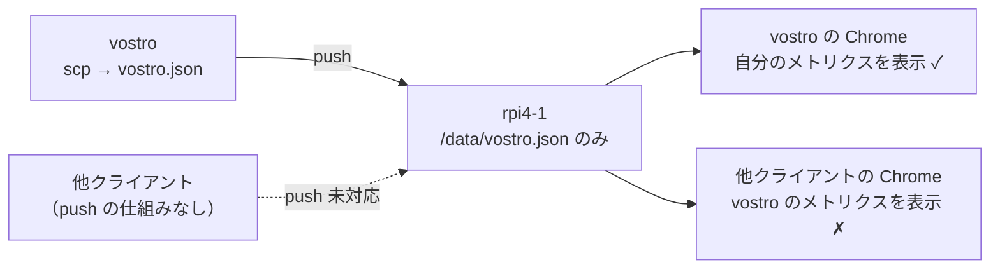
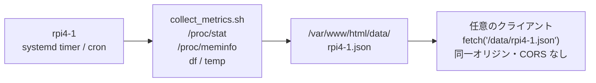
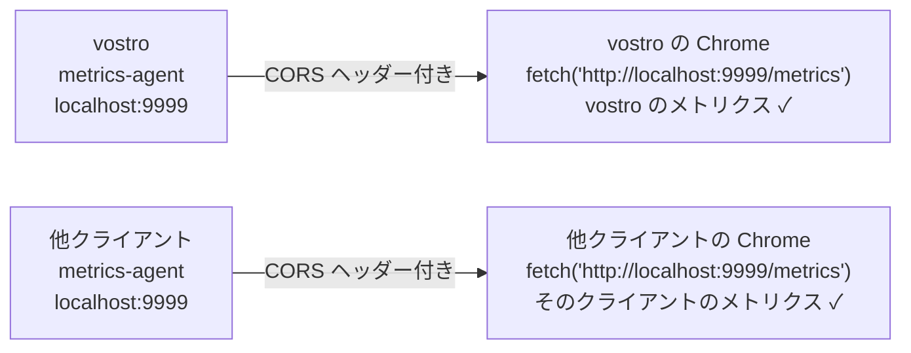
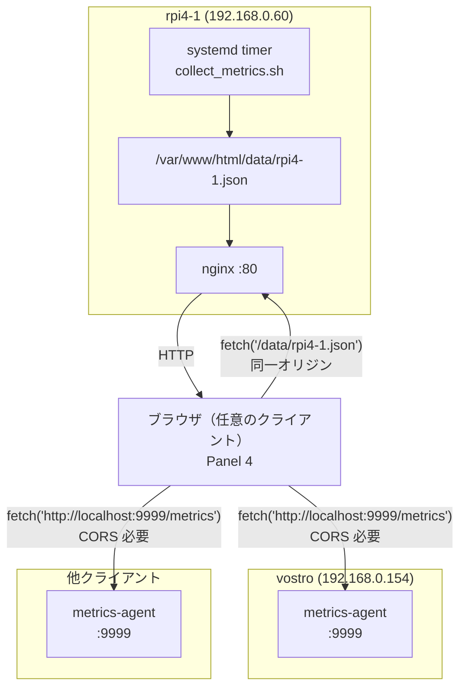

# クライアント アクティビティ検出方法 検討2

## 概要

`doc/vostroアクティビティ検出方法検討.md` では vostro 単体を前提として3案を検討した。  
本文書では**マルチクライアント対応**の観点から要件を見直し、設計方針を更新する。

---

## 前回検討からの変更点

| 項目 | 前回（vostro 単体） | 今回（マルチクライアント） |
|---|---|---|
| クライアント | vostro のみ | vostro + その他ノード（将来追加） |
| "localhost" の意味 | 常に vostro | 閲覧しているマシン（ノードごとに変わる） |
| 推奨案 | 案1（scp + 静的 JSON） | 要見直し |

---

## 要件の確定

フェーズ4のリソース監視パネルに表示する内容：

| 表示対象 | 性質 | 説明 |
|---|---|---|
| rpi4-1 のメトリクス | **固定** | 誰が閲覧しても同じ内容を表示 |
| 閲覧クライアントのメトリクス | **動的** | 今このブラウザを動かしているマシンの情報 |

```
┌──────────────┬──────────────┐
│ Swing#1      │ AtomCam2     │
│ (二階左側)    │ (玄関)        │
├──────────────┼──────────────┤
│ Swing#2      │ [フェーズ4]   │
│ (二階右側)    │  rpi4-1      │
│              │  + クライアント│
└──────────────┴──────────────┘
```

---

## 案1 がマルチクライアントで破綻する理由

案1（vostro が scp で vostro.json を rpi4-1 へ push）では、  
rpi4-1 には「vostro のメトリクス」しか存在しない。



他クライアントから閲覧すると「自分ではなく vostro」のメトリクスが表示されてしまう。

---

## マルチクライアント対応設計

### rpi4-1 メトリクス（固定部分）

rpi4-1 上でスクリプトが定期実行し、自分自身のメトリクスを JSON ファイルとして保存する。  
ブラウザは同一オリジンの `/data/rpi4-1.json` を fetch する。  
**CORS は発生しない。**



---

### クライアント メトリクス（動的部分）

各クライアント上に軽量メトリクス API エージェントを常駐させる。  
ブラウザは `http://localhost:9999/metrics` を fetch する。  
`localhost` は常に「今のブラウザが動いているマシン」に解決されるため、  
クライアントが誰であっても自分自身のメトリクスが取得できる。  
**CORS 対応が必須。**（→ 詳細は `doc/用語集.md` 参照）



---

### 全体構成



---

## metrics-agent の要件

各クライアントに展開する軽量エージェント。

| 項目 | 内容 |
|---|---|
| 提供エンドポイント | `http://localhost:9999/metrics` |
| レスポンス形式 | JSON |
| CORS ヘッダー | `Access-Control-Allow-Origin: http://rpi4-1.tsystem.gr.jp` |
| 収集項目 | CPU 使用率・メモリ使用率・ディスク使用率・CPU 温度 |
| 常駐方式 | systemd service |

### レスポンス JSON 例

```json
{
  "hostname": "vostro",
  "timestamp": "2026-05-06T12:00:00",
  "cpu_percent": 42.3,
  "mem_used_mb": 1820,
  "mem_total_mb": 4096,
  "mem_percent": 44.4,
  "disk_used_gb": 18.2,
  "disk_total_gb": 59.4,
  "disk_percent": 30.6,
  "cpu_temp_c": 55.2
}
```

---

## 実装言語の選択肢

| 言語 | メリット | デメリット |
|---|---|---|
| Python（標準ライブラリのみ） | 追加インストール不要（Linux 標準） | コード量がやや増える |
| Python（Flask） | シンプルに書ける | pip install が必要 |
| Go（シングルバイナリ） | デプロイが scp 1ファイルで完結 | コンパイル環境が必要 |
| bash + socat | 依存ゼロ | HTTP/CORS 実装が複雑 |

**Python 標準ライブラリ（`http.server` + `subprocess`）が最もシンプルで依存が少ない。**

---

## 案の再比較（マルチクライアント前提）

| 項目 | 案1: scp + 静的 JSON | 案2: ローカル HTTP API | 案3: HTTP POST |
|---|---|---|---|
| rpi4-1 メトリクス（固定） | ○ | ○ | △（受付 app 必要） |
| クライアントメトリクス（動的） | **✗**（vostro 固定） | ✓ | **✗**（固定 push） |
| マルチクライアント対応 | **✗** | ✓ | **✗** |
| CORS 対応 | 不要 | **必要** | 不要 |
| rpi4-1 側の追加構成 | 最小 | 最小 | app サーバー必要 |
| 各クライアントへの展開 | scp のみ | **agent インストール必要** | scp のみ |

---

## 推奨案の更新

**マルチクライアント要件（rpi4-1 固定 + クライアント動的）には案2が唯一対応できる。**

| 対象 | 方式 | CORS |
|---|---|---|
| rpi4-1 メトリクス | rpi4-1 上の cron → `/data/rpi4-1.json` | なし |
| クライアント メトリクス | 各クライアントの metrics-agent `:9999` | **必要** |

CORS 対応のコストを許容できれば、案2が要件を満たす唯一の構成となる。

---

## 今後の検討事項

- metrics-agent の実装言語確定（Python 標準ライブラリを推奨）
- systemd service ユニットファイルの設計
- CORS の `Access-Control-Allow-Origin` に設定する Origin の確定
- rpi4-1 の collect_metrics.sh の設計

---

## 関連文書

| ファイル | 内容 |
|---|---|
| `doc/vostroアクティビティ検出方法検討.md` | 初回検討（vostro 単体・3案比較） |
| `doc/用語集.md` | CORS 等の用語解説 |
| `doc/設計変遷履歴.md` | フェーズ1〜4の設計変遷 |
