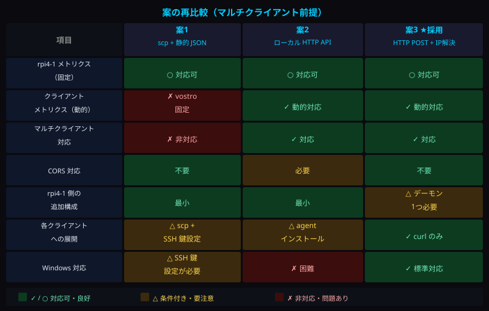
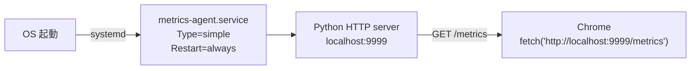
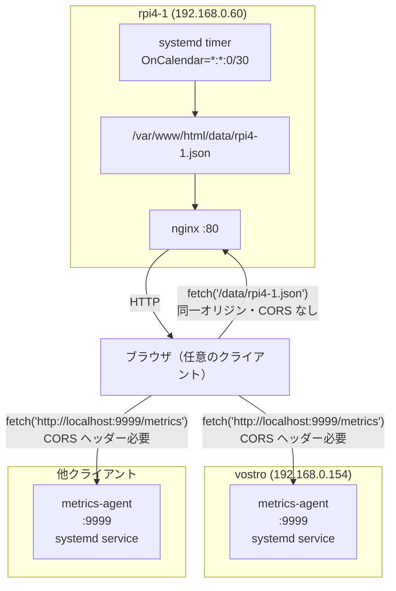

# クライアント アクティビティ検出方法 検討3

## 概要

`doc/clientアクティビティ検出方法検討2.md` のマルチクライアント対応設計をベースに、  
取得メトリクスの確定・更新タイマー方式の決定・案の再比較を行い、実装方針を確定する。

---

## 前回（検討2）からの進展

| 検討項目 | 状態 |
|---|---|
| マルチクライアント対応の必要性確認 | ✓ 確定 |
| 取得メトリクスの選定 | ✓ 確定（→ 3.1） |
| 更新タイマー方式の選定 | ✓ 確定（→ 3.2） |
| 案の再比較（SVG図） | ✓ 本文書に収録 |
| 推奨案の確定 | ✓ 確定（→ 5） |
| metrics-agent 実装 | 未着手 |

---

## 確定事項

### 3.1 取得メトリクス

WebRTC ストリーミングによる消費影響を考慮し、以下の3項目を採用する。  
詳細は `doc/clientメトリクス選択.md` を参照。

| メトリクス | 取得元 | 更新間隔 | 採用理由 |
|---|---|---|---|
| CPU 使用率 | `/proc/stat` | 5〜10秒 | H.264 ソフトウェアデコードで常時高負荷 |
| CPU 温度 | `/sys/class/thermal/thermal_zone*/temp` | 5〜10秒 | サーマルスロットリングの予兆検知 |
| メモリ使用率 | `/proc/meminfo`（MemAvailable 使用） | 30秒 | Chrome + 映像バッファで積み上がる |
| ~~ディスク使用率~~ | ~~除外~~ | ー | ストリーミングでは消費しない |

---

### 3.2 更新タイマー方式

**systemd timer**（`OnCalendar=*:*:0/30`）を採用する。  
cron の最小間隔（1分）では CPU・CPU温度の変化を適切に捉えられないため。

```ini
[Timer]
OnCalendar=*:*:0/30   # 毎分 0秒・30秒に起動（= 30秒ごと）
AccuracySec=1s        # 精度を1秒に設定（デフォルト1分では間隔が保証されない）
Persistent=true       # 起動中に missed した分も再実行
```

`AccuracySec=1s` を省略すると、systemd がタイマーを他と束ねて遅延させるため必須。

---

## 案の再比較（マルチクライアント前提）



### 判定根拠

**案1（scp + 静的 JSON）** は、rpi4-1 に push できるのは push 元ホストの情報のみ。  
他クライアントが閲覧した際に「自クライアントのメトリクス」を表示できない。マルチクライアント要件を満たさない。

**案2（ローカル HTTP API）** は、ブラウザの `fetch('http://localhost:9999/metrics')` が  
常に「今のブラウザが動いているマシン」に解決されるため、クライアントが変わっても自動的に自ホストのメトリクスを返す。  
CORS 対応が必要だが、要件を唯一満たす構成。

**案3（HTTP POST）** は、push 元が固定されるため案1と同様の問題を抱える。  
加えて rpi4-1 側に書き込みエンドポイントが必要となり、構成が最も複雑。

---

## 推奨案の確定

**案2（ローカル HTTP API）を採用する。**

| 対象 | 方式 | CORS |
|---|---|---|
| rpi4-1 メトリクス（固定） | rpi4-1 上の systemd timer → `/var/www/html/data/rpi4-1.json` | なし |
| クライアントメトリクス（動的） | 各クライアント上の metrics-agent `:9999` | **必要** |

---

## metrics-agent 設計方針

### エンドポイント仕様

| 項目 | 内容 |
|---|---|
| URL | `http://localhost:9999/metrics` |
| メソッド | GET |
| レスポンス形式 | `application/json` |
| CORS ヘッダー | `Access-Control-Allow-Origin: http://rpi4-1.tsystem.gr.jp` |

### レスポンス JSON

```json
{
  "hostname":     "vostro",
  "timestamp":    "2026-05-06T12:00:00",
  "cpu_percent":  42.3,
  "cpu_temp_c":   55.2,
  "mem_used_mb":  1820,
  "mem_total_mb": 4096,
  "mem_percent":  44.4
}
```

### 実装言語

Python 標準ライブラリ（`http.server` + `subprocess`）を採用する。  
追加インストール不要で、Linux 標準環境（vostro: Debian 13）に必ず存在する。

### 常駐方式



---

## 全体構成（確定版）



---

## 今後の実装ステップ

| ステップ | 内容 | 対象ホスト |
|---|---|---|
| 1 | metrics-agent（Python）の実装 | 開発環境 |
| 2 | metrics-agent の vostro へのデプロイ・動作確認 | vostro |
| 3 | rpi4-1 用 collect_metrics.sh の実装 | rpi4-1 |
| 4 | rpi4-1 の systemd timer 設定 | rpi4-1 |
| 5 | フロントエンド（app.js / index.html）へのパネル4追加 | rpi4-1 |
| 6 | 全クライアントへの metrics-agent 展開手順の整備 | 各クライアント |

---

## 関連文書

| ファイル | 内容 |
|---|---|
| `doc/clientアクティビティ検出方法検討2.md` | マルチクライアント対応設計（前回） |
| `doc/clientメトリクス選択.md` | 取得メトリクスの選定根拠 |
| `doc/vostroアクティビティ検出方法検討.md` | 初回検討（3案比較） |
| `doc/用語集.md` | CORS 等の用語解説 |
| `doc/設計変遷履歴.md` | フェーズ1〜4の設計変遷 |
