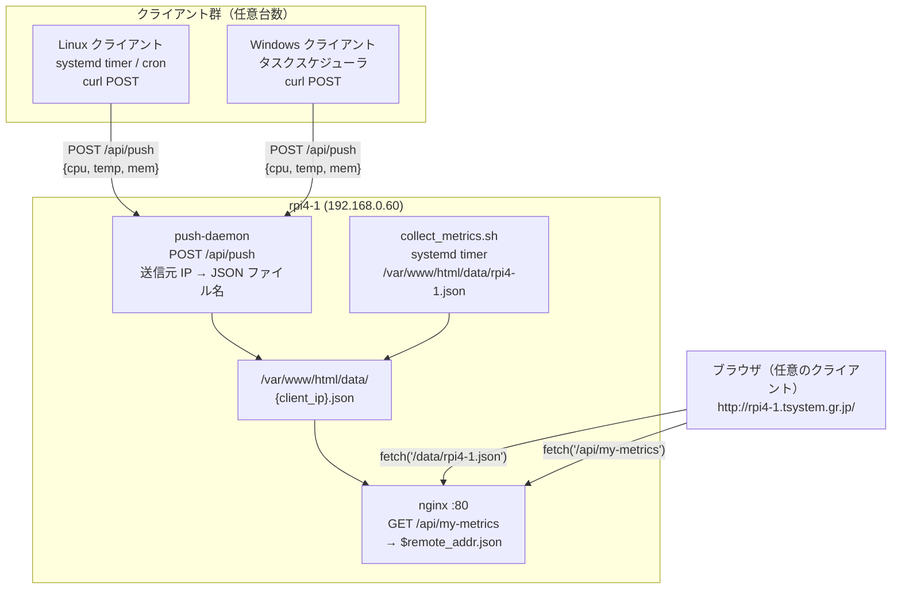

# クライアント アクティビティ検出方法 検討4

## 概要

`doc/clientアクティビティ検出方法検討3.md` で仮採用していた案2を見直し、  
**案3（HTTP POST + 送信元 IP 解決）** を正式採用として設計を確定する。

---

## 採用案の確定

**案3：HTTP POST + 案B（送信元 IP によるクライアント自動識別）**

### 採用理由

- 案2（ローカル HTTP API）は CORS 対応が必要で、特に Windows クライアントでの管理が複雑
- 案Bは「ブラウザが `http://rpi4-1.tsystem.gr.jp/` をそのまま開く」だけで自クライアントのメトリクスを取得できる唯一の方式
- `curl` は Windows 10/11・Linux ともに標準搭載のため、クライアントへの追加インストールが不要

---

## 案の再比較（更新版）


---

## 確定設計

### 全体構成



---

### クライアント側の動作

| 項目 | Linux | Windows |
|---|---|---|
| スケジューラ | cron / systemd timer | タスクスケジューラ |
| 実行内容 | シェルスクリプト + curl | バッチ / PowerShell + curl |
| 送信先 | `http://rpi4-1.tsystem.gr.jp/api/push` | 同左 |
| 追加インストール | 不要 | 不要（curl 標準搭載） |

**POST リクエスト例**

```bash
curl -s -X POST http://rpi4-1.tsystem.gr.jp/api/push \
     -H 'Content-Type: application/json' \
     -d '{"hostname":"vostro","cpu_percent":42.3,"cpu_temp_c":55.2,"mem_percent":44.4}'
```

---

### rpi4-1 側の構成

#### push-daemon

| 項目 | 内容 |
|---|---|
| 役割 | POST を受け取り、送信元 IP をファイル名として JSON を保存 |
| エンドポイント | `POST /api/push` |
| 保存先 | `/var/www/html/data/{remote_ip}.json` |
| 実装 | Python 標準ライブラリ（`http.server`） |
| 常駐方式 | systemd service（`Restart=always`） |

**保存 JSON 例**（`/var/www/html/data/192.168.0.154.json`）

```json
{
  "hostname":    "vostro",
  "timestamp":   "2026-05-06T12:00:00",
  "cpu_percent": 42.3,
  "cpu_temp_c":  55.2,
  "mem_percent": 44.4
}
```

#### nginx 設定（自クライアント JSON の返却）

```nginx
# 送信元 IP に対応する JSON ファイルを返す
location /api/my-metrics {
    alias /var/www/html/data/$remote_addr.json;
    default_type application/json;
    add_header Cache-Control "no-cache";
}
```

`$remote_addr` は nginx が自動的に解決するため、デーモン側への問い合わせは不要。

#### rpi4-1 自身のメトリクス収集

push-daemon とは独立して、rpi4-1 自身のメトリクスを定期収集する。

| 項目 | 内容 |
|---|---|
| スクリプト | `collect_metrics.sh` |
| 保存先 | `/var/www/html/data/rpi4-1.json` |
| 更新方式 | systemd timer（`OnCalendar=*:*:0/30`、`AccuracySec=1s`） |

---

### ブラウザ（fetch）側の動作

| 取得対象 | fetch URL | 方式 |
|---|---|---|
| rpi4-1 メトリクス | `/data/rpi4-1.json` | 静的ファイル、同一オリジン |
| 自クライアント メトリクス | `/api/my-metrics` | nginx が `$remote_addr` で解決 |

CORS は一切不要。すべて `http://rpi4-1.tsystem.gr.jp` からの同一オリジン fetch。

---

## 実装ステップ（確定版）

| ステップ | 内容 | 対象ホスト |
|---|---|---|
| 1 | push-daemon（Python）の実装 | 開発環境 → rpi4-1 |
| 2 | rpi4-1 の systemd service 設定（push-daemon） | rpi4-1 |
| 3 | nginx に `/api/my-metrics` エンドポイント追加 | rpi4-1 |
| 4 | rpi4-1 の `collect_metrics.sh` 実装と systemd timer 設定 | rpi4-1 |
| 5 | Linux クライアント用 `push_metrics.sh` の実装 | vostro 等 |
| 6 | Windows クライアント用スクリプトの実装 | Windows 端末 |
| 7 | フロントエンド（app.js / index.html）へのパネル4追加 | rpi4-1 |

---

## 関連文書

| ファイル | 内容 |
|---|---|
| `doc/clientアクティビティ検出方法検討3.md` | 前回検討（案2採用 → 本文書で修正） |
| `doc/clientメトリクス選択.md` | 取得メトリクスの選定根拠 |
| `doc/用語集.md` | CORS 等の用語解説 |
| `doc/設計変遷履歴.md` | フェーズ1〜4の設計変遷 |
