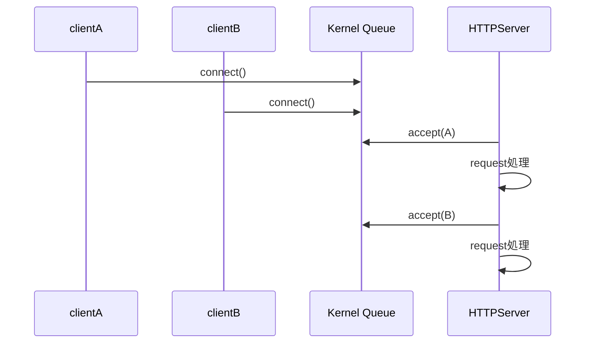

# push_daemon.py の同時接続処理について

## 現在の構成

このスクリプトは、以下の構成で動作しています。

```text
client
  ↓
nginx
  ↓ proxy_pass
127.0.0.1:9091
  ↓
push_daemon.py
```

Python 側では以下を使用しています。

```python
http.server.HTTPServer
```

これは **シングルスレッド動作** です。

---

# 同時POST時の動作

例えば：

- clientA
- clientB

が、NTP同期 + systemd timer により、
ほぼ同時に POST した場合でも、
Linux カーネル側の接続待ちキュー(backlog queue)に入り、
順番に処理されます。

---

## 動作イメージ



---

# 「同時」ではなく「直列処理」

現在のコードは：

```python
http.server.HTTPServer
```

なので、

- 接続は受けられる
- ただし処理は1件ずつ

となります。

つまり：

- 完全並列ではない
- 直列処理
- OSの待ちキューが吸収

という構成です。

---

# 実運用上は問題になるか？

## 2〜10台程度なら問題になりにくい

現在の処理内容は非常に軽量です。

処理内容：

- JSON parse
- 数KBファイル write
- NDJSON append
- logging

程度です。

そのため：

- 数台
- 1分毎POST
- 数KB程度

であれば、普通の Linux サーバでは十分処理可能です。

---

# nginx が負荷を吸収している

実際には nginx が前段にあるため：

- TCP accept
- keepalive
- buffering

を nginx が担当しています。

そのため Python 側の負荷はかなり軽減されています。

---

# 現在の実装で本当に危険な箇所

実は「同時POST」より問題になりやすいのは、
履歴ファイルの trim 処理です。

現在：

```python
text = history.read_text()
lines = text.splitlines()

if len(lines) > MAX_HISTORY:
    history.write_text(
        '\n'.join(lines[-MAX_HISTORY:]) + '\n',
        encoding='utf-8'
    )
```

となっています。

これは毎回：

1. history 全読み込み
2. splitlines
3. 再書き込み

を行っています。

---

# 問題点

履歴ファイルが大きくなると：

- I/O増加
- メモリ消費増加
- 処理時間増加

が発生します。

こちらの方が、
「同時POST」より先にボトルネックになります。

---

# ThreadingHTTPServer に変更した場合

例えば：

```python
class ReusePortHTTPServer(http.server.ThreadingHTTPServer):
    allow_reuse_address = True
    allow_reuse_port = True
```

とすると、
接続ごとにスレッド処理になります。

---

# ただし注意点

現在は：

```python
with history.open('a', encoding='utf-8') as f:
    f.write(line)
```

で同じファイルに追記しています。

ThreadingHTTPServer 化すると：

- race condition
- write競合
- 行破壊

が発生する可能性があります。

特に：

- 同一IP
- 同時POST

時は危険です。

---

# 安全化方法

## 方法1: threading.Lock

```python
from threading import Lock

file_lock = Lock()

with file_lock:
    with history.open('a', encoding='utf-8') as f:
        f.write(line)
```

---

## 方法2: Queue + Writer Thread（推奨）


この構成では：

- HTTP受信
- ファイル書き込み

を分離できます。

そのため：

- 安定性向上
- race condition回避
- 高負荷耐性向上

が可能です。

---

# 現状評価

現在の構成は：

- 数台〜10台程度
- 数十秒〜数分間隔POST

なら、
かなり実用的です。

---

# 将来的な改善優先順位

## 優先度1

履歴 trim 処理改善

現在の：

```python
read_text()
splitlines()
write_text()
```

をやめる。

---

## 優先度2

ThreadingHTTPServer 化

---

## 優先度3

Queue + Writer Thread 化

---

# まとめ

現在のコードは：

- 同時接続は可能
- 処理は直列
- Linux backlog queue が吸収
- nginx も吸収

する構成です。

2〜10台程度の systemd timer + NTP 同期POSTであれば、
通常は十分実用範囲です。

むしろ：

- 履歴ファイル全読み込み
- trim処理

の方が、
先にボトルネックになる可能性があります。
