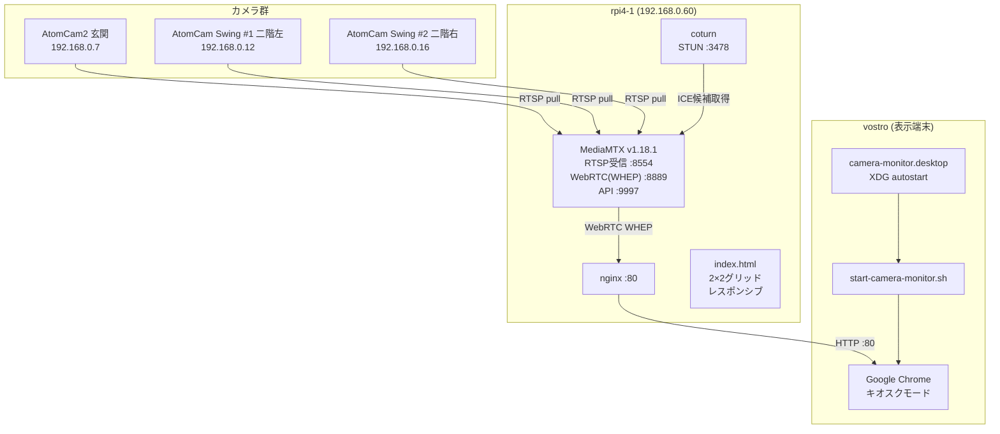

# セキュリティモニター 構築まとめ

## 概要

AtomCam 3台のRTSPストリームをWebRTC(WHEP)でブラウザに表示するセキュリティモニターシステム。  
rpi4-1にMediaMTX + coturn + nginxを構築し、vostroをキオスクモードの表示端末として使用する。

---

## システム構成



---

## ホスト情報

| ホスト | IPアドレス | OS | 役割 |
|---|---|---|---|
| rpi4-1 | 192.168.0.60 | Debian 12 (aarch64) | MediaMTX / coturn / nginx |
| vostro | 192.168.0.154 | Debian 13 | 表示端末（キオスク） |
| AtomCam2 | 192.168.0.7 | - | 玄関カメラ |
| AtomCam Swing #1 | 192.168.0.12 | - | 二階部屋左側 |
| AtomCam Swing #2 | 192.168.0.16 | - | 二階部屋右側 |

---

## コンポーネントと役割

| コンポーネント | 場所 | 役割 |
|---|---|---|
| atomcam_tools | 各カメラ | RTSPストリーム公開 |
| MediaMTX v1.18.1 | rpi4-1 | RTSP → WebRTC(WHEP)変換・再配信 |
| coturn | rpi4-1 | STUNサーバー（ChromeのmDNS変換問題を回避） |
| nginx | rpi4-1 | 静的ファイル配信 + MediaMTXへのリバースプロキシ |
| index.html | rpi4-1 | WHEPクライアント・2×2グリッドレスポンシブ表示 |
| camera-monitor.desktop | vostro | 起動時Chrome自動起動（XDG autostart） |
| start-camera-monitor.sh | vostro | Chrome キオスクモード起動スクリプト |

---

## 設定ファイル

### /opt/mediamtx/mediamtx.yml

```yaml
###############################################################################
# MediaMTX設定
# 用途: AtomCam3台のRTSPストリームをWebRTCで配信
###############################################################################

logLevel: info
logDestinations: [file]
logFile: /var/log/mediamtx.log

rtsp: yes
rtspAddress: :8554

webrtc: yes
webrtcAddress: :8889

hls: yes
hlsAddress: :8888

api: yes
apiAddress: :9997

paths:

  # AtomCam Swing #1（二階部屋左側）
  swing1:
    source: rtsp://192.168.0.12:8554/video0_unicast
    sourceOnDemand: no

  # AtomCam 2（玄関）
  atomcam2:
    source: rtsp://192.168.0.7:8554/video0_unicast
    sourceOnDemand: no

  # AtomCam Swing #2（二階部屋右側）
  swing2:
    source: rtsp://192.168.0.16:8554/video0_unicast
    sourceOnDemand: no
```

> **注意:** MediaMTX v1.18.1では `sourceReconnectPause` は廃止されている。

---

### /etc/systemd/system/mediamtx.service

```ini
[Unit]
Description=MediaMTX RTSP/WebRTC Server
After=network.target

[Service]
User=root
WorkingDirectory=/opt/mediamtx
ExecStart=/opt/mediamtx/mediamtx /opt/mediamtx/mediamtx.yml
Restart=always
RestartSec=5s

[Install]
WantedBy=multi-user.target
```

---

### /etc/turnserver.conf

```
# STUNのみ有効化（TURNは不要）
listening-port=3478
listening-ip=192.168.0.60
log-file=/var/log/coturn.log
```

---

### /etc/nginx/sites-available/security-monitor

```nginx
server {
    listen 80;
    server_name rpi4-1.local;

    # 静的ファイル配信
    location / {
        root /var/www/html;
        index index.html;
    }

    # MediaMTX WebRTCシグナリング プロキシ
    location /webrtc/ {
        proxy_pass http://127.0.0.1:8889/;
        proxy_http_version 1.1;
        proxy_set_header Upgrade $http_upgrade;
        proxy_set_header Connection "upgrade";
        proxy_set_header Host $host;
    }

    # MediaMTX HLS フォールバック プロキシ
    location /hls/ {
        proxy_pass http://127.0.0.1:8888/;
        proxy_set_header Host $host;
    }

    # MediaMTX API プロキシ
    location /api/ {
        proxy_pass http://127.0.0.1:9997/;
        proxy_set_header Host $host;
    }
}
```

---

### /home/indou/start-camera-monitor.sh (vostro)

```bash
#!/bin/bash
# 防犯カメラモニター起動スクリプト

# スクリーンセーバー・画面オフを無効化
xset s off
xset -dpms
xset s noblank

# Chromeをキオスクモードで起動
# --mute-audio: WebRTC音声をPipeWireに送信しない（大音量防止）
google-chrome-stable \
    --kiosk \
    --mute-audio \
    --noerrdialogs \
    --disable-infobars \
    --disable-session-crashed-bubble \
    --disable-restore-session-state \
    --no-first-run \
    --start-fullscreen \
    --password-store=basic \
    http://rpi4-1.tsystem.gr.jp/
```

---

### /home/indou/.config/autostart/camera-monitor.desktop (vostro)

```ini
[Desktop Entry]
Type=Application
Name=Camera Monitor
Comment=防犯カメラモニター
Exec=/home/indou/start-camera-monitor.sh
X-GNOME-Autostart-enabled=true
```

---

### /home/indou/.config/lxsession/LXDE/autostart (vostro)

```
@lxpanel --profile LXDE
@pcmanfm --desktop --profile LXDE
@xset s off
@xset -dpms
@xset s noblank
```

> **注意:** Chrome起動は `camera-monitor.desktop` (XDG autostart) で行うため、  
> ここにはChrome起動設定を記載しない。

---

## index.html 設計

### レイアウト（PC時：2×2グリッド）

```
┌──────────────┬──────────────┐
│ Swing #1     │ AtomCam2     │
│ 二階左側     │ 玄関         │
├──────────────┼──────────────┤
│ Swing #2     │ (4台目予約)  │
│ 二階右側     │              │
└──────────────┴──────────────┘
```

### レスポンシブ対応

| 画面幅 | レイアウト |
|---|---|
| 769px以上（PC） | 2列2行の4マスグリッド |
| 768px以下（スマホ） | 1列縦並び |

### WHEPエンドポイント

| カメラ | エンドポイント |
|---|---|
| AtomCam Swing #1 | `http://rpi4-1.tsystem.gr.jp/webrtc/swing1/whep` |
| AtomCam2 | `http://rpi4-1.tsystem.gr.jp/webrtc/atomcam2/whep` |
| AtomCam Swing #2 | `http://rpi4-1.tsystem.gr.jp/webrtc/swing2/whep` |

---

## 動作確認コマンド

```bash
# MediaMTX カメラ接続状態確認
curl -s http://localhost:9997/v3/paths/list | python3 -m json.tool | grep -E '"name"|"ready"'

# MediaMTXログ確認
sudo tail -30 /var/log/mediamtx.log

# nginx設定テスト
sudo nginx -t

# サービス状態確認
sudo systemctl status mediamtx coturn nginx
```

---

## トラブルシューティング記録

| 問題 | 原因 | 解決策 |
|---|---|---|
| `sourceReconnectPause`エラーで起動失敗 | MediaMTX v1.18.1で廃止 | 該当行を削除 |
| ポート8554競合で起動失敗 | go2rtcが残存 | `systemctl stop go2rtc` |
| `.local`名前解決失敗 | GoランタイムがmDNS非対応 | RTSPソースをIPアドレスに直接指定 |
| `codecs not supported by client` | AtomCamがLPCM音声を配信、ブラウザ非対応 | audioトランシーバーを削除 |
| `SetRemoteDescription: no ice-ufrag` | ICEギャザリング完了前にSDPをPOST | ICEギャザリング完了待ち処理を追加 |
| ICE接続失敗（接続中のまま） | ChromeがIPをmDNS名（.local）に変換 | coturnでSTUNサーバーを構築 |
| ICEギャザリングが完了しない | タイムアウト処理なし | 3秒タイムアウトを追加 |
| vostroが旧go2rtc画面を表示 | `camera-monitor.desktop`がlocalhost参照 | URLを`http://rpi4-1.tsystem.gr.jp/`に変更 |

---

## 今後の拡張候補

- **4台目カメラ追加**（2×2グリッドの右下スロットが空き）
- **映像録画機能**（MediaMTXのrecording機能を利用）
- **モーション検知連携**（rpi4-0のYOLOv8との統合）
- **WireGuard経由のリモート監視**（外出先からのアクセス）
