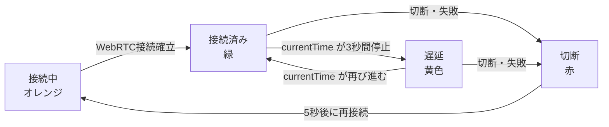
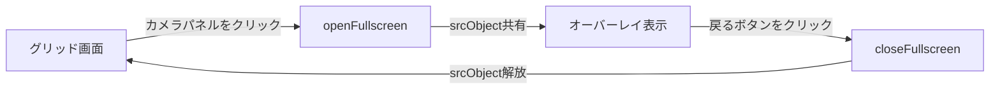

# セキュリティモニター改修まとめ

## 概要

既存の `index.html`（単一ファイル）を、保守性向上のため3ファイルに分離し、
キオスクモード（DELL Vostro 1520）での動作に最適化した。

---

## ファイル構成

```
index.html   … HTML構造のみ
style.css    … 全スタイル定義
app.js       … 時計・WHEP接続・stall検出・全画面制御
```

---

## 実施した変更

### 1. ファイル分離（index.html → 3ファイル）

単一HTMLファイルから CSS・JavaScript を外部ファイルに分離した。

| ファイル | 参照方法 |
|---|---|
| `style.css` | `<link rel="stylesheet" href="style.css">` |
| `app.js` | `<script src="app.js"></script>`（`</body>` 直前） |

`app.js` 冒頭に `'use strict';` を追加した。

---

### 2. 時計表示フォーマット変更

`toLocaleString('ja-JP')` による出力をやめ、手動フォーマットに変更した。

| 変更前 | 変更後 |
|---|---|
| `2026/5/5 20:10:14`（ロケール依存） | `2026-05-05 20:10:14`（固定書式） |

```javascript
const pad2 = (n) => String(n).padStart(2, '0');
`${yyyy}-${mm}-${dd} ${hh}:${mi}:${ss}`
```

---

### 3. 映像遅延検出（stall検出）

映像に焼き込まれたタイムスタンプは JavaScript から文字として読めないため、
`video.currentTime` の停止を監視することで遅延を検出する方式を採用した。

#### ステータス遷移



#### ステータスバッジ仕様

| 状態 | 色 | CSS クラス | 表示テキスト |
|---|---|---|---|
| 接続中 | オレンジ | `connecting` | 接続中... |
| 接続済み | 緑 | `connected` | 接続済み |
| 遅延 | 黄色 | `delayed` | 遅延 |
| 切断 | 赤 | `disconnected` | 切断 |

#### stall検出ロジック（`startStallDetector()`）

- 1秒ごとに `video.currentTime` を前回値と比較
- `video.paused` または `readyState < 2` の場合はスキップ（誤検知防止）
- `STALL_THRESHOLD`（デフォルト：3秒）以上停止で **遅延** に遷移
- `currentTime` が再び進んだら **接続済み** に自動復帰
- 再接続時の多重起動を `stallTimers` マップで防止

---

### 4. クリックで1カメラ全画面表示

#### 実装方針

Chrome キオスクモードでは Fullscreen API（`requestFullscreen()`）が
制限される場合があるため、`position: fixed` の CSS オーバーレイ方式を採用した。

#### 動作フロー



#### HTML 追加要素

```html
<!-- 全画面オーバーレイ -->
<div id="fullscreen-overlay" class="hidden">
    <div id="overlay-title"></div>
    <video id="overlay-video" autoplay muted playsinline></video>
    <button id="overlay-back-btn">◀ 戻る</button>
</div>
```

#### ストリーム共有

グリッド側 `<video>` の `srcObject` をオーバーレイ側に共有するため、
WebRTC 接続は1本のまま全画面表示が可能。
オーバーレイを閉じると `srcObject = null` で解放し、グリッド側は継続再生する。

---

### 5. キオスクモード対応レイアウト

DELL Vostro 1520（画面解像度 1280×800、推測）でのキオスクモード動作に対応するため、
スクロール不要な固定レイアウトに変更した。

#### レイアウト構成

```
+------------------+------------------+
|   swing1 (cam1)  | atomcam2 (cam2)  |
+------------------+------------------+
|   swing2 (cam3)  |    （空欄）       |
+------------------+------------------+
```

3カメラすべて同一サイズ（各セル = 画面の約50%幅 × 約50%高さ）。

#### CSS グリッド定義

```css
#grid {
    display: grid;
    grid-template-columns: 1fr 1fr;
    grid-template-rows: 1fr 1fr;
    grid-template-areas:
        "cam1 cam2"
        "cam3 .  ";
}
.camera-panel:nth-child(1) { grid-area: cam1; }
.camera-panel:nth-child(2) { grid-area: cam2; }
.camera-panel:nth-child(3) { grid-area: cam3; }
```

#### スクロール無効化

```css
body {
    height: 100vh;
    overflow: hidden;   /* キオスクモード：スクロール完全無効 */
}
```

---

### 6. 映像はみ出し防止（min-height: 0 問題）

CSS flex/grid アイテムはデフォルトで `min-height: auto` のため、
コンテンツ（映像）がセルサイズを無視してはみ出す問題が発生した。

#### 原因

flex・grid アイテムの `min-height` デフォルト値 `auto` は、
コンテンツサイズより小さく縮まることを拒否する。

#### 修正

```css
.camera-panel {
    min-height: 0;    /* グリッドセルに収まるよう縮小を許可 */
    min-width: 0;
    overflow: hidden;
}
.cam-video {
    min-height: 0;    /* flex子要素の縮小を許可 */
}
```

---

## 動作確認済み環境

| 項目 | 内容 |
|---|---|
| サーバー | rpi4-1（nginx + MediaMTX） |
| クライアント | Chrome（通常モード） |
| カメラ | ATOM Cam Swing ×2、ATOM Cam 2 ×1 |
| ストリーム方式 | WHEP / WebRTC（H.264優先） |
| STUNサーバー | ローカル（192.168.0.60:3478） |

## 未確認事項

- キオスクモードでのクリック全画面表示の動作（Vostro実機で未確認）
