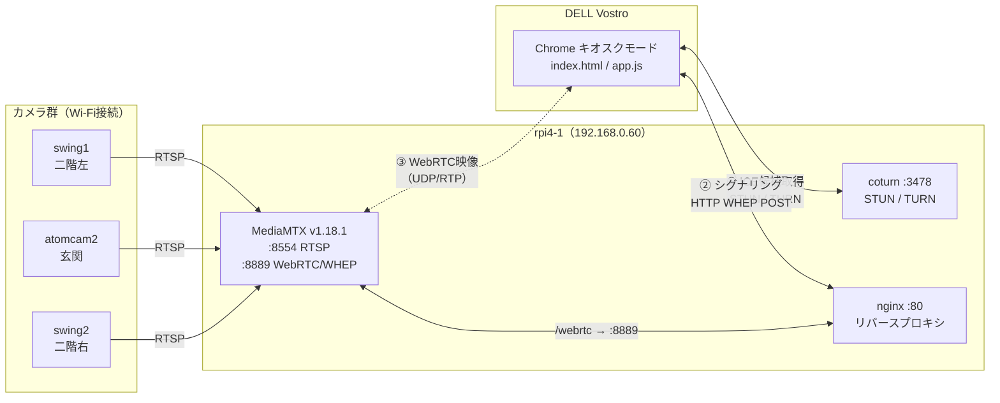
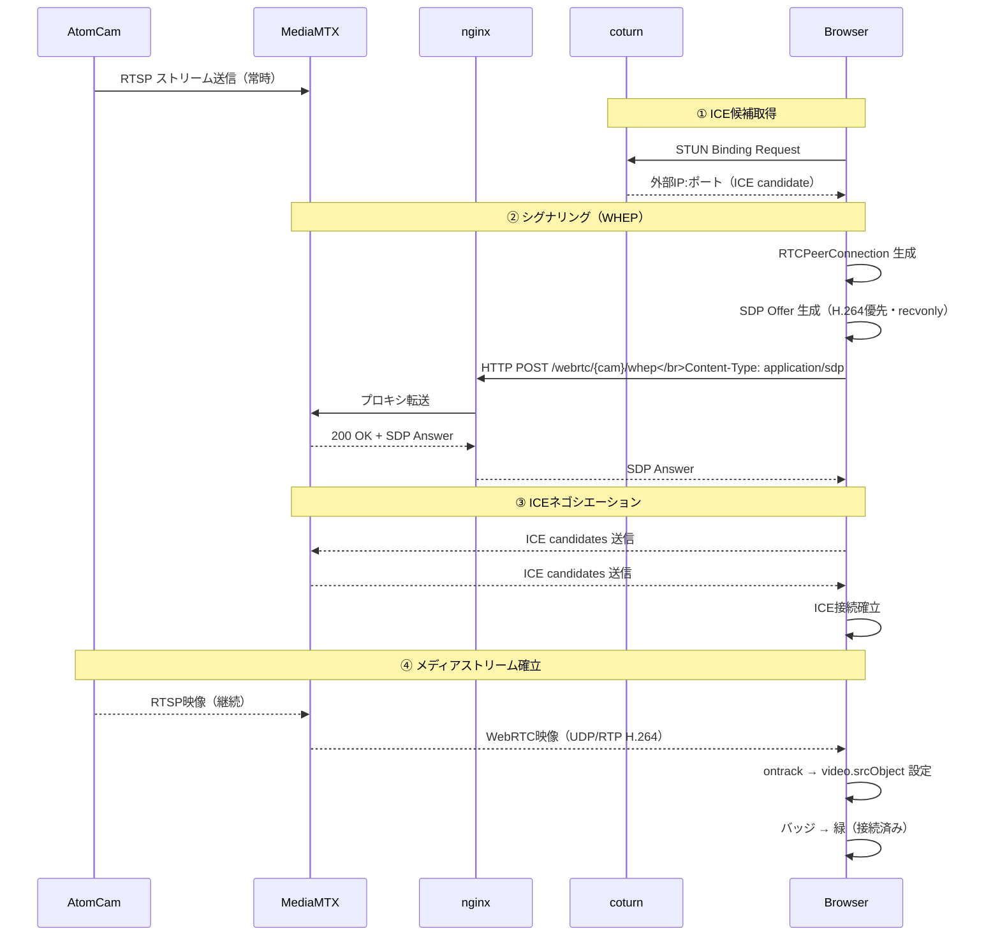
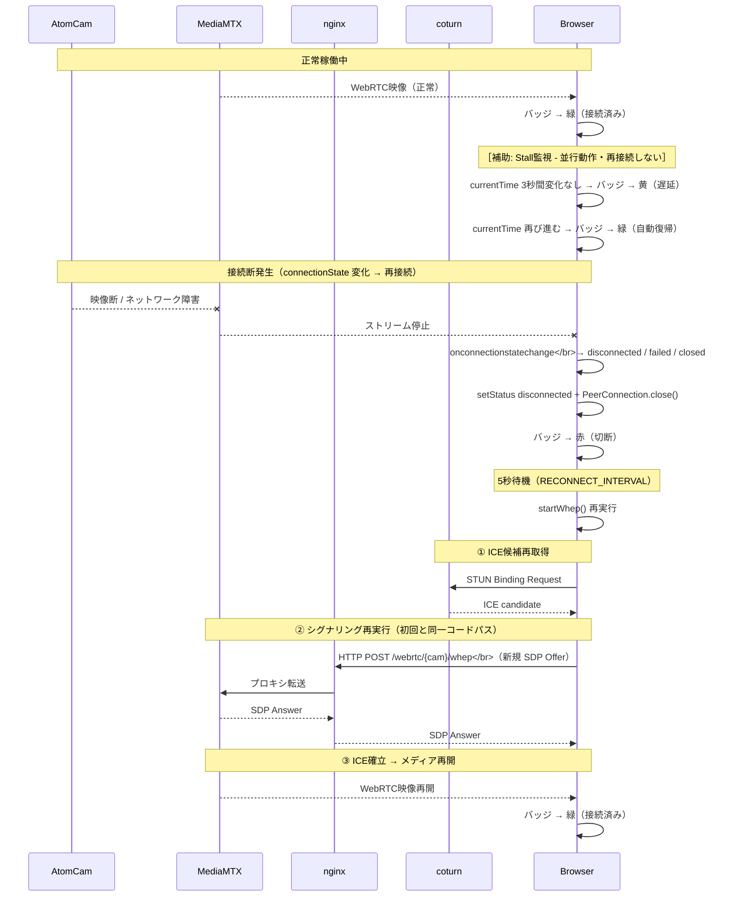

# セキュリティモニター - ストリーミング

## 1. システム概要

3台のAtomCamの映像を、WHEP/WebRTCでブラウザに表示するキオスクモニターシステム。
Raspberry Pi 4（rpi4-1）上のMediaMTXがRTSPストリームをWebRTCに変換し、nginx経由でDELL Vostro上のChrome（キオスクモード）に配信する。

### システム構成図



### ファイル構成

| ファイル | 役割 |
|----------|------|
| `/var/www/html/index.html` | ページ構造（ヘッダー、カメラグリッド、全画面オーバーレイ） |
| `/var/www/html/app.js` | メインスクリプト（WHEP接続、時計、stall検出、全画面制御） |
| `/var/www/html/style.css` | スタイルシート（キオスクレイアウト、グリッド、バッジ色） |

### カメラ一覧

| カメラ名 | 表示名 | グリッド位置 |
|----------|--------|-------------|
| `swing1` | ATOM Cam Swing 二階部屋左側 | 左上 |
| `atomcam2` | ATOM Cam 2 玄関 | 右上 |
| `swing2` | ATOM Cam Swing 二階部屋右側 | 左下 |

※ 右下（4マス目）はメトリクスグラフ。

---

## 2. ストリーミング技術

### 2.1 WHEP（WebRTC-HTTP Egress Protocol）

MediaMTXが提供するWHEPエンドポイント（`/webrtc/{カメラ名}/whep`）に対し、ブラウザ側からSDP OfferをHTTP POSTすることでWebRTC接続を確立する。nginx がリバースプロキシとして`/webrtc`パスをMediaMTXへ中継する。

#### 接続フロー（app.js: `startWhep`関数）

1. `RTCPeerConnection`を生成（STUNサーバー指定）
2. 受信専用トランシーバーを追加（映像：`recvonly`）
3. H.264コーデックを優先設定（AtomCamのH.264配信に合わせる）
4. SDP Offerを生成し、ICEギャザリング完了を待機（最大3秒タイムアウト）
5. WHEPエンドポイントへOfferをPOST
6. サーバーから返されたSDP Answerをリモートに設定
7. `ontrack`コールバックで受信ストリームを`<video>`要素に接続

#### 初回接続シーケンス図



#### 初回接続 各ステップ詳細

> **Vanilla ICE について**: 本実装は ICE candidate を SDP Offer/Answer に埋め込んで一括送受信する **Vanilla ICE** 方式を採用している。Trickle ICE のような candidate の逐次交換メッセージは発生しない。

**前提: `Cam ->> MTX` RTSP ストリーム送信**

AtomCam は電源投入後、常時 RTSP で映像を MediaMTX へ送信し続ける（app.js の処理対象外）。

---

**① ICE候補取得**

| 矢印 | コード（app.js） | 説明 |
|------|----------------|------|
| `Br ->> CT: STUN Binding Request` | L83-85: `new RTCPeerConnection({iceServers:[{urls:'stun:192.168.0.60:3478'}]})` | `RTCPeerConnection` 生成と同時にブラウザが自動で coturn に STUN Binding Request を UDP 送信する。`iceServers` に指定した URL が送信先を決める |
| `CT -->> Br: ICE candidate` | L165-172: `pc.onicegatheringstatechange = () => { if (pc.iceGatheringState === 'complete') resolve() }` | coturn が「あなたの送信元は `IP:ポート`」と返答。ブラウザは **server-reflexive candidate** として SDP に自動埋め込む。`onicegatheringstatechange` で収集完了を検知する |

> **注**: L117-121 の `onicecandidate` は `onconnectionstatechange` ハンドラ内に定義されており、初回ギャザリングには適用されない（状態変化後のデバッグログ用途のみ）。

---

**② シグナリング（WHEP）**

| 矢印 | コード（app.js） | 説明 |
|------|----------------|------|
| `Br: RTCPeerConnection 生成` | L83-85 | coturn STUN を `iceServers` に指定して生成。同時に ICE ギャザリングが開始される |
| `Br: SDP Offer 生成（H.264優先・recvonly）` | L137 `addTransceiver('video',{direction:'recvonly'})` → L141-155 H.264 コーデック優先 (`setCodecPreferences`) → L161 `createOffer()` → L162 `setLocalDescription(offer)` → L165-177 ICE ギャザリング完了待ち（max 3秒） → L180 `pc.localDescription.sdp` | 受信専用トランシーバー追加→H.264を先頭に並べ替えて Offer 生成。**Vanilla ICE** のため ICE candidate 収集完了まで最大3秒待機し、candidate を含む完全な SDP を `localDescription.sdp` から取得する |
| `Br ->> Ng: HTTP POST /webrtc/{cam}/whep` | L76 `` whepUrl=`${WHEP_BASE}/${name}/whep` `` → L183-187 `fetch(whepUrl, {method:'POST', headers:{'Content-Type':'application/sdp'}, body:gatheredSdp})` | ICE candidate を含む完全な SDP Offer を nginx の WHEP エンドポイントへ POST する。`Content-Type: application/sdp` が WHEP プロトコルの仕様 |
| `Ng ->> MTX: プロキシ転送` | nginx 設定（app.js 外） | nginx が `/webrtc` パスを MediaMTX `:8889` に転送する |
| `MTX -->> Ng: 200 OK + SDP Answer` | MediaMTX 処理（app.js 外） | MediaMTX が Offer を解析し、自身の ICE candidate を含む SDP Answer を返す |
| `Ng -->> Br: SDP Answer` | L194 `const answerSdp = await resp.text()` → L195-198 `pc.setRemoteDescription({type:'answer', sdp:answerSdp})` | `fetch()` レスポンスから SDP Answer テキストを取得し、`setRemoteDescription()` でリモート側の ICE candidate・コーデック情報を登録する |

---

**③ ICEネゴシエーション**

| 矢印 | コード（app.js） | 説明 |
|------|----------------|------|
| `Br ↔ MTX: ICE candidates 交換` | Vanilla ICE（SDP 埋め込み済み） | candidate 情報は SDP Offer/Answer に含まれており別途交換しない。`setRemoteDescription()` 後に双方が candidate ペアを使って **ICE Connectivity Check**（STUN Binding Request の往復）を UDP で実施し、到達可能な経路を選定する |
| `Br: ICE接続確立` | L105 `pc.onconnectionstatechange = () => {...}` → L125-126 `if (state === 'connected') { setStatus(statusId, 'connected') }` | ICE Connectivity Check 成功後、`connectionState` が `'connected'` に変化すると `onconnectionstatechange` が発火。`setStatus()` でバッジを緑（接続済み）に更新する |

---

**④ メディアストリーム確立**

| 矢印 | コード（app.js） | 説明 |
|------|----------------|------|
| `MTX -->> Br: WebRTC映像（UDP/RTP H.264）` | ブラウザ内部 WebRTC トランスポート層 | ICE 経路確立後、MediaMTX が RTSP 映像を RTP/SRTP パケットに変換して UDP 送信を開始する |
| `Br: ontrack → video.srcObject 設定` | L92-98: `pc.ontrack = (event) => { videoEl.srcObject = event.streams[0]; startStallDetector(videoEl, statusId) }` | 最初の RTP パケット受信でブラウザが `ontrack` を発火する。`event.streams[0]` を `<video>` の `srcObject` に代入して映像表示を開始する。同時に `startStallDetector()` で Stall 検出タイマーを起動する |
| `Br: バッジ → 緑（接続済み）` | ③と同タイミング（L125-126） | `connectionState === 'connected'` 検出時点ですでに実行済み |

#### 自動再接続

`onconnectionstatechange`で接続状態を監視し、`disconnected`/`failed`/`closed`のいずれかになった場合、`PeerConnection`を閉じて5秒後（`RECONNECT_INTERVAL`）に再接続を試行する。接続エラー（fetch失敗等）時も同様に再接続する。

#### 再接続シーケンス図

> **図の注意**: Stall検出（映像フリーズ）はバッジを黄に変えるだけで再接続しない。再接続を担うのは `connectionState` 変化のみ。



#### 再接続 各ステップ詳細

**Stall検出（補助機能）vs connectionState（再接続トリガー）の違い**

| 検出方法 | コード（app.js） | 動作 | 再接続 |
|---------|----------------|------|--------|
| Stall検出 | L247-282 `startStallDetector` の `setInterval(1秒)` | `video.currentTime` が3秒間変化しない → バッジ黄、再び進む → バッジ緑に自動復帰 | **しない** |
| `connectionState` 変化 | L105 `onconnectionstatechange` → L128 `['disconnected','failed','closed'].includes(state)` | バッジ赤 → 5秒後に `startWhep()` 再実行 | **する** |

Stall検出は映像フリーズを可視化する補助機能であり、**再接続を担うのは `onconnectionstatechange` のみ**。

---

**接続断検出〜再接続 各ステップ**

| 矢印 | コード（app.js） | 説明 |
|------|----------------|------|
| `Cam --x MTX: 映像断` | app.js 外 | ネットワーク障害やカメラ電源断で RTSP が途絶える |
| `MTX --x Br: ストリーム停止` | WebRTC トランスポート層 | RTSP が途絶えると MediaMTX から RTP 送信が止まり、ICE が維持できなくなる |
| `Br: onconnectionstatechange → disconnected/failed/closed` | L105 `pc.onconnectionstatechange = () => {...}` → L128 `} else if (['disconnected','failed','closed'].includes(state)) {` | ICE 維持失敗で `connectionState` が `disconnected` → `failed` と遷移する。`onconnectionstatechange` が発火する。`'closed'` はコード側で `pc.close()` を呼んだ場合 |
| `Br: setStatus disconnected + PeerConnection.close()` | L129 `setStatus(statusId, 'disconnected')` → L130 `pc.close()` | バッジを赤（切断）に更新し、古い PeerConnection を明示的に閉じてリソースを解放する |
| `5秒待機 → startWhep() 再実行` | L132 `setTimeout(() => startWhep(cam), RECONNECT_INTERVAL)` fetch失敗時: L204 `setTimeout(() => startWhep(cam), RECONNECT_INTERVAL)` | `RECONNECT_INTERVAL`=5000ms 後に `startWhep(cam)` を再帰呼び出しする。fetch 失敗（カメラ未起動等）でも同じ間隔で再試行する |

---

**Stall検出 各ステップ**

| 矢印 | コード（app.js） | 説明 |
|------|----------------|------|
| `currentTime 3秒変化なし → バッジ → 黄（遅延）` | L247-271: `setInterval(() => { if (currentTime === lastTime) { stalledSec++ } if (stalledSec >= STALL_THRESHOLD && !isStalled) { setStatus(statusId, 'delayed') } }, 1000)` | 1秒ごとに `video.currentTime` をチェック。前回値と同じなら `stalledSec` をインクリメント。`STALL_THRESHOLD`=3秒以上継続で `delayed` バッジ（黄）に切り替える |
| `currentTime 再び進む → バッジ → 緑（自動復帰）` | L273-277: `else if (stalledSec < STALL_THRESHOLD && isStalled) { isStalled = false; setStatus(statusId, 'connected') }` | `stalledSec` が閾値未満に戻ると自動で `connected` バッジ（緑）に復帰する |
| 誤検知防止 | L250-254: `if (videoEl.paused \|\| videoEl.readyState < 2) { lastTime = null; stalledSec = 0; return }` | 一時停止中・未ロード中はチェックをスキップしカウンターをリセットする |
| タイマー多重起動防止 | L238-240: `if (stallTimers[statusId]) { clearInterval(stallTimers[statusId]) }` | 再接続のたびに `startStallDetector` が呼ばれるため、前回のタイマーを `clearInterval` してから新しいタイマーを起動する |

---

以降の再接続手順（① ICE取得 → ② シグナリング → ③ ICE確立 → メディア再開）は初回接続フローと同一のコードパスを経る（`startWhep()` の再帰呼び出し）。

### 2.2 MediaMTXとgo2rtcの比較

両者とも「RTSPなどのストリームをWebRTC（WHEP）等に変換してブラウザに配信する」役割は共通。

| 項目 | go2rtc | MediaMTX |
|------|--------|----------|
| 設計思想 | 軽量・プロトコル変換ブリッジ特化 | 多機能メディアサーバー |
| 対応プロトコル | RTSP, WebRTC, MSE, HLS | RTSP, RTMP, HLS, WebRTC, SRT 等 |
| 設定 | YAMLで最小限 | パス単位の細かな制御が可能 |
| 追加機能 | 基本的に変換のみ | 録画、認証、詳細制御 |

※ 本システムではgo2rtcで接続断が頻発したため、MediaMTX v1.18.1 + coturnに移行して安定稼働している。

### 2.3 STUN（Session Traversal Utilities for NAT）

WebRTC接続確立時に「自分の外部IP・ポートを知る」ための仕組み。

#### 必要性

WebRTCはP2P通信だが、端末は通常NATの配下にあり、グローバルIPやNATマッピングされたポートを自身では把握できない。STUNサーバーに問い合わせることで「外から見たIP:ポート」（ICE candidate）を取得し、相手に伝えて接続経路を確立する。

#### 動作の流れ

1. 端末がSTUNサーバーにパケットを送信
2. STUNサーバーが「あなたのパケットはこのIP:ポートから届いた」と応答
3. 端末がその情報をICE candidateとしてSDPに含め、相手に送信

#### 本システムでの設定

```javascript
const pc = new RTCPeerConnection({
    iceServers: [{ urls: 'stun:192.168.0.60:3478' }],
});
```

rpi4-1上のローカルSTUNサーバー（192.168.0.60:3478）を使用。LAN内完結の通信のため、外部STUNサーバー（例：`stun:stun.l.google.com:19302`）は使わず、mDNS名前解決問題を回避する構成。coturnがSTUN兼TURNとして動作しており、STUNだけではNATの種類によって接続できないケースをTURNリレーで補完する。

---

## 3. app.js の主要機能

### 3.1 時計更新（`updateClock`関数）

`setInterval`で1秒ごとに`YYYY-MM-DD HH:MM:SS`形式で右上の時計表示を更新する。`pad2`ヘルパーでゼロ埋め2桁に整形。

### 3.2 接続状態バッジ（`setStatus`関数）

各カメラの接続状態を4色のバッジで表示する。

| 状態 | CSSクラス | バッジ色 | 日本語ラベル |
|------|-----------|----------|-------------|
| 接続済み | `connected` | 緑 (`#2a7`) | 接続済み |
| 接続中 | `connecting` | オレンジ (`#a70`) | 接続中... |
| 切断 | `disconnected` | 赤 (`#a22`) | 切断 |
| 遅延 | `delayed` | 黄 (`#cc0`) | 遅延 |

### 3.3 Stall検出（`startStallDetector`関数）

WebRTCの`connectionState`が`connected`のままでも、カメラ側やネットワークの問題で映像フレームが届かなくなるケースがある。この「接続は維持されているが映像は停止している」状態を検出する仕組み。

#### 検出ロジック

`setInterval`で1秒ごとに`video.currentTime`をチェックし、前回と同じ値であればフレーム停止とカウント。`STALL_THRESHOLD`（3秒）連続で停止した場合を「遅延」と判定する。

| 条件 | 動作 |
|------|------|
| `currentTime`が毎秒進む | 正常再生 → バッジ緑 |
| `currentTime`が3秒間変化なし | stall検出 → バッジ黄に切替 |
| `currentTime`が再び進む | stall解消 → バッジ緑に復帰 |

#### 誤検知防止

- `videoEl.paused`（一時停止中）や`readyState < 2`（データ未読み込み）の場合はチェックをスキップし、カウンターもリセット
- `stallTimers`マップで各カメラのタイマーIDを管理し、再接続時の多重起動を防止

### 3.4 全画面オーバーレイ

#### `openFullscreen(camName)`

グリッド上のカメラパネルをクリックすると呼び出される。グリッド側`<video>`の`srcObject`をオーバーレイ側`<video>`に共有（ストリーム共有）し、カメラ名をオーバーレイ内に表示してオーバーレイを可視化する。ストリーム未接続の場合は何もしない。

#### `closeFullscreen()`

オーバーレイを`hidden`クラスで非表示にし、オーバーレイ側の`srcObject`を`null`に解放する。グリッド側のストリームは継続再生される。

#### イベント登録

```javascript
// 各カメラパネルのクリックで全画面表示
document.querySelectorAll('.camera-panel').forEach((panel) => {
    panel.addEventListener('click', () => {
        const camName = panel.dataset.cam;
        openFullscreen(camName);
    });
});

// 戻るボタンで全画面を閉じる
backBtn.addEventListener('click', closeFullscreen);
```

`addEventListener`の第2引数に`closeFullscreen`を括弧なしで渡すことで、関数への参照を登録している（その場で実行しない）。

---

## 4. index.html の構造

- **ヘッダー**: タイトル「セキュリティ モニター」と右上の時計（`#clock`）
- **カメラグリッド（`#grid`）**: 2×2のCSSグリッドに3つの`.camera-panel`を配置。各パネルは`data-cam`属性でカメラ名を保持し、内部にタイトルバー（カメラ名＋接続状態バッジ）と`<video>`要素を持つ
- **全画面オーバーレイ（`#fullscreen-overlay`）**: 初期状態は`class="hidden"`で非表示。カメラ名表示、映像表示用`<video>`、戻るボタンで構成

各`<video>`要素には`autoplay muted playsinline`属性が設定され、ユーザー操作なしで自動再生する。

---

## 5. style.css のレイアウト

### キオスクモード対応

- `body`に`overflow: hidden`でスクロール完全無効
- `height: 100vh`でビューポート高さに固定

### グリッドレイアウト

```css
grid-template-columns: 1fr 1fr;   /* 2列均等 */
grid-template-rows: 1fr 1fr;      /* 2行均等 */
grid-template-areas:
    "cam1 cam2"                   /* 上段 */
    "cam3 .  ";                   /* 下段：右は空欄 */
```

- スマホ（768px以下）では縦1列に切り替わるレスポンシブ対応
- 各パネルに`min-height: 0; min-width: 0; overflow: hidden`でグリッドセルからのはみ出しを防止

### 全画面オーバーレイ

- `position: fixed`で画面全体を覆う
- `z-index: 1000`で最前面に表示
- 映像は`object-fit: contain`でアスペクト比を維持
