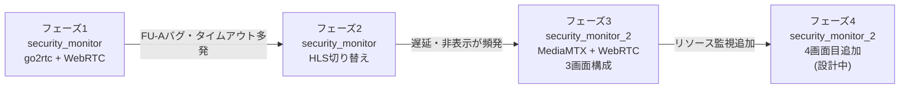
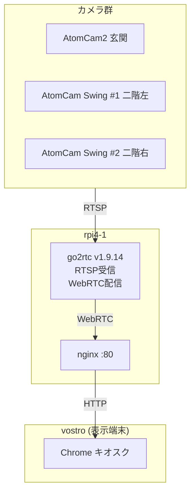
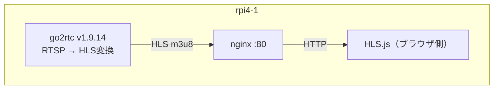
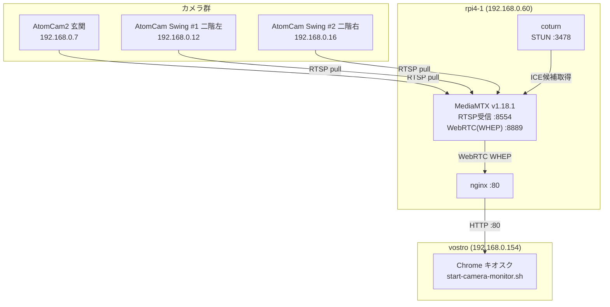
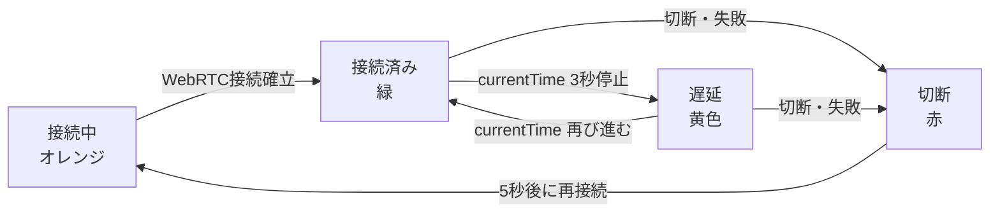

# セキュリティモニター 設計変遷履歴

## 概要

本文書は、セキュリティモニターシステムの設計変遷を記録する。
初代実装 (`security_monitor`) の課題を起点に、再設計・再実装した。 
`security_monitor_2` への移行過程と、今後の拡張計画を記述する。

---

## 設計フェーズ一覧



---

## フェーズ1：security_monitor（go2rtc + WebRTC）

### 期間

2026年5月3日以前

### システム構成



### 画面構成（6画面）

| 画面 | 表示内容 |
|---|---|
| 1 | AtomCam Swing #1（二階左） |
| 2 | AtomCam2（玄関） |
| 3 | AtomCam Swing #2（二階右） |
| 4 | USBカメラ #1 |
| 5 | USBカメラ #2 |
| 6 | vostro CPU温度グラフ |

### 発生した問題

| 問題 | 原因 |
|---|---|
| 映像が黒画面になる | go2rtc の FU-A バグ（H.264 大パケット分割不具合） |
| ICE 接続が完了しない | タイムアウト処理の欠如 |
| 映像が表示されないまま固まる | WebRTC シグナリング失敗時のリカバリなし |
| 再接続ループで CPU 高負荷 | 再接続間隔の未調整 |

---

## フェーズ2：security_monitor（HLS切り替え）

### 期間

2026年5月3日

### 変更内容

go2rtc の FU-A バグを根本回避するため、配信プロトコルを  
**WebRTC → HLS（HTTP Live Streaming）** に切り替えた。



### HLS.js リトライ強化設定

```javascript
const hls = new Hls({
    fragLoadingMaxRetry:        30,   // デフォルト6 → 30（約90秒分）
    fragLoadingRetryDelay:    2000,   // 2秒
    fragLoadingMaxRetryTimeout: 8000  // 8秒
});
```

### 残存した問題

HLS に切り替えることで FU-A バグは回避できたが、  
根本的な遅延・非表示問題は解消されなかった。

| 問題 | 状況 |
|---|---|
| HLS の構造的遅延（5〜15秒） | HLS は仕様上リアルタイム性が低い |
| 黒画面誤検知 | `MANIFEST_PARSED` 前にポーリング開始で誤検知 |
| WiFi 不安定時の接続断 | AtomCam の WiFi 接続品質に依存 |
| 再接続仕様の複雑化 | 5秒待機・複数リトライ・状態管理の複雑化 |
| 映像が表示されない画面が常態化 | タイムアウト多発で非表示のまま放置 |

### 教訓

HLS は録画・録音用途には適しているが、  
**リアルタイム監視モニター**には不向きであることが明確になった。  
根本的な設計変更が必要と判断し、`security_monitor_2` を新規設計することにした。

---

## フェーズ3：security_monitor_2（現在の実装）

### 期間

2026年5月4日〜5日

### 設計方針の転換

| 項目 | 旧設計 | 新設計 |
|---|---|---|
| メディアサーバー | go2rtc v1.9.14 | MediaMTX v1.18.1 |
| 配信プロトコル | WebRTC（後にHLS） | WebRTC（WHEP） |
| 画面数 | 6画面 | 3画面（常時表示） |
| 温度表示 | あり（vostro CPU温度グラフ） | なし（撤廃） |
| コード構成 | 単一HTMLファイル | 3ファイル分離 |
| 目標 | 多機能 | 遅延なく常時3画面表示 |

### システム構成



### ホスト情報

| ホスト | IPアドレス | OS | 役割 |
|---|---|---|---|
| rpi4-1 | 192.168.0.60 | Debian 12 (aarch64) | MediaMTX / coturn / nginx |
| vostro | 192.168.0.154 | Debian 13 | 表示端末（キオスク） |
| AtomCam2 | 192.168.0.7 | - | 玄関カメラ |
| AtomCam Swing #1 | 192.168.0.12 | - | 二階部屋左側 |
| AtomCam Swing #2 | 192.168.0.16 | - | 二階部屋右側 |

### 画面構成（2×2グリッド、3画面使用）

```
┌──────────────┬──────────────┐
│ Swing#1      │ AtomCam2     │
│ (二階左側) 　　│ (玄関) 　　　　│
├──────────────┼──────────────┤
│ Swing#2      │ (フェーズ4)　　│
│ (二階右側) 　　│              │
└──────────────┴──────────────┘
```

### タイムアウト問題の解決策

#### ICE ギャザリングタイムアウト

旧設計では ICE ギャザリング完了を無限に待ち続け、接続が固まる問題があった。
新設計では **3秒タイムアウト** を設けてブロックを防止する。

```javascript
// ICE ギャザリング完了待ち（最大3秒）
await new Promise((resolve) => {
    if (pc.iceGatheringState === 'complete') { resolve(); return; }
    pc.onicegatheringstatechange = () => {
        if (pc.iceGatheringState === 'complete') resolve();
    };
    setTimeout(resolve, 3000);
});
```

#### 自動再接続

切断検知から **5秒後** に再接続を試みる。

```javascript
const RECONNECT_INTERVAL = 5000;  // 5秒後に再接続
```

#### stall 検出（映像停止検知）

`video.currentTime` の変化を1秒ごとに監視し、  
**3秒間変化しない場合** は「遅延」ステータスに遷移する。



### 解決したトラブル一覧

| 問題 | 原因 | 解決策 |
|---|---|---|
| `sourceReconnectPause` エラーで起動失敗 | MediaMTX v1.18.1 で廃止 | 該当行を削除 |
| ポート 8554 競合 | go2rtc が残存 | `systemctl stop go2rtc` |
| `.local` 名前解決失敗 | Go ランタイムが mDNS 非対応 | RTSP ソースを IP アドレス指定に変更 |
| `codecs not supported by client` | AtomCam が LPCM 音声を配信 | audio トランシーバーを削除 |
| ICE 接続失敗（接続中のまま固まる） | Chrome が IP を mDNS 名に変換 | coturn で STUN サーバーを構築 |
| ICE ギャザリングが完了しない | タイムアウト処理なし | 3秒タイムアウトを追加 |
| vostro が旧 go2rtc 画面を表示 | URL が localhost 参照 | URL を `http://rpi4-1.tsystem.gr.jp/` に変更 |
| 映像がセルからはみ出す | flex/grid の `min-height: auto` 問題 | `.camera-panel` に `min-height: 0` を設定 |

### ファイル構成

```
inventory/rpi4-1/
├── @var@www@html@index.html   … HTML構造（カメラグリッド・オーバーレイ）
├── @var@www@html@app.js       … WebRTC接続・stall検出・全画面制御
└── @var@www@html@style.css    … レイアウト・接続状態バッジ・レスポンシブ
```

### 成果

- 3画面が**常時表示**される状態を達成
- タイムアウト・黒画面・非表示の問題が大幅に改善
- コードを3ファイルに分離し、保守性が向上

---

## フェーズ4：4画面目 リソース監視パネル（設計中）

### 目的

2×2グリッドの右下スロット（現在空欄）に、  
**localhost（vostro、client）と rpi4-1 のリソース情報** を表示するパネルを追加する。

### 表示候補項目

| ホスト | 表示候補 |
|---|---|
| localhost（vostro） | CPU使用率、メモリ使用率、ディスク使用率、CPU温度 |
| rpi4-1 | CPU使用率、メモリ使用率、ディスク使用率、CPU温度 |

### 設計方針（未確定）

- vostro 側のリソースは JavaScript から直接 `/proc` または 
  システムコマンドを呼び出すことが難しいため、ローカルAPIを用意する方式を検討
- rpi4-1 のリソースは MediaMTX API または別途エンドポイントを経由して取得する方式を検討

> **注:** フェーズ4の詳細設計は別文書にて記述予定。

---

## 文書一覧

| ファイル | 内容 |
|---|---|
| `doc/design_history.md` | 本文書：設計変遷履歴 |
| `doc/security_monitor.20260504.md` | フェーズ3 システム構築まとめ |
| `doc/security_monitor.20260505.md` | フェーズ3 改修まとめ（ファイル分離・stall検出） |
