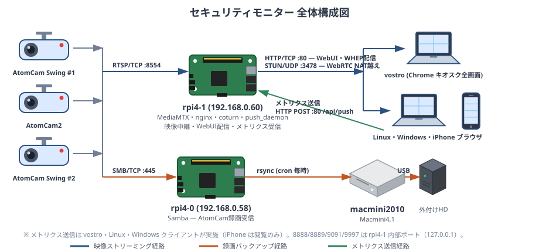
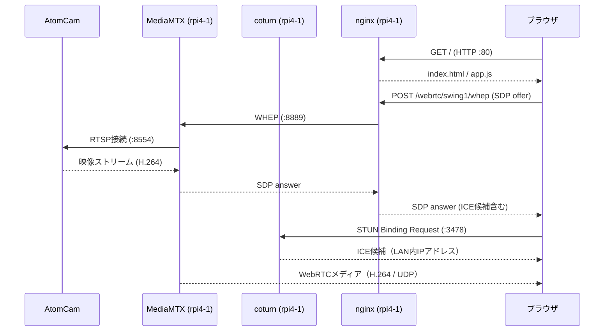
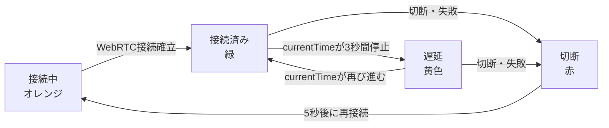
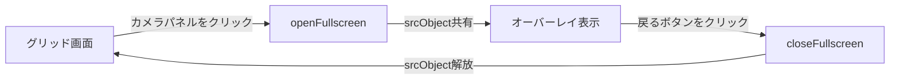
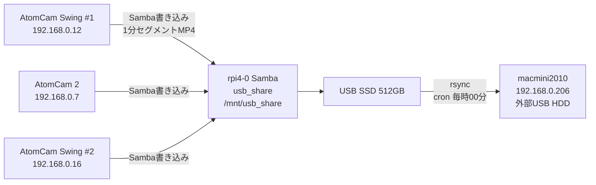
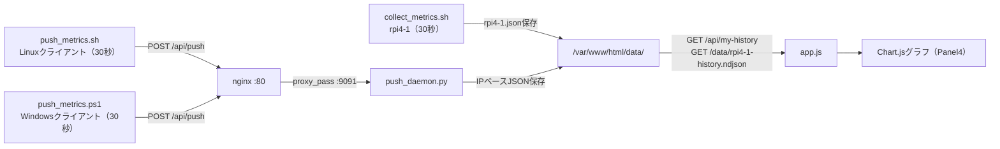

# セキュリティモニター 設計書

作成日: 2026-05-11  
最終更新日: 2026-05-15  
対象バージョン: フェーズ4完成版（security_monitor_2）

---

## 1. システム概要

### 1.1 目的

自宅LAN内に設置したAtomCam 3台の映像を **1画面に集約** して閲覧できるセキュリティモニターの仕組みを構築する。

- **主機能**: 

  AtomCam 3台のRTSPストリームをWebRTC(WHEP)でブラウザに表示（2×2グリッド）

- **副機能**:

  ラズパイおよびクライアントPCのリソース使用状況をリアルタイムにグラフ表示

  (初期開発時、kiosk端末としたvostroのCPU温度が高くなる傾向があったため、確認のための実装)

### 1.2 設計方針

| 方針 | 詳細 |
|---|---|
| LAN内完結 | 映像・メトリクスデータは外部に送信しない |
| atomcam_tools依存 | AtomCamのRTSP配信はatomcam_toolsに委任 |
| 低負荷 | Raspberry Pi 4（4GB RAM）で安定稼働できる構成 |
| ブラウザ標準技術 | WebRTC（WHEP）によりプラグイン不要で映像表示 |
| キオスクモード対応 | vostroをスクロール不要の固定レイアウト専用表示端末として使用 |

### 1.3 システム変遷

| フェーズ | リポジトリ | 映像中継 | 移行理由と対策 |
|---|---|---|---|
| フェーズ1〜3 | security_monitor | go2rtc | WHEPサポートの制約・LAN内ICE候補の解決困難、go2rtcの不具合 |
| フェーズ4 | security_monitor_2 | MediaMTX v1.18.1 | WHEP対応充実・coturnでICE問題を解決 |

---

## 2. システムアーキテクチャ

### 2.1 全体構成図



> 各ノードの内部ポート・コンポーネント構成は「4.1 IPアドレス・ポート一覧」、リソース監視の詳細は「7. リソース監視サブシステム」を参照。

---

## 3. ハードウェア構成

### 3.1 ノード一覧

| ノード | IPアドレス | ハードウェア | 役割 |
|---|---|---|---|
| AtomCam Swing #1 | 192.168.0.12 | ATOM Tech AtomCam Swing | 防犯カメラ（二階左側） |
| AtomCam 2 | 192.168.0.7 | ATOM Tech AtomCam 2 | 防犯カメラ（玄関） |
| AtomCam Swing #2 | 192.168.0.16 | ATOM Tech AtomCam Swing | 防犯カメラ（二階右側） |
| rpi4-1 | 192.168.0.60 | Raspberry Pi 4 (4GBメモリ) | 映像中継・WebUI・メトリクスサーバー |
| rpi4-0 | 192.168.0.58 | Raspberry Pi 4 (8GBメモリ) | AtomCam録画受信サーバー |
| macmini2010 | 192.168.0.206 | Mac mini 2010 (ubuntu 22.04) | 録画バックアップ（不定期起動） |
| vostro | 192.168.0.154 | Dell Vostro 1520 (Debian 13.4) | 専用表示端末（キオスクモード） |

### 3.2 AtomCamスペック

| カメラ | モデル | 解像度 | RTSP URL |
|---|---|---|---|
| AtomCam Swing #1 | ATOM Tech AtomCam Swing | 1080p | rtsp://192.168.0.12:8554/video0_unicast |
| AtomCam 2 | ATOM Tech AtomCam 2 | 1080p | rtsp://192.168.0.7:8554/video0_unicast |
| AtomCam Swing #2 | ATOM Tech AtomCam Swing | 1080p | rtsp://192.168.0.16:8554/video0_unicast |

> RTSP配信はAtomCam内のmicroSDに導入したatomcam_toolsによって有効化される。

### 3.3 ストレージ構成

| ストレージ | ノード | 容量 | 用途 |
|---|---|---|---|
| USB SSD（SE-512GS3D） | rpi4-0（/mnt/usb_share） | 512GB | AtomCam 3台の録画一次保存 |
| 外部USB HDD | macmini2010（/mnt/usb_disk） | 1.8TB | 録画バックアップ（二次保存） |

---

## 4. ネットワーク構成

### 4.1 IPアドレス・ポート一覧

| ノード | IPアドレス | ポート | プロトコル | 用途 |
|---|---|---|---|---|
| AtomCam 3台 | 各IP参照 | 8554 | TCP (RTSP) | RTSP映像配信 |
| rpi4-1 | 192.168.0.60 | 80 | TCP (HTTP) | nginx（WebUI・APIプロキシ） |
| rpi4-1 | 192.168.0.60 | 3478 | UDP (STUN) | coturn STUNサーバー |
| rpi4-1 | 192.168.0.60 | 8888 | TCP (HTTP) | MediaMTX HLS（127.0.0.1のみ） |
| rpi4-1 | 192.168.0.60 | 8889 | TCP (HTTP) | MediaMTX WHEP（127.0.0.1のみ） |
| rpi4-1 | 192.168.0.60 | 9091 | TCP (HTTP) | push_daemon（127.0.0.1のみ） |
| rpi4-1 | 192.168.0.60 | 9997 | TCP (HTTP) | MediaMTX API（127.0.0.1のみ） |
| rpi4-0 | 192.168.0.58 | 445 | TCP (SMB) | Samba（AtomCam録画受信） |

> クライアントからrpi4-1への外部公開ポートは **80（HTTP）と 3478（STUN）** のみ。

---

## 5. カメラ映像サブシステム（主機能）

本システムの主機能。AtomCam 3台の映像をブラウザの1画面に集約し、セキュリティモニターとして使用する。

### 5.1 atomcam_tools の役割

AtomCamはデフォルトでRTSP配信機能を持たない。microSDにatomcam_toolsをインストールすることで以下が有効になる。

| 機能 | 詳細 |
|---|---|
| RTSP配信 | `rtsp://[IP]:8554/video0_unicast` でH.264ストリームを配信 |
| NAS録画 | Sambaサーバーへの録画ファイル書き込み（1分ごとのMP4セグメント） |
| 管理画面 | `http://[IP]/` でatomcam_toolsの設定が可能 |

### 5.2 MediaMTX の役割と設定

rpi4-1で稼働するメディアプロキシサーバー（v1.18.1）。  
AtomCam 3台からRTSPでストリームをプルし、WHEPでブラウザに配信する。

| 機能 | 詳細 |
|---|---|
| RTSP受信 | AtomCam 3台からRTSPストリームをプル（sourceOnDemand: no → 常時接続） |
| WebRTC/WHEP配信 | WHEPプロトコルでブラウザへWebRTC映像を配信（ポート8889） |
| HLS配信 | HLSフォールバック（ポート8888） |
| API | メディアパス管理API（ポート9997） |

**設定ファイル**: `/opt/mediamtx/mediamtx.yml`

```yaml
logLevel: info
logDestinations: [file]
logFile: /var/log/mediamtx.log

rtsp: yes
rtspAddress: :8554

webrtc: yes
webrtcAddress: :8889

hls: yes
hlsAddress: :8888

api: yes
apiAddress: :9997

paths:

  # AtomCam Swing #1（二階部屋左側）
  swing1:
    source: rtsp://192.168.0.12:8554/video0_unicast
    sourceOnDemand: no

  # AtomCam 2（玄関）
  atomcam2:
    source: rtsp://192.168.0.7:8554/video0_unicast
    sourceOnDemand: no

  # AtomCam Swing #2（二階部屋右側）
  swing2:
    source: rtsp://192.168.0.16:8554/video0_unicast
    sourceOnDemand: no
```

> **注意**: MediaMTX v1.18.1では `sourceReconnectPause` は廃止されている。削除すること。

**systemdサービス**: `/etc/systemd/system/mediamtx.service`

```ini
[Unit]
Description=MediaMTX RTSP/WebRTC Server
After=network.target

[Service]
User=root
WorkingDirectory=/opt/mediamtx
ExecStart=/opt/mediamtx/mediamtx /opt/mediamtx/mediamtx.yml
Restart=always
RestartSec=5s

[Install]
WantedBy=multi-user.target
```

### 5.3 WHEP エンドポイント

| カメラ | MediaMTXパス | WHEPエンドポイント（nginx経由） |
|---|---|---|
| AtomCam Swing #1（二階左） | swing1 | http://rpi4-1.tsystem.gr.jp/webrtc/swing1/whep |
| AtomCam 2（玄関） | atomcam2 | http://rpi4-1.tsystem.gr.jp/webrtc/atomcam2/whep |
| AtomCam Swing #2（二階右） | swing2 | http://rpi4-1.tsystem.gr.jp/webrtc/swing2/whep |

### 5.4 coturn STUNサーバーの役割と設定

ChromeブラウザはmDNS obfuscationによりローカルIPアドレスをICE候補として公開しない。  
coturnをSTUNサーバーとして使用することで、LAN内のICE候補を正しく解決しWebRTC接続を確立する。

**設定ファイル**: `/etc/turnserver.conf`

```
# STUNのみ有効化（TURNは不要）
listening-port=3478
listening-ip=192.168.0.60
log-file=/var/log/coturn.log
```

### 5.5 nginx プロキシ構成

**設定ファイル**: `/etc/nginx/sites-available/security-monitor.conf`

| ロケーション | 機能 | バックエンド |
|---|---|---|
| `/` | WebUI（静的ファイル） | /var/www/html/ |
| `/webrtc/` | MediaMTX WebRTC/WHEPシグナリング | http://127.0.0.1:8889/ |
| `/hls/` | MediaMTX HLSフォールバック | http://127.0.0.1:8888/ |
| `/api/` | MediaMTX API | http://127.0.0.1:9997/ |
| `/api/push` | メトリクス受信（push_daemon） | http://127.0.0.1:9091/ |
| `/api/my-metrics` | クライアント自身の最新メトリクス | /var/www/html/data/$remote_addr.json |
| `/api/my-history` | クライアント自身の履歴 | /var/www/html/data/$remote_addr-history.ndjson |
| `/data/` | メトリクスデータ静的配信 | /var/www/html/data/ |

### 5.6 WebRTC接続シーケンス



### 5.7 WebUI 設計（index.html / app.js / style.css）

WebUIはrpi4-1のnginxから配信される。vostroのChromeキオスクモードでの表示に最適化されている。

#### ファイル構成

| ファイル | 配置先 | 役割 |
|---|---|---|
| index.html | /var/www/html/index.html | HTML構造のみ（スタイル・スクリプトは外部化） |
| app.js | /var/www/html/app.js | 時計・WHEP接続・stall検出・全画面制御・リソースグラフ |
| style.css | /var/www/html/style.css | 全スタイル定義 |

#### 2×2グリッドレイアウト

vostro（1280×800）のキオスクモードでスクロールなしに3カメラを表示する。

```
┌──────────────┬──────────────┐
│ swing1       │ atomcam2     │
│ 二階左側      │ 玄関          │
├──────────────┼──────────────┤
│ swing2       │ リソースモニタ │
│ 二階右側      │              │
└──────────────┴──────────────┘
```

| 画面幅 | レイアウト |
|---|---|
| 769px以上（PC） | 2列2行の4マスグリッド（キオスクモード） |
| 768px以下（スマホ） | 1列縦並び |

```css
#grid {
    display: grid;
    grid-template-columns: 1fr 1fr;
    grid-template-rows: 1fr 1fr;
    grid-template-areas:
        "cam1 cam2"
        "cam3 .  ";
}
```

> `min-height: 0` を `.camera-panel` と `.cam-video` に設定することで、  
> グリッドセルからの映像はみ出しを防止する（CSS flex/grid の `min-height: auto` 問題への対処）。

#### 映像stall検出（startStallDetector）

映像に焼き込まれたタイムスタンプはJavaScriptから読み取れないため、  
`video.currentTime` の停止を監視することで映像フリーズを検出する。

**ステータス遷移**



| 状態 | 色 | 表示テキスト | 検出条件 |
|---|---|---|---|
| 接続中 | オレンジ | 接続中... | WebRTC確立前 |
| 接続済み | 緑 | 接続済み | WebRTC確立後 |
| 遅延 | 黄色 | 遅延 | currentTimeが3秒以上停止 |
| 切断 | 赤 | 切断 | 切断・接続失敗 |

- 1秒ごとに `video.currentTime` を前回値と比較
- `video.paused` または `readyState < 2` の場合はスキップ（誤検知防止）
- 切断後5秒で自動再接続

#### 全画面表示（CSSオーバーレイ方式）

Chromeキオスクモードでは Fullscreen API（`requestFullscreen()`）が制限されるため、  
`position: fixed` のCSSオーバーレイで全画面表示を実現する。



グリッド側 `<video>` の `srcObject` をオーバーレイ側に共有するため、WebRTC接続は1本のまま全画面表示が可能。

#### その他のapp.js機能

| 機能 | 詳細 |
|---|---|
| 時計表示 | `YYYY-MM-DD HH:MM:SS` 形式（`toLocaleString` 非使用・固定フォーマット） |
| WHEPAudio除去 | AudioトランシーバーをrecvonlyのみとしてブラウザPipeWireへの大音量出力を防止 |
| ICEギャザリング待機 | SDP POST前にICEギャザリング完了まで待機（最大3秒タイムアウト） |
| リソースグラフ | Chart.js v4でCPU使用率・温度・ディスクI/O・メモリをグラフ表示（Panel4） |
| グラフX軸 | 5分間隔（300秒）でHH:MM形式の時刻ラベルを表示 |

### 5.8 vostro キオスクモード構成

vostroは専用表示端末としてChromeをキオスクモードで常時起動する。

#### 起動スクリプト: `/home/indou/start-camera-monitor.sh`

```bash
#!/bin/bash
# スクリーンセーバー・画面オフを無効化
xset s off
xset -dpms
xset s noblank

# Chromeをキオスクモードで起動
# --mute-audio: WebRTC音声をPipeWireに送信しない（大音量防止）
google-chrome-stable \
    --kiosk \
    --mute-audio \
    --noerrdialogs \
    --disable-infobars \
    --disable-session-crashed-bubble \
    --disable-restore-session-state \
    --no-first-run \
    --start-fullscreen \
    --password-store=basic \
    http://rpi4-1.tsystem.gr.jp/
```

#### XDG Autostart: `/home/indou/.config/autostart/camera-monitor.desktop`

```ini
[Desktop Entry]
Type=Application
Name=Camera Monitor
Comment=防犯カメラモニター
Exec=/home/indou/start-camera-monitor.sh
X-GNOME-Autostart-enabled=true
```

ログイン時(現在、ログイン認証なし)に自動起動することで、電源投入後に自動的に監視画面が表示される。

---

## 6. 録画・バックアップサブシステム

### 6.1 録画フロー図



### 6.2 rpi4-0 録画受信

| 項目 | 設定値 |
|---|---|
| Samba共有名 | usb_share |
| 実体パス | /mnt/usb_share（USB SSD 512GB） |
| デバイス | /dev/sda（SE-512GS3D 476.9GB） |
| ファイルシステム | ext4 |
| 認証 | ゲスト可（guest ok = yes） |
| ディレクトリ構成 | YYYYMMDD/HH/ 配下に1分セグメントMP4 |

### 6.3 macmini2010 バックアップ

#### rpi4-0 からのrsync（rpi4-0のcron）

| cronスケジュール | コマンド | 内容 |
|---|---|---|
| `0 * * * *` | /home/indo/bin/bkup-rpi4-0-to-macmini2010.sh | /mnt/usb_shareから、indo@macmini2010:/mnt/usb_disk/atomcam/へのrsync (削除は行わない) |
| `45 * * * *` | `LOG_DIR=/home/indo/log RETENTION_DAYS=30 /home/indo/bin/rm-log.sh` | 保存期間30日超のスクリプトログファイルを削除 |

#### macmini2010 上のcron

macmini2010はrsyncで受信した録画ファイルの保持期間管理と、ログファイルの削除を行う。

| cronスケジュール | コマンド | 内容 |
|---|---|---|
| `30 * * * *` | `LOG_DIR=/home/indo/log RETENTION_DAYS=30 /home/indo/bin/rm-on-macmini2010.sh` | 保存期間30日超の録画ファイルを削除 |
| `0  * * * *` | `LOG_DIR=/home/indo/log RETENTION_DAYS=30 /home/indo/bin/rm-log.sh` | 保存期間30日超のスクリプトログファイルを削除 |

#### macmini2010 の起動特性

macmini2010は常時起動せず1日数時間のみ稼働する。  
起動後の初回rsyncは数時間〜十数時間分の差分を一括処理するが、これは設計上の想定動作である。  
macmini2010が停止中はrpi4-0のrsyncが失敗するが、次回起動時に差分が吸収される。

---

## 7. リソース監視サブシステム（副機能）

### 7.1 概要

当初、vostro(Debian13)上に、go2rtc、cheome(ブラウザでの表示)機能を集約したため、CPU温度上昇が非常に大きく、機能を他ノードへ移行した経緯から、CPU使用率、CPU温度、ディスクIO、メモリ使用率については、メトリクスを収集し、グラフ表示を行うことにする。



### 7.2 メトリクス収集スクリプト一覧

| スクリプト | 動作ノード | 起動方法 | 収集間隔 |
|---|---|---|---|
| collect_metrics.sh | rpi4-1 | systemd timer（collect-metrics.timer） | 30秒 |
| push_metrics.sh | Linuxクライアント（vostro等） | systemd timer（push-metrics.timer） | 30秒 |
| push_metrics.ps1 | Windowsクライアント | タスクスケジューラ（\SecurityMonitor\push_metrics） | 30秒 |

### 7.3 メトリクスJSONスキーマ

```json
{
  "hostname": "vostro",
  "ts":       "2026-05-11T13:00:00+09:00",
  "cpu":      45.5,
  "temp":     63.0,
  "disk_rw":  1024,
  "mem":      38.9,
  "mem_total":16384000
}
```

### 7.4 データファイル構成

| ファイル | 内容 | 更新タイミング |
|---|---|---|
| `{IP}.json` | 最新メトリクス1件（上書き） | 受信のたびに上書き |
| `{IP}-history.ndjson` | 最大2880行（24時間分）の履歴（NDJSON形式） | 受信のたびに追記 |
| `rpi4-1.json` | rpi4-1自身の最新メトリクス | collect_metrics.sh実行ごとに上書き |
| `rpi4-1-history.ndjson` | rpi4-1自身の履歴 | collect_metrics.sh実行ごとに追記 |

---

## 8. 既知の問題と解決策

移行・構築時に遭遇した問題の記録。

| 問題 | 原因 | 解決策 |
|---|---|---|
| `sourceReconnectPause` エラーで起動失敗 | MediaMTX v1.18.1で廃止されたパラメータ | mediamtx.yml から当該行を削除 |
| ポート8554競合で起動失敗 | go2rtcが残存していた | `systemctl stop go2rtc && systemctl disable go2rtc` |
| `.local` 名前解決失敗 | GoランタイムがmDNS非対応 | RTSPソースをIPアドレスに直接指定 |
| `codecs not supported by client` エラー | AtomCamがLPCM音声を配信、ブラウザが非対応 | app.jsのaudioトランシーバーをrecvonlyのみに変更 |
| ICEギャザリング完了前にSDPをPOSTしてしまう | `SetRemoteDescription: no ice-ufrag` エラー | ICEギャザリング完了まで待機（最大3秒タイムアウト） |
| ICE接続失敗（接続中のまま） | ChromeがLAN内IPをmDNS名（.local）に変換 | coturnでSTUNサーバーを構築 |
| vostroが旧go2rtc画面を表示 | `camera-monitor.desktop` がlocalhost参照 | URLを `http://rpi4-1.tsystem.gr.jp/` に変更 |
| vostroのCPU温度が 0.0 | x86はthermal_zone*が存在しない | push_metrics.shをhwmon経由にも対応（dual source） |
| X軸目盛ラベルが表示されない | Chart.js v4でafterBuildTicksとcallbackの競合 | afterBuildTicksを削除しcallbackのみで制御 |

---

## 9. 今後の拡張

- **WireGuard経由のリモート監視**（外出先からのアクセス）
- スワップのメトリクス取得・グラフ追加
