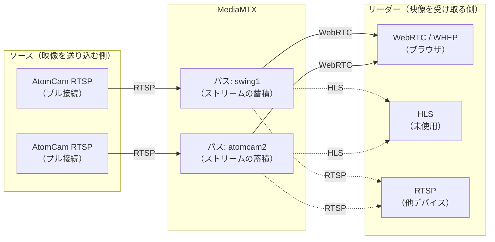
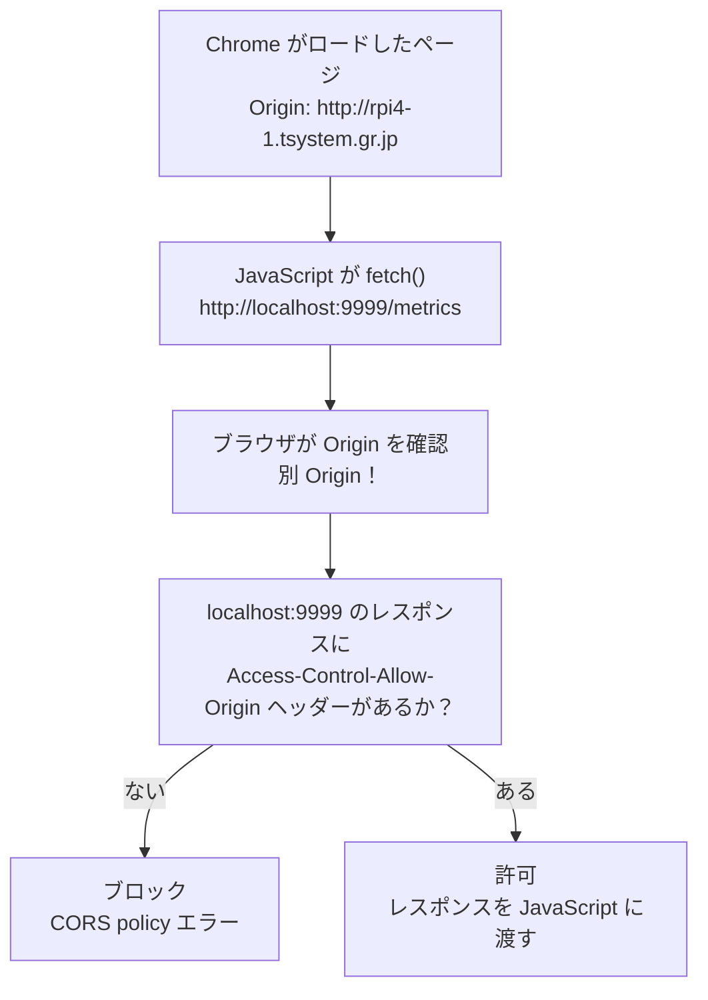

# 用語集

---

## MediaMTX

**MediaMTX** は、RTSP / RTMP / WebRTC / HLS など多様なプロトコルに対応するオープンソースの**メディアルーティングサーバー**。旧称 **rtsp-simple-server**。

### 基本的な役割

MediaMTX の本来の役割は**「ストリームを受け取り、蓄積し、異なるプロトコルで再配信する」**こと。単なるプロトコル変換ブリッジではなく、複数クライアントへの同時配信・録画・認証・パス単位のアクセス制御も担う。

設計の核心は**パス（Path）**という概念にある。



| 概念 | 説明 |
|---|---|
| **パス（Path）** | ストリームの論理的な名前空間（例: `swing1`, `atomcam2`）。ソースとリーダーを仲介する |
| **ソース（Source）** | パスへ映像を送り込む側。本プロジェクトでは MediaMTX が AtomCam へ RTSP プル接続する |
| **リーダー（Reader）** | パスから映像を受け取る側。同一パスに対して複数リーダーが同時接続できる |

#### プル接続の動作

`sourceOnDemand: no` の場合、MediaMTX は起動時に即座にカメラへ接続しにいく。MediaMTX 自身が **RTSP クライアント** として動作し、カメラ側の RTSP サーバーへ能動的に TCP 接続を張る（プル）。

```
MediaMTX（RTSP クライアント）         AtomCam（RTSP サーバー）
      |------ RTSP DESCRIBE -------->|  ストリーム情報を問い合わせる
      |<----- 200 OK + SDP ----------|  コーデック・解像度・FPS を受け取る
      |------ RTSP SETUP ----------->|  RTP セッション（使用ポート）を確立する
      |<----- 200 OK + Session ID ---|
      |------ RTSP PLAY ------------>|  映像の送信を要求する
      |<----- RTP パケット(H.264)  ---|  映像データの受信開始
      |<----- RTP パケット(H.264)  ---|
      |         （以降、継続受信）      |
```

接続が切れた場合、MediaMTX は自動で再接続を試みる。`sourceOnDemand: yes` にするとリーダーが接続したときだけプル接続を張り、全リーダーが切断したら RTSP を切る（待機電力削減に使える）。

#### ストリームの蓄積（バッファリング）

「蓄積」はバッファリングと考えてよい。単純な受信バッファに加えて、以下の働きをする。

| 働き | 説明 |
|---|---|
| **RTP パケットバッファ** | 受け取った RTP パケットを内部リングバッファに一時蓄積する |
| **キーフレーム待機** | 新たなリーダー（ブラウザ）が接続した際、直近のキーフレーム（I フレーム）から配信を開始する。これにより接続直後から映像が表示される |
| **ジッター吸収** | ソースの送信タイミングとリーダーの受信タイミングのズレを吸収する |

### 変換の仕組み（リマックス）

MediaMTX はデフォルトでは**コーデックの再エンコードを行わない**。RTSP で受け取った H.264 の RTP パケットを、WebRTC 向けの SRTP パケットとして**そのまま詰め替える（リマックス）**だけである。

これにより：
- CPU 負荷を最小限に抑えられる（エンコード処理不要）
- 映像品質が劣化しない（コーデック変換なし）
- 低レイテンシを維持できる

> ブラウザは RTSP を直接受信できないため、HTTP ベースのシグナリング（WHEP）と UDP/RTP ベースのメディア伝送（WebRTC）に変換して届ける必要がある。

### 本プロジェクトでの役割

AtomCam が配信する **RTSPストリームを WebRTC（WHEP）に変換** し、ブラウザに映像を届けるためにrpi4-1上で稼働している。  
go2rtc に代わって採用した（go2rtcの不安定さと、WHEPのネイティブ対応とICE候補処理の安定性が主な理由）。

| 項目 | 設定値 |
|---|---|
| バージョン | v1.18.1 |
| インストール先 | /opt/mediamtx/ |
| 設定ファイル | /opt/mediamtx/mediamtx.yml |

#### 使用ポート

| ポート | プロトコル | 用途 |
|---|---|---|
| 8554 | TCP (RTSP) | AtomCam からのRTSP受信 |
| 8889 | TCP (HTTP) | WHEPエンドポイント（ブラウザ向け） |
| 8888 | TCP (HTTP) | HLSエンドポイント（未使用） |
| 9997 | TCP (HTTP) | 管理API（パス一覧・状態確認） |

#### パス設定

```yaml
# /opt/mediamtx/mediamtx.yml
paths:
  swing1:
    source: rtsp://192.168.0.12:8554/video0_unicast
    sourceOnDemand: no
  atomcam2:
    source: rtsp://192.168.0.7:8554/video0_unicast
    sourceOnDemand: no
  swing2:
    source: rtsp://192.168.0.16:8554/video0_unicast
    sourceOnDemand: no
```

#### WHEPエンドポイント

ブラウザは以下URLに対してWHEP（HTTP POST）で映像を取得する。nginx経由でMediaMTXに転送される。

| カメラ | WHEP URL |
|---|---|
| AtomCam Swing #1 | `http://rpi4-1.tsystem.gr.jp/webrtc/swing1/whep` |
| AtomCam 2 | `http://rpi4-1.tsystem.gr.jp/webrtc/atomcam2/whep` |
| AtomCam Swing #2 | `http://rpi4-1.tsystem.gr.jp/webrtc/swing2/whep` |

### 用語の区別

| 用語 | 説明 |
|---|---|
| **RTSP** | Real Time Streaming Protocol。TCP で制御コマンド（DESCRIBE / SETUP / PLAY）をやり取りし、RTP（UDP または TCP）で映像データを転送する。監視カメラ・IP カメラの標準的な配信方式。**ブラウザは直接受信できない**ため、本プロジェクトでは MediaMTX で WebRTC に変換する |
| **WebRTC** | Web Real-Time Communication。ブラウザに組み込まれたリアルタイム通信の Web 標準（W3C / IETF）。メディアは RTP/SRTP（UDP）で転送し、NAT 越えに ICE / STUN を使う。プラグイン不要で低レイテンシ（< 500 ms）が特徴 |
| **HLS** | HTTP Live Streaming。映像を数秒単位のセグメントファイル（`.ts`）に分割して HTTP で順次配信する Apple 発のプロトコル。ほぼ全デバイスで再生可能だがレイテンシが大きい（5〜30 秒）。監視カメラのリアルタイム表示には不向き |
| **WHEP** | WebRTC-HTTP Egress Protocol。ブラウザが HTTP POST で SDP Offer を送り、サーバーから SDP Answer を受け取って WebRTC 接続を確立するシグナリングプロトコル |
| go2rtc | MediaMTX 採用前に使用していたメディアサーバー（security_monitor フェーズ1〜3） |

---

## coturn

**coturn** は、STUN/TURNサーバーのオープンソース実装。

### 本プロジェクトでの役割

本プロジェクトでは **STUNサーバー** としてのみ使用する（TURN機能は不要）。

#### 問題の背景

Google Chromeは **mDNS obfuscation** 機能により、ローカルIPアドレス（192.168.x.x）をWebRTC ICE候補として直接公開せず、`.local` のmDNS名に変換する。  
しかし、MediaMTXはmDNS名を解決できないため、ICE候補のマッチングに失敗しWebRTC接続が確立されない。

#### 解決策

rpi4-1上でcoturnをSTUNサーバーとして起動し、ブラウザの `RTCPeerConnection` の `iceServers` に登録する。  
STUNサーバーを経由することでChromeはLAN内のIPアドレスをICE候補として得られるようになり、WebRTC接続が確立される。

| 項目 | 設定値 |
|---|---|
| ホスト | rpi4-1（192.168.0.60） |
| ポート | UDP 3478 |
| 設定ファイル | /etc/turnserver.conf |
| 機能 | STUNのみ有効（TURN無効） |

```
# /etc/turnserver.conf
listening-port=3478
listening-ip=192.168.0.60
log-file=/var/log/coturn.log
```

### 用語の区別

| 用語 | 説明 |
|---|---|
| STUN | クライアントが自分のグローバルIPを知るためのプロトコル。LAN内では「NAT外側のIP」ではなく「ICE候補の収集」に使われる |
| TURN | STUNで接続できない場合にメディアをリレーするプロトコル。本プロジェクトでは不使用 |
| ICE | WebRTCが接続経路（ICE候補）を収集・選択するためのフレームワーク |
| mDNS obfuscation | ChromeがローカルIPをmDNS名に変換するプライバシー保護機能 |

---

## ICE candidate（候補）

**ICE candidate**（候補）は、WebRTC の **ICE**（Interactive Connectivity Establishment、RFC 8445）が「対向ピアと UDP/TCP で通信するための接続先 = IP アドレスとポートの組」を列挙したものです。各ピアが自身の到達可能な経路を列挙して候補として相手に提示し、双方が **Connectivity Check**（互いに STUN Binding を送り合う）を実施して実際に通る経路を1つ選定します。

### 候補の種類

候補には収集方法に応じて4種類があります。SDP の `a=candidate:` 行の末尾 `typ <種別>` で示されます。

| 種別 | 略称 | 説明 | 本プロジェクトでの典型例 |
|---|---|---|---|
| host | host | ピア自身の NIC に割り当てられた IP（LAN内アドレス含む） | rpi4-1 の `192.168.0.60:8189`、ブラウザ側 `192.168.0.x:xxxxx` |
| server-reflexive | srflx | STUN サーバを介して得られる「相手から見た自分のアドレス」（NAT 外側の IP） | LAN内のため通常 host と同じ IP・別ポート |
| peer-reflexive | prflx | 接続確認の途中で相手側から観測された送信元アドレス。事前収集ではなく Connectivity Check 中に動的に発見される | go2rtc の `/api/streams` で `remote_addr: "192.168.0.141:56059 prflx"` のように現れる |
| relay | relay | TURN サーバ経由でリレーされるアドレス。NAT越えに失敗した最終手段 | 本プロジェクトでは未使用（TURN 不採用） |

### SDP 上の表現

ICE candidate は SDP の `a=candidate:` 行として記述されます。

```
a=candidate:1 1 UDP 2122252543 192.168.0.60 8189 typ host
a=candidate:2 1 UDP 1686052607 192.168.0.60 8189 typ srflx raddr 192.168.0.60 rport 8189
```

| フィールド | 例 | 意味 |
|---|---|---|
| foundation | `1` | 同種別・同IP・同STUN由来をまとめる識別子 |
| component | `1` | RTP=1、RTCP=2（RTCP-mux 使用時は 1 のみ） |
| transport | `UDP` | トランスポートプロトコル |
| priority | `2122252543` | 候補の優先度。host > srflx > prflx > relay |
| address / port | `192.168.0.60 8189` | 接続先 IP とポート |
| typ | `host` | 候補種別 |
| raddr / rport | `192.168.0.60 8189` | srflx/prflx/relay の場合の「内側のアドレス」（参考情報） |

### mDNS obfuscation と candidate の関係

Chrome（80以降、`anonymize-local-ips-in-webrtc-ice-candidates` 機能）は、プライバシー保護のため **host 候補の IP アドレスを `<UUID>.local` 形式の mDNS 名に置換** してから対向ピアに送信します。これにより、Web ページが自身のローカル IP を把握することを防ぎます。

```
通常:    a=candidate:1 1 UDP 2122252543 192.168.0.141 56059 typ host
obfusc:  a=candidate:1 1 UDP 2122252543 a1b2c3d4-....local 56059 typ host
```

mDNS を解決できない対向ピア（go2rtc v1.9.14 はこれに該当）では、host 候補が使い物にならず ICE 接続が成立しません。本プロジェクトのフェーズ1〜3で発生した「LAN内ICE候補の解決困難」はこの問題が直接の原因です。

### 解決策（フェーズ4以降）

rpi4-1 上に coturn を STUN サーバとして配置し、ブラウザが **srflx 候補** を取得できるようにしています（[coturn](#coturn) 参照）。srflx 候補は STUN サーバから返される「外から見た IP」で、obfuscation の対象外であるため、mDNS 名ではなく実 IP（LAN内では host と同等のアドレス）が candidate として相手に届きます。

### Vanilla ICE と Trickle ICE

| 方式 | 動作 | 本プロジェクト |
|---|---|---|
| Vanilla ICE | 全候補を収集してから SDP に埋め込んで一括送信。シグナリングは1往復 | **採用**（WHEP の前提） |
| Trickle ICE | 候補を収集次第、逐次相手に送信。シグナリング双方向が必要 | 不採用 |

ブラウザ実装（`inventory/rpi4-1/@var@www@html@app.js`）では、ICE ギャザリング完了を最大3秒待ち、収集した全候補を SDP Offer に含めてから WHEP エンドポイントへ POST しています。

### 参考

- RFC 8445（Interactive Connectivity Establishment）
- RFC 8838（Trickle ICE）
- 関連項目: [coturn](#coturn) / [SDP Offer/Answer](#sdp-offeranswer) / [WHEP](#whepwebrtc-http-egress-protocol)

---

## ICE ギャザリング（ICE gathering）

**ICE ギャザリング** は、`RTCPeerConnection` が **ICE candidate を収集するフェーズ** を指します。ブラウザがネットワークインターフェイスを走査し、必要に応じて STUN/TURN サーバへ問い合わせを行い、host・srflx・relay の各候補を1つずつ揃えていきます。

### 状態遷移

`RTCPeerConnection.iceGatheringState` プロパティで現在の状態を確認できます。

| 状態 | 説明 |
|---|---|
| `new` | `RTCPeerConnection` 生成直後。候補収集はまだ開始されていません |
| `gathering` | `setLocalDescription()` の呼び出しを契機に収集が始まり、候補が逐次得られている途中 |
| `complete` | 全候補の収集が完了。これ以上の候補は得られません |

状態変化は `icegatheringstatechange` イベントで通知され、個々の候補の発見は `icecandidate` イベントで通知されます。`icecandidate` イベントの `candidate === null` を受け取ったタイミングが収集完了の合図でもあります。

### 完了までの所要時間と落とし穴

ICE ギャザリングの完了時間は環境依存です。次の要因で長引いたり、完了しなかったりします。

| 要因 | 影響 |
|---|---|
| STUN サーバへの問い合わせがタイムアウト | srflx 取得待ちで `complete` に到達しない |
| TURN サーバの応答待ち | 同上 |
| ネットワークインターフェイスが多数（VPN・仮想NIC等） | host 候補の収集が増え時間がかかる |
| サーバ未到達・名前解決失敗 | 既定タイムアウト（数十秒）まで `gathering` のまま |

`complete` を無限に待つ実装は、上記いずれかが発生した際にシグナリング送信前で固まる原因になります。

### Vanilla ICE での扱い

WHEP は Vanilla ICE（[ICE candidate](#ice-candidate候補) 参照）を採用するため、SDP Offer には **ギャザリング完了後の全候補** を埋め込んで送信する必要があります。したがって、シグナリングは「ギャザリング完了を待つ → POST」という直列フローになります。

```javascript
// inventory/rpi4-1/@var@www@html@app.js（抜粋）
// ICE ギャザリング完了待ち（最大3秒）
await new Promise((resolve) => {
    if (pc.iceGatheringState === 'complete') { resolve(); return; }
    pc.onicegatheringstatechange = () => {
        if (pc.iceGatheringState === 'complete') resolve();
    };
    setTimeout(resolve, 3000);
});
```

本プロジェクトのブラウザ側実装では、上記のとおり **3秒のソフトタイムアウト** を設けています。理由は次のとおりです。

- `complete` を待ち続けると、STUN 応答遅延等で WHEP POST が永遠に発射されない事故を起こしやすいです。
- 3秒で打ち切っても、その時点で得られている host / srflx 候補のみで Connectivity Check は十分成立します（LAN内利用が前提のため）。
- フェーズ1〜3 ではこのタイムアウトを設けていなかったため、ICE が完了しないままブラウザが「接続中…」で固まる事象が発生していました（詳細は [docs/internal/フェーズ1〜3で発生した課題.md](internal/フェーズ1〜3で発生した課題.md) を参照）。

### ICE ギャザリングと ICE Connectivity Check の違い

「ギャザリング」と、SDP 交換後に行う「Connectivity Check（接続性確認）」は別フェーズです。混同しないよう注意してください。

| フェーズ | 内容 | タイミング |
|---|---|---|
| ICE ギャザリング | 自分の候補を収集する | `setLocalDescription()` 後 |
| SDP 交換 | 候補を含む SDP を相手に送る／受け取る | WHEP POST と Response |
| ICE Connectivity Check | 双方の候補ペアに STUN Binding を送って疎通確認し、使用ペアを決定 | `setRemoteDescription()` 後 |

### 参考

- RFC 8445（Interactive Connectivity Establishment）§ 5.1（Gathering Candidates）
- W3C WebRTC 1.0 仕様（`RTCPeerConnection.iceGatheringState`）
- 関連項目: [ICE candidate](#ice-candidate候補) / [SDP Offer/Answer](#sdp-offeranswer) / [WHEP](#whepwebrtc-http-egress-protocol)

---

## WHEP（WebRTC-HTTP Egress Protocol）

**WHEP** は、ブラウザが WebRTC で映像・音声を **受信側（egress）** として接続するためのシグナリングプロトコルです。IETF の Internet-Draft（**draft-ietf-wish-whep**）として標準化作業が進められており、シンプルな HTTP リクエスト/レスポンスのみで WebRTC セッションを確立できる点が特徴です。

### 基本フロー

1. クライアント（ブラウザ）が `POST <whep-url>` に **SDP Offer** をリクエストボディとして送信します。
2. サーバが **SDP Answer** をレスポンスボディとして返却します。
3. レスポンスの `Location` ヘッダにセッションリソースの URI が含まれます。
4. ICE リスタートが必要な場合は `PATCH <Location>` を送信します。
5. セッション終了時は `DELETE <Location>` を送信します。

| HTTPメソッド | 用途 |
|---|---|
| POST | セッション確立（SDP Offer/Answer 交換） |
| PATCH | ICE リスタート（候補の更新） |
| DELETE | セッション明示終了 |

### 標準WHEPクライアントとは

「**IETF draft-ietf-wish-whep に準拠した標準WHEPクライアント**」とは、上記の HTTP メソッドと URI 構造に従ってサーバとやり取りするクライアント実装を指します。標準準拠のクライアントは、サーバ実装が同じく標準準拠であれば差し替えが可能であり、汎用ライブラリ（例: `@eyevinn/whep-web-player` 等の OSS、MediaMTX 純正のサンプルクライアント）を流用できます。

一方、go2rtc v1.9.14 は WHEP ではなく独自エンドポイント `POST /api/webrtc?src={name}` で SDP を交換する仕様であり、`Location` ヘッダや `PATCH` / `DELETE` も提供しないため、標準WHEPクライアントでは接続できませんでした。go2rtc 専用のロジックをブラウザ側に実装する必要がありました。

### 本プロジェクトでの使用

MediaMTX v1.18.1 が WHEP エンドポイントを提供し、ブラウザ（`inventory/rpi4-1/@var@www@html@app.js`）が標準WHEPフローに沿って接続します。WHEP URL は MediaMTX セクションの「WHEPエンドポイント」表を参照してください。

### 関連プロトコル

| プロトコル | 用途 | 標準化 |
|---|---|---|
| WHEP | WebRTC 受信側のシグナリング | draft-ietf-wish-whep |
| WHIP | WebRTC 配信側（ingress）のシグナリング | draft-ietf-wish-whip |

---

## SDP Offer/Answer

WebRTC で2つのピア（本プロジェクトではブラウザと MediaMTX）が接続を確立する際に交換する、**メディアの能力（コーデック・解像度・トランスポート方式）と接続情報** を記述するテキストフォーマットです。SDP（**Session Description Protocol**、RFC 8866）に基づき、**Offer**（要求）と **Answer**（応答）をピア間で1回ずつ交換することでセッションパラメータを合意します（RFC 3264 Offer/Answer Model）。

### 交換の仕組み

```
ブラウザ（Offerer）                          MediaMTX（Answerer）
    │
    │ 1. RTCPeerConnection.createOffer()
    │    → 受信したいコーデック・自分の ICE 候補を SDP に列挙
    │
    │ 2. POST /webrtc/swing1/whep
    │    Content-Type: application/sdp
    │    Body: SDP Offer
    │ ────────────────────────────────────►│
    │                                       │
    │                                       │ 3. SDP Offer を解析
    │                                       │    → 配信可能なコーデック・
    │                                       │      使用する RTP ポート等を返却
    │                                       │
    │ 4. 200 OK
    │    Content-Type: application/sdp
    │    Location: /webrtc/swing1/whep/...
    │    Body: SDP Answer
    │◄──────────────────────────────────── │
    │
    │ 5. RTCPeerConnection.setRemoteDescription(answer)
    │    → ICE Connectivity Check → メディア（SRTP）受信開始
```

### SDP に含まれる主な情報

| カテゴリ | 例 |
|---|---|
| メディア種別 | `m=video 9 UDP/TLS/RTP/SAVPF 96` |
| コーデック | `a=rtpmap:96 H264/90000` |
| ICE 候補 | `a=candidate:1 1 UDP 2122252543 192.168.0.60 8189 typ host` |
| DTLS フィンガープリント | `a=fingerprint:sha-256 ...` |
| ICE ユーザー名/パスワード | `a=ice-ufrag:...` / `a=ice-pwd:...` |

### Vanilla ICE と Trickle ICE

WHEP は **Vanilla ICE**（ICE 候補を SDP に埋め込み、まとめて送る方式）を採用します。各ピアは ICE 候補をすべて収集してから SDP を送信するため、シグナリングは1往復で完結します。

これに対し **Trickle ICE** は候補を逐次追加で送信する方式で、シグナリングチャネルが双方向で必要になります。WHEP は単純な HTTP POST/Response で完結させる設計のため、Vanilla を採っています。

> 本プロジェクトのブラウザ側実装では、ICE ギャザリング完了を最大3秒待ってから SDP Offer を POST しています（`inventory/rpi4-1/@var@www@html@app.js`）。

---

## CORS

**Cross-Origin Resource Sharing（クロスオリジンリソース共有）**

### Origin（オリジン）とは

ブラウザが通信相手を識別する単位。`スキーム + ホスト + ポート` の組み合わせで決まる。

| URL | Origin |
|---|---|
| `http://rpi4-1.tsystem.gr.jp/` | `http://rpi4-1.tsystem.gr.jp` |
| `http://localhost:9999/metrics` | `http://localhost:9999` |
| `http://192.168.0.154:9999/` | `http://192.168.0.154:9999` |

ホストが同じでもポートが異なれば別 Origin 扱いになる。

---

### Same-Origin Policy（同一オリジンポリシー）

ブラウザに組み込まれたセキュリティルール。  
**「ページを配信した Origin と異なる Origin へのリクエストは、原則ブロックする」**。

悪意あるサイトが別サイトのAPIを勝手に呼び出してデータを盗むことを防ぐための仕組み。

---

### CORS の仕組み

fetch される側のサーバーが、レスポンスヘッダーで「許可する Origin」を宣言することで  
ブラウザのブロックを解除する。



---

### Access-Control-Allow-Origin ヘッダー

fetch される側（サーバー）がレスポンスに付与するヘッダー。

```http
HTTP/1.1 200 OK
Content-Type: application/json
Access-Control-Allow-Origin: http://rpi4-1.tsystem.gr.jp
```

| 設定値 | 意味 | リスク |
|---|---|---|
| `http://rpi4-1.tsystem.gr.jp` | 特定 Origin のみ許可（推奨） | 低い |
| `*` | 任意の Origin を許可 | LAN 内のみなら許容範囲 |
| 未設定 | ブラウザがブロック | サイレントに失敗する |

---

### 注意点

- CORS の許可・拒否は **fetch する側（JavaScript）ではなく、fetch される側（サーバー）** が宣言する
- ヘッダーが未設定の場合、JavaScript 側でエラーは出るが **「なぜ失敗したか」がわかりにくい**
- `curl` や `wget` は Same-Origin Policy の対象外（ブラウザ固有の制約）

---

### 本プロジェクトにおける CORS の発生箇所

クライアント側のローカルメトリクスAPI（案2）を利用する場合に発生する。

| fetch 元 Origin | fetch 先 Origin | CORS 発生 |
|---|---|---|
| `http://rpi4-1.tsystem.gr.jp` | `/data/vostro.json`（同一） | なし |
| `http://rpi4-1.tsystem.gr.jp` | `http://localhost:9999/metrics` | **あり** |

→ 詳細は `docs/clientアクティビティ検出方法検討2.md` を参照。

---

## Content-Length

`Content-Length` は、**HTTP メッセージのボディ（本文）のバイト数を示す HTTP ヘッダー**。リクエスト・レスポンスの両方に付与される。

### 役割

HTTP はストリーム（TCP）上でやり取りするため、受信側はボディの終端を自力で判断できない。`Content-Length` がボディのバイト数を事前に通知することで、受信側は **「何バイト読めばよいか」** を把握できる。

```
POST /api/push HTTP/1.1
Content-Type: application/json
Content-Length: 87          ← ボディが 87 バイトであることを通知

{"hostname":"vostro","cpu":12.3,"temp":45.0,"disk_rw":204800,"mem":63.2}
```

### 本プロジェクトでの使用箇所

#### リクエスト側（クライアント → push_daemon.py）

クライアント（`push_metrics.sh` / `push_metrics.ps1`）が POST するとき、`curl` / PowerShell の HTTP クライアントが自動で付与する。  
`push_daemon.py` はこの値を読み取り、ボディを正確なバイト数だけ読み込む。

```python
# push_daemon.py L62-71
length = int(self.headers.get('Content-Length', 0))  # ヘッダーからバイト数を取得
if length <= 0 or length > MAX_BODY:                  # 0 以下・上限超えはエラー
    self._send(400, b'invalid Content-Length')
    return
raw = self.rfile.read(length)                         # 宣言されたバイト数だけ読む
```

`Content-Length` が 0 以下・または `MAX_BODY`（4096 bytes）超の場合は 400 エラーを返す。これにより巨大なボディを受け付けないサイズ制限として機能している。

#### レスポンス側（push_daemon.py → クライアント）

レスポンスを返す際にも `Content-Length` を付与し、クライアントがボディを過不足なく受信できるようにする。

```python
# push_daemon.py L50
self.send_header('Content-Length', str(len(body)))
```

---

## X-Real-IP

`X-Real-IP` は、**リバースプロキシ（nginx 等）がバックエンドへリクエストを転送する際に付与する HTTP リクエストヘッダー**。クライアントの実際の IP アドレスをバックエンドサーバーへ伝えるために使用する。

### 背景

nginx のようなリバースプロキシを経由すると、バックエンドから見た接続元 IP（`REMOTE_ADDR`）は常にプロキシ自身の IP（`127.0.0.1`）になる。クライアントの実 IP を知る手段がなくなるため、プロキシがヘッダーを付加して元の IP を伝える。

```
クライアント（192.168.0.154）
    │ POST /api/push-metrics
    ▼
nginx（127.0.0.1）
    │ POST /push-metrics
    │ X-Real-IP: 192.168.0.154  ← 付加
    ▼
push_daemon.py
    ├── client_address[0] → 127.0.0.1（プロキシ IP）
    └── X-Real-IP ヘッダー → 192.168.0.154（クライアントの実 IP）
```

### X-Forwarded-For との違い

| ヘッダー | 形式 | 説明 |
|---|---|---|
| `X-Real-IP` | 単一 IP | 直接の接続元 IP。プロキシが 1 段の構成で使いやすい |
| `X-Forwarded-For` | カンマ区切りのリスト | 多段プロキシを経由した場合、各プロキシが IP を追記する |

本プロジェクトではプロキシが nginx の 1 段のみのため、シンプルな `X-Real-IP` を使用する。

### 本プロジェクトでの使用箇所

| コンポーネント | 設定・処理 |
|---|---|
| nginx | `proxy_set_header X-Real-IP $remote_addr;` を付与してバックエンドへ転送する |
| push_daemon.py | `X-Real-IP` ヘッダーを優先して読み取り（なければ `client_address[0]`）、クライアントを識別する |

`push_daemon.py` は取得した `client_ip` をファイル名のキーとして使用する。

```python
# push_daemon.py L86-101
client_ip = self.headers.get('X-Real-IP') or self.client_address[0]
latest  = DATA_DIR / f'{client_ip}.json'          # 最新メトリクス
history = DATA_DIR / f'{client_ip}-history.ndjson' # 履歴
```

---

## systemd timer

**systemd timer** は、systemd の `.timer` ユニットを使って任意のコマンドを定期実行する仕組み。cron の代替として使用でき、**秒単位の間隔指定**や **journalctl へのログ統合**が利点。

### cron との違い

| 項目 | cron | systemd timer |
|---|---|---|
| 最小間隔 | 1分 | 秒単位 |
| ログ | syslog / mail | journalctl に統合 |
| 依存関係の制御 | なし | `After=` / `Requires=` で指定可能 |
| 設定ファイル | crontab 1行 | `.timer` + `.service` の2ファイル |
| 実行ユーザー | crontab 所有者 | `User=` で明示指定 |

### 構成ファイル

timer を動かすには **`.timer` ユニット** と **`.service` ユニット** の2つが必要。

#### .timer ユニット例（30秒間隔）

```ini
[Unit]
Description=Collect metrics every 30 seconds

[Timer]
OnBootSec=10
OnUnitActiveSec=30s
AccuracySec=1s

[Install]
WantedBy=timers.target
```

#### .service ユニット例

```ini
[Unit]
Description=Collect metrics (oneshot)

[Service]
Type=oneshot
ExecStart=/usr/local/bin/collect_metrics.sh
```

#### 主要な Timer 設定キー

| キー | 説明 |
|---|---|
| `OnBootSec=` | システム起動後N秒経ってから初回実行 |
| `OnUnitActiveSec=` | 前回の実行完了からN秒後に次回実行 |
| `OnCalendar=` | cron式に近い時刻指定（例: `*:0/5` = 5分ごと） |
| `AccuracySec=` | 実行タイミングの許容ズレ幅。省略時は60s。秒精度が必要なら `1s` に設定 |

### 本プロジェクトでの使用箇所

| ノード | タイマーユニット | 実行スクリプト | 間隔 |
|---|---|---|---|
| rpi4-1 | collect-metrics.timer | collect_metrics.sh | 30秒 |
| vostro | push-metrics.timer | push_metrics.sh | 30秒 |

### 操作コマンド

```bash
# タイマー一覧と次回実行時刻を確認
systemctl list-timers

# 特定タイマーの状態確認
systemctl status collect-metrics.timer

# 有効化して即時起動
systemctl enable --now collect-metrics.timer

# 実行ログ確認（サービスユニット側）
journalctl -u collect-metrics.service -f
```
