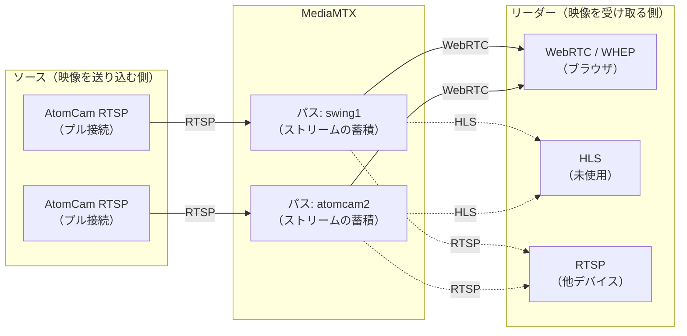
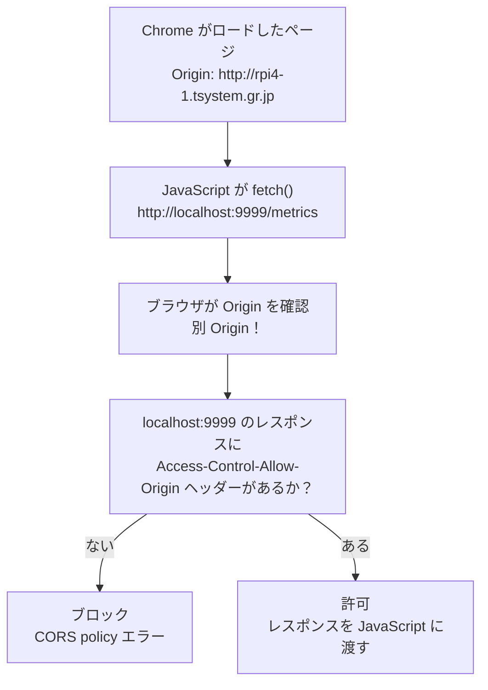

# 用語集

---

## MediaMTX

**MediaMTX** は、RTSP / RTMP / WebRTC / HLS など多様なプロトコルに対応するオープンソースの**メディアルーティングサーバー**。旧称 **rtsp-simple-server**。

### 基本的な役割

MediaMTX の本来の役割は**「ストリームを受け取り、蓄積し、異なるプロトコルで再配信する」**ことです。単なるプロトコル変換ブリッジではなく、複数クライアントへの同時配信・録画・認証・パス単位のアクセス制御も担います。

設計の核心は**パス（Path）**という概念にあります。



| 概念 | 説明 |
|---|---|
| **パス（Path）** | ストリームの論理的な名前空間（例: `swing1`, `atomcam2`）。ソースとリーダーを仲介する |
| **ソース（Source）** | パスへ映像を送り込む側。本プロジェクトでは MediaMTX が AtomCam へ RTSP プル接続する |
| **リーダー（Reader）** | パスから映像を受け取る側。同一パスに対して複数リーダーが同時接続できる |

#### プル接続の動作

`sourceOnDemand: no` の場合、MediaMTX は起動時に即座にカメラへ接続しにいきます。MediaMTX 自身が **RTSP クライアント** として動作し、カメラ側の RTSP サーバーへ能動的に TCP 接続を張ります（プル）。

```
MediaMTX（RTSP クライアント）         AtomCam（RTSP サーバー）
      |------ RTSP DESCRIBE -------->|  ストリーム情報を問い合わせる
      |<----- 200 OK + SDP ----------|  コーデック・解像度・FPS を受け取る
      |------ RTSP SETUP ----------->|  RTP セッション（使用ポート）を確立する
      |<----- 200 OK + Session ID ---|
      |------ RTSP PLAY ------------>|  映像の送信を要求する
      |<----- RTP パケット(H.264)  ---|  映像データの受信開始
      |<----- RTP パケット(H.264)  ---|
      |         （以降、継続受信）      |
```

接続が切れた場合、MediaMTX は自動で再接続を試みます。`sourceOnDemand: yes` にするとリーダーが接続したときだけプル接続を張り、全リーダーが切断したら RTSP を切ります（待機電力削減に使えます）。

#### ストリームの蓄積（バッファリング）

「蓄積」はバッファリングと考えて差し支えありません。単純な受信バッファに加えて、以下の働きをします。

| 働き | 説明 |
|---|---|
| **RTP パケットバッファ** | 受け取った RTP パケットを内部リングバッファに一時蓄積する |
| **キーフレーム待機** | 新たなリーダー（ブラウザ）が接続した際、直近のキーフレーム（I フレーム）から配信を開始する。これにより接続直後から映像が表示される |
| **ジッター吸収** | ソースの送信タイミングとリーダーの受信タイミングのズレを吸収する |

### 変換の仕組み（リマックス）

MediaMTX はデフォルトでは**コーデックの再エンコードを行いません**。RTSP で受け取った H.264 の RTP パケットを、WebRTC 向けの SRTP パケットとして**そのまま詰め替える（リマックス）**だけです。

これにより：
- CPU 負荷を最小限に抑えられます（エンコード処理不要）
- 映像品質が劣化しません（コーデック変換なし）
- 低レイテンシを維持できます

> ブラウザは RTSP を直接受信できないため、HTTP ベースのシグナリング（WHEP）と UDP/RTP ベースのメディア伝送（WebRTC）に変換して届ける必要があります。

### 本プロジェクトでの役割

AtomCam が配信する **RTSPストリームを WebRTC（WHEP）に変換** し、ブラウザに映像を届けるためにrpi4-1上で稼働しています。  
go2rtc に代わって採用しました（go2rtcの不安定さと、WHEPのネイティブ対応とICE候補処理の安定性が主な理由）。

| 項目 | 設定値 |
|---|---|
| バージョン | v1.18.1 |
| インストール先 | /opt/mediamtx/ |
| 設定ファイル | /opt/mediamtx/mediamtx.yml |

#### 使用ポート

| ポート | プロトコル | 用途 |
|---|---|---|
| 8554 | TCP (RTSP) | AtomCam からのRTSP受信 |
| 8889 | TCP (HTTP) | WHEPエンドポイント（ブラウザ向け） |
| 8888 | TCP (HTTP) | HLSエンドポイント（未使用） |
| 9997 | TCP (HTTP) | 管理API（パス一覧・状態確認） |

#### パス設定

```yaml
# /opt/mediamtx/mediamtx.yml
paths:
  swing1:
    source: rtsp://192.168.0.12:8554/video0_unicast
    sourceOnDemand: no
  atomcam2:
    source: rtsp://192.168.0.7:8554/video0_unicast
    sourceOnDemand: no
  swing2:
    source: rtsp://192.168.0.16:8554/video0_unicast
    sourceOnDemand: no
```

#### WHEPエンドポイント

ブラウザは以下URLに対してWHEP（HTTP POST）で映像を取得します。nginx経由でMediaMTXに転送されます。

| カメラ | WHEP URL |
|---|---|
| AtomCam Swing #1 | `http://rpi4-1.tsystem.gr.jp/webrtc/swing1/whep` |
| AtomCam 2 | `http://rpi4-1.tsystem.gr.jp/webrtc/atomcam2/whep` |
| AtomCam Swing #2 | `http://rpi4-1.tsystem.gr.jp/webrtc/swing2/whep` |

### 用語の区別

| 用語 | 説明 |
|---|---|
| **RTSP** | Real Time Streaming Protocol。TCP で制御コマンド（DESCRIBE / SETUP / PLAY）をやり取りし、RTP（UDP または TCP）で映像データを転送する。監視カメラ・IP カメラの標準的な配信方式。**ブラウザは直接受信できない**ため、本プロジェクトでは MediaMTX で WebRTC に変換する |
| **WebRTC** | Web Real-Time Communication。ブラウザに組み込まれたリアルタイム通信の Web 標準（W3C / IETF）。メディアは RTP/SRTP（UDP）で転送し、NAT 越えに ICE / STUN を使う。プラグイン不要で低レイテンシ（< 500 ms）が特徴 |
| **HLS** | HTTP Live Streaming。映像を数秒単位のセグメントファイル（`.ts`）に分割して HTTP で順次配信する Apple 発のプロトコル。ほぼ全デバイスで再生可能だがレイテンシが大きい（5〜30 秒）。監視カメラのリアルタイム表示には不向き |
| **WHEP** | WebRTC-HTTP Egress Protocol。ブラウザが HTTP POST で SDP Offer を送り、サーバーから SDP Answer を受け取って WebRTC 接続を確立するシグナリングプロトコル |
| go2rtc | MediaMTX 採用前に使用していたメディアサーバー（security_monitor フェーズ1〜3） |

---

## coturn

**coturn** は、STUN/TURNサーバーのオープンソース実装。

### 本プロジェクトでの役割

本プロジェクトでは **STUNサーバー** としてのみ使用します（TURN機能は不要）。

#### 問題の背景

Google Chromeは **mDNS obfuscation** 機能により、ローカルIPアドレス（192.168.x.x）をWebRTC ICE候補として直接公開せず、`.local` のmDNS名に変換します。  
しかし、MediaMTXはmDNS名を解決できないため、ICE候補のマッチングに失敗しWebRTC接続が確立されません。

#### 解決策

rpi4-1上でcoturnをSTUNサーバーとして起動し、ブラウザの `RTCPeerConnection` の `iceServers` に登録します。  
STUNサーバーを経由することでChromeはLAN内のIPアドレスをICE候補として得られるようになり、WebRTC接続が確立されます。

| 項目 | 設定値 |
|---|---|
| ホスト | rpi4-1（192.168.0.60） |
| ポート | UDP 3478 |
| 設定ファイル | /etc/turnserver.conf |
| 機能 | STUNのみ有効（TURN無効） |

```
# /etc/turnserver.conf
listening-port=3478
listening-ip=192.168.0.60
log-file=/var/log/coturn.log
```

### 用語の区別

| 用語 | 説明 |
|---|---|
| STUN | クライアントが自分のグローバルIPを知るためのプロトコル。LAN内では「NAT外側のIP」ではなく「ICE候補の収集」に使われる |
| TURN | STUNで接続できない場合にメディアをリレーするプロトコル。本プロジェクトでは不使用 |
| ICE | WebRTCが接続経路（ICE候補）を収集・選択するためのフレームワーク |
| mDNS obfuscation | ChromeがローカルIPをmDNS名に変換するプライバシー保護機能 |

---

## CORS

**Cross-Origin Resource Sharing（クロスオリジンリソース共有）**

### Origin（オリジン）とは

ブラウザが通信相手を識別する単位です。`スキーム + ホスト + ポート` の組み合わせで決まります。

| URL | Origin |
|---|---|
| `http://rpi4-1.tsystem.gr.jp/` | `http://rpi4-1.tsystem.gr.jp` |
| `http://localhost:9999/metrics` | `http://localhost:9999` |
| `http://192.168.0.154:9999/` | `http://192.168.0.154:9999` |

ホストが同じでもポートが異なれば別 Origin 扱いになります。

---

### Same-Origin Policy（同一オリジンポリシー）

ブラウザに組み込まれたセキュリティルール。  
**「ページを配信した Origin と異なる Origin へのリクエストは、原則ブロックする」**。

悪意あるサイトが別サイトのAPIを勝手に呼び出してデータを盗むことを防ぐための仕組み。

---

### CORS の仕組み

fetch される側のサーバーが、レスポンスヘッダーで「許可する Origin」を宣言することで  
ブラウザのブロックを解除します。



---

### Access-Control-Allow-Origin ヘッダー

fetch される側（サーバー）がレスポンスに付与するヘッダー。

```http
HTTP/1.1 200 OK
Content-Type: application/json
Access-Control-Allow-Origin: http://rpi4-1.tsystem.gr.jp
```

| 設定値 | 意味 | リスク |
|---|---|---|
| `http://rpi4-1.tsystem.gr.jp` | 特定 Origin のみ許可（推奨） | 低い |
| `*` | 任意の Origin を許可 | LAN 内のみなら許容範囲 |
| 未設定 | ブラウザがブロック | サイレントに失敗する |

---

### 注意点

- CORS の許可・拒否は **fetch する側（JavaScript）ではなく、fetch される側（サーバー）** が宣言します
- ヘッダーが未設定の場合、JavaScript 側でエラーは出ますが **「なぜ失敗したか」がわかりにくいです**
- `curl` や `wget` は Same-Origin Policy の対象外（ブラウザ固有の制約）

---

### 本プロジェクトにおける CORS の発生箇所

クライアント側のローカルメトリクスAPI（案2）を利用する場合に発生します。

| fetch 元 Origin | fetch 先 Origin | CORS 発生 |
|---|---|---|
| `http://rpi4-1.tsystem.gr.jp` | `/data/vostro.json`（同一） | なし |
| `http://rpi4-1.tsystem.gr.jp` | `http://localhost:9999/metrics` | **あり** |

→ 詳細は `docs/clientアクティビティ検出方法検討2.md` を参照してください。

---

## Content-Length

`Content-Length` は、**HTTP メッセージのボディ（本文）のバイト数を示す HTTP ヘッダー** です。リクエスト・レスポンスの両方に付与されます。

### 役割

HTTP はストリーム（TCP）上でやり取りするため、受信側はボディの終端を自力で判断できません。`Content-Length` がボディのバイト数を事前に通知することで、受信側は **「何バイト読めばよいか」** を把握できます。

```
POST /api/push HTTP/1.1
Content-Type: application/json
Content-Length: 87          ← ボディが 87 バイトであることを通知

{"hostname":"vostro","cpu":12.3,"temp":45.0,"disk_rw":204800,"mem":63.2}
```

### 本プロジェクトでの使用箇所

#### リクエスト側（クライアント → push_daemon.py）

クライアント（`push_metrics.sh` / `push_metrics.ps1`）が POST するとき、`curl` / PowerShell の HTTP クライアントが自動で付与します。  
`push_daemon.py` はこの値を読み取り、ボディを正確なバイト数だけ読み込みます。

```python
# push_daemon.py L62-71
length = int(self.headers.get('Content-Length', 0))  # ヘッダーからバイト数を取得
if length <= 0 or length > MAX_BODY:                  # 0 以下・上限超えはエラー
    self._send(400, b'invalid Content-Length')
    return
raw = self.rfile.read(length)                         # 宣言されたバイト数だけ読む
```

`Content-Length` が 0 以下・または `MAX_BODY`（4096 bytes）超の場合は 400 エラーを返します。これにより巨大なボディを受け付けないサイズ制限として機能しています。

#### レスポンス側（push_daemon.py → クライアント）

レスポンスを返す際にも `Content-Length` を付与し、クライアントがボディを過不足なく受信できるようにします。

```python
# push_daemon.py L50
self.send_header('Content-Length', str(len(body)))
```

---

## X-Real-IP

`X-Real-IP` は、**リバースプロキシ（nginx 等）がバックエンドへリクエストを転送する際に付与する HTTP リクエストヘッダー** です。クライアントの実際の IP アドレスをバックエンドサーバーへ伝えるために使用します。

### 背景

nginx のようなリバースプロキシを経由すると、バックエンドから見た接続元 IP（`REMOTE_ADDR`）は常にプロキシ自身の IP（`127.0.0.1`）になります。クライアントの実 IP を知る手段がなくなるため、プロキシがヘッダーを付加して元の IP を伝えます。

```
クライアント（192.168.0.154）
    │ POST /api/push-metrics
    ▼
nginx（127.0.0.1）
    │ POST /push-metrics
    │ X-Real-IP: 192.168.0.154  ← 付加
    ▼
push_daemon.py
    ├── client_address[0] → 127.0.0.1（プロキシ IP）
    └── X-Real-IP ヘッダー → 192.168.0.154（クライアントの実 IP）
```

### X-Forwarded-For との違い

| ヘッダー | 形式 | 説明 |
|---|---|---|
| `X-Real-IP` | 単一 IP | 直接の接続元 IP。プロキシが 1 段の構成で使いやすい |
| `X-Forwarded-For` | カンマ区切りのリスト | 多段プロキシを経由した場合、各プロキシが IP を追記する |

本プロジェクトではプロキシが nginx の 1 段のみのため、シンプルな `X-Real-IP` を使用します。

### 本プロジェクトでの使用箇所

| コンポーネント | 設定・処理 |
|---|---|
| nginx | `proxy_set_header X-Real-IP $remote_addr;` を付与してバックエンドへ転送する |
| push_daemon.py | `X-Real-IP` ヘッダーを優先して読み取り（なければ `client_address[0]`）、クライアントを識別する |

`push_daemon.py` は取得した `client_ip` をファイル名のキーとして使用します。

```python
# push_daemon.py L86-101
client_ip = self.headers.get('X-Real-IP') or self.client_address[0]
latest  = DATA_DIR / f'{client_ip}.json'          # 最新メトリクス
history = DATA_DIR / f'{client_ip}-history.ndjson' # 履歴
```

---

## systemd timer

**systemd timer** は、systemd の `.timer` ユニットを使って任意のコマンドを定期実行する仕組み。cron の代替として使用でき、**秒単位の間隔指定**や **journalctl へのログ統合**が利点。

### cron との違い

| 項目 | cron | systemd timer |
|---|---|---|
| 最小間隔 | 1分 | 秒単位 |
| ログ | syslog / mail | journalctl に統合 |
| 依存関係の制御 | なし | `After=` / `Requires=` で指定可能 |
| 設定ファイル | crontab 1行 | `.timer` + `.service` の2ファイル |
| 実行ユーザー | crontab 所有者 | `User=` で明示指定 |

### 構成ファイル

timer を動かすには **`.timer` ユニット** と **`.service` ユニット** の2つが必要。

#### .timer ユニット例（30秒間隔）

```ini
[Unit]
Description=Collect metrics every 30 seconds

[Timer]
OnBootSec=10
OnUnitActiveSec=30s
AccuracySec=1s

[Install]
WantedBy=timers.target
```

#### .service ユニット例

```ini
[Unit]
Description=Collect metrics (oneshot)

[Service]
Type=oneshot
ExecStart=/usr/local/bin/collect_metrics.sh
```

#### 主要な Timer 設定キー

| キー | 説明 |
|---|---|
| `OnBootSec=` | システム起動後N秒経ってから初回実行 |
| `OnUnitActiveSec=` | 前回の実行完了からN秒後に次回実行 |
| `OnCalendar=` | cron式に近い時刻指定（例: `*:0/5` = 5分ごと） |
| `AccuracySec=` | 実行タイミングの許容ズレ幅。省略時は60s。秒精度が必要なら `1s` に設定 |

### 本プロジェクトでの使用箇所

| ノード | タイマーユニット | 実行スクリプト | 間隔 |
|---|---|---|---|
| rpi4-1 | collect-metrics.timer | collect_metrics.sh | 30秒 |
| vostro | push-metrics.timer | push_metrics.sh | 30秒 |

### 操作コマンド

```bash
# タイマー一覧と次回実行時刻を確認
systemctl list-timers

# 特定タイマーの状態確認
systemctl status collect-metrics.timer

# 有効化して即時起動
systemctl enable --now collect-metrics.timer

# 実行ログ確認（サービスユニット側）
journalctl -u collect-metrics.service -f
```
