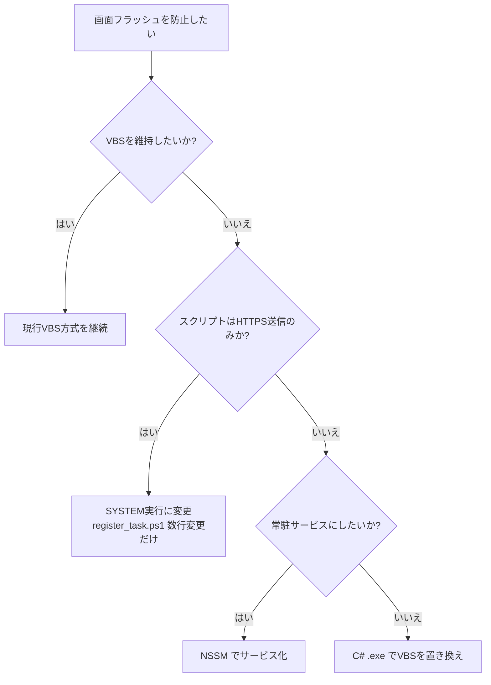

# Windows クライアント 画面フラッシュ防止方法

作成日: 2026-05-13  
対象: security_monitor_2 Windows クライアント（`inventory/client/win/`）

---

## 1. 問題の概要

Task Scheduler から `powershell.exe` を起動する際、`-WindowStyle Hidden` を指定しても一瞬コンソールウィンドウ（`conhost.exe`）が表示される。  
これは Windows の動作仕様であり、フラッシュを完全に防止するには追加の対策が必要となる。

---

## 2. 対策方法比較

| No | 方法 | Flash防止 | 追加ツール | 難易度 | 備考 |
|---|---|---|---|---|---|
| 1 | **VBScript（現行）** | ✅ 完全 | 不要 | 低 | `WScript.Shell.Run` にウィンドウスタイル 0 を指定 |
| 2 | **C# コンパイル済み .exe** | ✅ 完全 | 不要（`csc.exe` 内蔵） | 中 | 依存ゼロ・最も堅牢 |
| 3 | **Task Scheduler を SYSTEM で実行** | ✅ 完全 | 不要 | 低 | ユーザーコンテキストが失われる |
| 4 | **NSSM（Windows Service 化）** | ✅ 完全 | NSSM 必要 | 中 | サービスとして常駐 |

---

## 3. 現行方法：VBScript（`run_hidden.vbs`）

`wscript.exe` から `WScript.Shell.Run` を呼び出し、第2引数にウィンドウスタイル `0`（非表示）を指定する。

```vbscript
' run_hidden.vbs
Dim WshShell, script
script = CreateObject("Scripting.FileSystemObject").GetParentFolderName( _
    WScript.ScriptFullName) & "\push_metrics.ps1"
Set WshShell = CreateObject("WScript.Shell")
WshShell.Run "powershell.exe -NonInteractive -ExecutionPolicy Bypass -File """ _
    & script & """", 0, True
Set WshShell = Nothing
```

Task Scheduler のアクションは `wscript.exe` を直接起動し、引数に本スクリプトのパスを渡す。

```powershell
$action = New-ScheduledTaskAction -Execute 'wscript.exe' -Argument "`"$VBS_PATH`""
```

**特徴**
- 追加インストール不要
- 実績あり・シンプル
- VBScript（レガシー技術）への依存が残る

---

## 4. 代替方法①：C# コンパイル済み .exe

Windows 標準の `csc.exe`（.NET Framework 付属）でコンパイルできる。VBS を置き換え可能。

### ソースコード（`run_hidden.cs`）

```csharp
using System.Diagnostics;
using System.IO;

class RunHidden {
    static void Main() {
        var script = Path.Combine(
            Path.GetDirectoryName(
                System.Reflection.Assembly.GetExecutingAssembly().Location),
            "push_metrics.ps1"
        );
        var p = new Process();
        p.StartInfo.FileName       = "powershell.exe";
        p.StartInfo.Arguments      = $"-NonInteractive -ExecutionPolicy Bypass -File \"{script}\"";
        p.StartInfo.WindowStyle    = ProcessWindowStyle.Hidden;
        p.StartInfo.CreateNoWindow = true;
        p.Start();
        p.WaitForExit();
    }
}
```

### コンパイル方法（PowerShell）

```powershell
# .NET Framework 付属の csc.exe を使用（追加インストール不要）
$csc = (Get-ChildItem "C:\Windows\Microsoft.NET\Framework64" -Filter csc.exe -Recurse |
        Sort-Object FullName | Select-Object -Last 1).FullName
& $csc /out:run_hidden.exe run_hidden.cs
```

**特徴**
- VBS 依存をなくせる
- `csc.exe` は Windows に標準搭載（.NET Framework 3.5 以降）
- バイナリ配布のため、ソース管理に注意

---

## 5. 代替方法②：Task Scheduler を SYSTEM アカウントで実行

`register_task.ps1` の Principal 定義を変更するだけで対応できる。

```powershell
# ---- Principal: SYSTEM で実行（UI なし・Flash なし） ----
$principal = New-ScheduledTaskPrincipal `
    -UserId    "SYSTEM" `
    -LogonType ServiceAccount `
    -RunLevel  Highest
```

**特徴**
- `register_task.ps1` 数行の変更のみ
- `push_metrics.ps1` が HTTPS 送信のみであれば問題なし
- Kerberos 認証・ユーザー固有の資格情報は使用不可

---

## 6. 代替方法③：NSSM（Windows Service 化）

スケジューラではなく Windows サービスとして常駐させる。

```powershell
# NSSM インストール後
nssm install push_metrics powershell.exe
nssm set push_metrics AppParameters "-NonInteractive -ExecutionPolicy Bypass -File C:\...\push_metrics.ps1"
nssm set push_metrics AppExit    Default Restart
nssm set push_metrics AppThrottle 60000   # 60 秒間隔（ミリ秒）
nssm start push_metrics
```

**特徴**
- サービスとして OS 起動時から自動常駐
- サービス管理ツールで状態確認・再起動が可能
- NSSM の別途入手・インストールが必要

---

## 7. 選択指針



---

## 8. 関連ファイル

| ファイル | 用途 |
|---|---|
| `inventory/client/win/run_hidden.vbs` | VBScript ラッパー（現行） |
| `inventory/client/win/push_metrics.ps1` | メトリクス収集・送信スクリプト |
| `inventory/client/win/register_task.ps1` | タスクスケジューラ登録スクリプト |
