# セキュリティモニター 詳細設計書

作成日: 2026-05-11  
最終更新日: 2026-05-24  
対象バージョン: フェーズ4完成版（security_monitor_2）

---

## 1. push_daemon.py

### 1.1 概要

rpi4-1上で常駐するHTTPサーバーデーモン。  
クライアントの push_metrics スクリプトからPOSTされたメトリクスJSONを受信し、クライアントIPアドレスをキーとしてファイルに保存する。  
nginxがリバースプロキシとして前段に位置し、X-Real-IPヘッダーでクライアントIPを通知する。

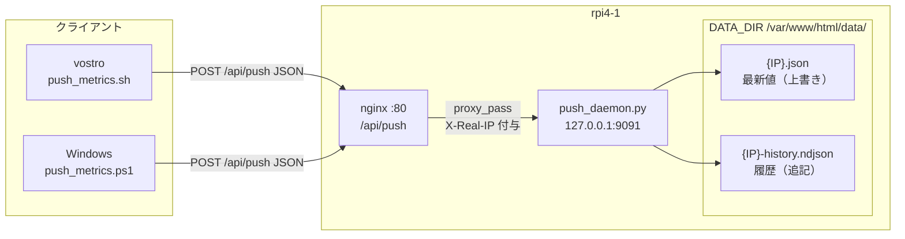

### 1.2 配置情報

| 項目 | 値 |
|---|---|
| ソース | inventory/rpi4-1/push_daemon.py |
| 配置先 | /home/indo/bin/push_daemon.py |
| 実行ユーザー | indo |
| systemdサービス | push-daemon.service |

### 1.3 設定パラメータ

| 変数 | デフォルト値 | 説明 |
|---|---|---|
| `PORT` | 9091 | 待受ポート（nginx経由でのみアクセス） |
| `DATA_DIR` | /var/www/html/data | JSONファイル保存先ディレクトリ |
| `MAX_HISTORY` | 2880 | 履歴保持最大行数（30秒×2880 = 24時間分） |
| `MAX_BODY` | 4096 | POSTボディ最大サイズ（bytes） |
| `REQUIRED_FIELDS` | hostname, cpu, temp, disk_rw, mem | 必須フィールド（検証用） |

### 1.4 クラス・関数一覧

| クラス/関数 | 概要 |
|---|---|
| `PushHandler` | `BaseHTTPRequestHandler` サブクラス。POST /api/push を処理する |
| `PushHandler.log_message()` | デフォルトのアクセスログを抑制する（エラー時のみ出力） |
| `PushHandler._send()` | HTTPレスポンス（ステータスコード + ボディ）を送信する |
| `PushHandler.do_POST()` | POST /api/push の主処理（JSON検証・IP取得・ファイル保存） |
| `ReusePortHTTPServer` | SO_REUSEPORT有効化。再起動直後のポート衝突を防ぐ |
| `main()` | デーモン起動・SIGTERM ハンドラ設定 |

### 1.5 処理フロー

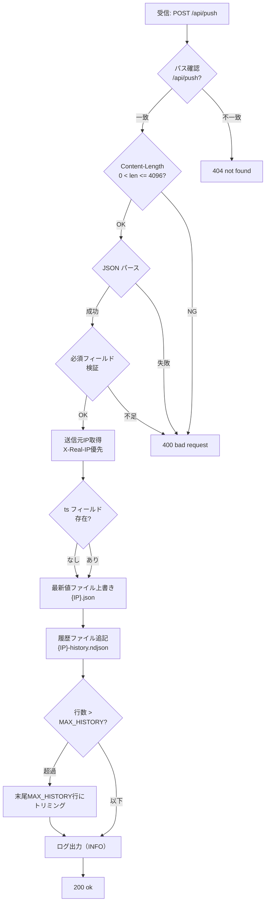

### 1.6 ファイル保存仕様

| ファイル | 命名規則 | 内容 | 更新方法 |
|---|---|---|---|
| 最新値 | `{client_ip}.json` | 最新メトリクス1件のJSON | 上書き（write_text） |
| 履歴 | `{client_ip}-history.ndjson` | NDJSON形式（1行1JSON）最大2880行 | 追記後、超過分を先頭から削除 |

### 1.7 systemdサービス定義

| 項目 | 設定値 |
|---|---|
| Unit After | network.target nginx.service |
| Type | simple |
| User / Group | indo / indo |
| ExecStart | /usr/bin/python3 /home/indo/bin/push_daemon.py |
| Restart | always |
| RestartSec | 5s |

---

## 2. collect_metrics.sh（rpi4-1自己収集）

### 2.1 概要

rpi4-1自身のリソースメトリクス（CPU使用率・CPU温度・ディスクI/O・メモリ）を収集し、  
`/var/www/html/data/rpi4-1.json`（最新値）と `rpi4-1-history.ndjson`（履歴）に保存する。  
systemdタイマーから30秒間隔で起動される。

### 2.2 配置情報

| 項目 | 値 |
|---|---|
| ソース | inventory/rpi4-1/collect_metrics.sh |
| 配置先 | /home/indo/bin/collect_metrics.sh |
| 実行ユーザー | indo |
| systemdサービス | collect-metrics.service（collect-metrics.timerから起動） |

### 2.3 設定パラメータ

| 変数 | デフォルト値 | 説明 |
|---|---|---|
| `DATA_DIR` | /var/www/html/data | JSONファイル保存先（環境変数で上書き可） |
| `LATEST_FILE` | ${DATA_DIR}/rpi4-1.json | 最新値ファイルパス |
| `HISTORY_FILE` | ${DATA_DIR}/rpi4-1-history.ndjson | 履歴ファイルパス |
| `LOG_FILE` | ~/log/collect_metrics.log | エラーログパス |
| `MAX_HISTORY` | 2880 | 履歴保持最大行数（24時間分） |
| `MAX_LOG` | 5000 | ログ保持最大行数 |
| `DISK_PAT` | `^(sd[a-z]+\|nvme...\|mmcblk...\|...)$` | 計測対象ディスクデバイスのパターン（ループ・RAMディスク除外） |

### 2.4 関数一覧

| 関数 | 概要 |
|---|---|
| `collect_cpu_disk()` | CPU使用率(%)とDiskI/O合計(bytes/s)を1秒差分で同時計測する |
| `collect_temp()` | CPU温度の最大値を取得する（thermal_zone経由、RPi専用） |
| `collect_mem()` | メモリ使用率(%)と総メモリ量(KB)を取得する |
| `on_err()` | ERRトラップ。エラー行番号とステータスをログに記録する |
| `on_exit()` | EXITトラップ。ログローテーション処理を行う |
| `main()` | 主処理。各関数を呼び出してJSONを組み立て保存する |

### 2.5 計測方法

#### CPU使用率

`/proc/stat` の `cpu ` 行を1秒間隔で2回読み取り、差分から計算する。

```
cpu_pct = (Δtotal - Δidle - Δiowait) / Δtotal × 100
```

`Δidle` = idle(col5) + iowait(col6) の増分

#### CPU温度（rpi4-1）

`/sys/class/thermal/thermal_zone*/temp` から全ゾーンを読み取り最大値を採用。  
値単位はmilli-celsius（1000分の1℃）→ 1000で除算して℃に変換。

> rpi4-1（ARM）はthermal_zoneが存在する。vostro等のx86はhwmonも参照（push_metrics.sh参照）。

#### ディスクI/O

`/proc/diskstats` を1秒間隔で2回読み取り、対象デバイスのread/write sectors差分を計算。  
1 sector = 512 bytes として bytes/s に変換。read + write の合計値を `disk_rw` として返す。

#### メモリ使用率

`/proc/meminfo` から `MemTotal` と `MemAvailable` を読み取り計算する。

```
mem_pct = (MemTotal - MemAvailable) / MemTotal × 100
```

### 2.6 処理フロー

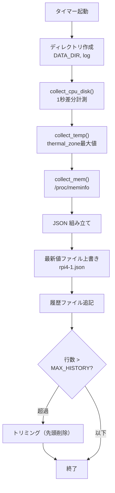

### 2.7 systemdタイマー定義

| 項目 | 設定値 |
|---|---|
| OnCalendar | `*:*:00/30`（毎分0秒と30秒 = 30秒間隔） |
| AccuracySec | 1s（タイマー精度） |
| Unit | collect-metrics.service |

---

## 3. push_metrics.sh（Linuxクライアント）

### 3.1 概要

Linuxクライアント（vostro等）で稼働するメトリクス収集スクリプト。  
CPU使用率・CPU温度・ディスクI/O・メモリ使用率を収集し、ローカル履歴に保存したうえでrpi4-1へHTTP POSTする。  
systemdタイマーから30秒間隔で起動される。

### 3.2 配置情報

| 項目 | 値 |
|---|---|
| ソース | inventory/client/lin/push_metrics.sh |
| 配置先 | /home/indou/bin/push_metrics.sh |
| 実行ユーザー | indou |
| systemdサービス | push-metrics.service（push-metrics.timerから起動） |

### 3.3 設定パラメータ

| 変数 | デフォルト値 | 説明 |
|---|---|---|
| `ENDPOINT` | http://rpi4-1.tsystem.gr.jp/api/push | POSTエンドポイント（環境変数で上書き可） |
| `HISTORY_DIR` | ~/.local/share/push_metrics | 履歴・ログ保存先 |
| `HISTORY_FILE` | ${HISTORY_DIR}/history.ndjson | ローカル履歴ファイル |
| `LOG_FILE` | ${HISTORY_DIR}/push_metrics.log | エラーログファイル |
| `MAX_HISTORY` | 2880 | 履歴保持最大行数（24時間分） |
| `MAX_LOG` | 5000 | ログ保持最大行数 |
| `DISK_PAT` | `^(sd[a-z]+\|nvme...\|mmcblk...\|...)$` | 計測対象ディスクデバイスのパターン |

### 3.4 関数一覧

| 関数 | 概要 |
|---|---|
| `collect_cpu_disk()` | CPU使用率(%)とDiskI/O合計(bytes/s)を1秒差分で同時計測する |
| `collect_temp()` | CPU温度の最大値を取得する（thermal_zone + hwmon 両対応） |
| `collect_mem()` | メモリ使用率(%)と総メモリ量(KB)を取得する |
| `on_err()` | ERRトラップ。エラー行番号とステータスをログに記録する |
| `on_exit()` | EXITトラップ。エラー時のログ記録とログローテーションを行う |
| `main()` | 主処理。各関数を呼び出してJSONを組み立て保存・POSTする |

### 3.5 collect_metrics.sh との差異

| 機能 | collect_metrics.sh（rpi4-1） | push_metrics.sh（Linuxクライアント） |
|---|---|---|
| 温度センサー | thermal_zone のみ | thermal_zone + hwmon（両方を参照し最大値） |
| データ保存先 | /var/www/html/data/rpi4-1.json（ローカル） | ~/.local/share/push_metrics/history.ndjson（ローカル） |
| rpi4-1へのPOST | なし（自己保存のみ） | あり（curl POST） |
| ホスト名 | rpi4-1固定 | `hostname -s` で動的取得 |

### 3.6 温度センサー対応（dual source）

vostro等のx86 PCは `/sys/class/thermal/thermal_zone*` が存在しないため、  
`/sys/class/hwmon/hwmon*/temp*_input` も参照することでx86の温度センサーにも対応する。

```bash
for f in /sys/class/thermal/thermal_zone*/temp \
         /sys/class/hwmon/hwmon*/temp*_input; do
    [[ -r "$f" ]] || continue
    t=$(< "$f")
    (( t > max_t )) && max_t=$t
done
```

| センサーパス | 対応機種 | 例（vostro） |
|---|---|---|
| /sys/class/thermal/thermal_zone*/temp | RPi、ARM系 | rpi4-1 |
| /sys/class/hwmon/hwmon*/temp*_input | x86 PC（dell_smm, coretemp等） | vostro（hwmon1: dell_smm, hwmon2: coretemp） |

### 3.7 エラー処理・ログローテーション

- `set -eEuo pipefail` でコマンド失敗時に即時終了
- `on_err` トラップでエラー行番号とコマンドをログに記録
- `on_exit` トラップでLOG_FILEがMAX_LOG行超過時にtrimming
- POST失敗時はローカル保存が完了しているためWARNログのみ記録（スクリプトは継続）

### 3.8 処理フロー

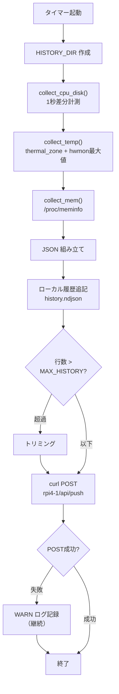

### 3.9 systemdサービス・タイマー定義

**push-metrics.service**

| 項目 | 設定値 |
|---|---|
| After | network-online.target |
| Type | oneshot |
| User | indou |
| ExecStart | /bin/bash /home/indou/bin/push_metrics.sh |

**push-metrics.timer**

| 項目 | 設定値 |
|---|---|
| OnCalendar | `*:*:00/30`（30秒間隔） |
| AccuracySec | 1s |

---

## 4. push_metrics.ps1（Windowsクライアント）

### 4.1 概要

Windowsクライアント用のメトリクス収集スクリプト（PowerShell）。  
CPU使用率・CPU温度・ディスクI/O・メモリ使用率を収集し、ローカル履歴に保存したうえでrpi4-1へHTTP POSTする。  
タスクスケジューラから1分間隔で起動される（Windows タスクスケジューラの繰り返し最小間隔は1分のため）。

### 4.2 配置情報

| 項目 | 値 |
|---|---|
| ソース | inventory/client/win/push_metrics.ps1 |
| 配置先 | C:\SecurityMonitor\push_metrics.ps1（任意） |
| 実行環境 | PowerShell 5.1以上 |
| タスクスケジューラ | \SecurityMonitor\push_metrics |

### 4.3 設定パラメータ

| 変数 | デフォルト値 | 環境変数上書き |
|---|---|---|
| `$ENDPOINT` | http://rpi4-1.tsystem.gr.jp/api/push | `$env:PUSH_ENDPOINT` |
| `$HISTORY_DIR` | %APPDATA%\push_metrics | `$env:PUSH_HISTORY_DIR` |
| `$HISTORY_FILE` | %APPDATA%\push_metrics\history.ndjson | - |
| `$LOG_FILE` | %APPDATA%\push_metrics\push_metrics.log | - |
| `$MAX_HISTORY` | 2880 | - |
| `$MAX_LOG` | 5000 | - |

### 4.4 関数一覧

| 関数 | 概要 |
|---|---|
| `Write-Log()` | タイムスタンプ付きでLOG_FILEにメッセージを追記する |
| `Trim-Log()` | LOG_FILEがMAX_LOG行を超えたら末尾MAX_LOG行にトリミングする |
| `Get-CpuPercent()` | CPU使用率(%)をGet-Counterで1秒サンプリングして取得する |
| `Get-CpuTempC()` | CPU温度(℃)をWMI（MSAcpi_ThermalZoneTemperature）から取得する |
| `Get-DiskRwBps()` | DiskI/O合計(bytes/s)をGet-Counterで1秒サンプリングして取得する |
| `Get-MemInfo()` | メモリ使用率(%)と総メモリ量(KB)をWin32_ComputerSystem + Get-Counterで取得し、ハッシュテーブルで返す |
| `Main()` | 主処理。各関数を呼び出してJSONを組み立て保存・POSTする |

### 4.5 メトリクス取得方法

| メトリクス | 取得方法 | 備考 |
|---|---|---|
| CPU使用率 | `Get-Counter '\Processor(_Total)\% Processor Time'` 1秒サンプリング | - |
| CPU温度 | `Get-WmiObject MSAcpi_ThermalZoneTemperature -Namespace 'root/wmi'` | BIOSが非対応の場合は 0.0 |
| ディスクI/O | `Get-Counter '\PhysicalDisk(_Total)\Disk Read/Write Bytes/sec'` 1秒サンプリング | read + write の合計 |
| メモリ使用率 | `Win32_ComputerSystem.TotalPhysicalMemory` + `Get-Counter '\Memory\Available MBytes'` | `Get-MemInfo()` の `pct` フィールド |
| 総メモリ量 | `Win32_ComputerSystem.TotalPhysicalMemory` (bytes → KB に変換) | `Get-MemInfo()` の `total_kb` フィールド。Linux の mem_total と同単位 |

**CPU温度の変換式**:  
WMIの `CurrentTemperature` は 1/10 Kelvin 単位。  
`℃ = (CurrentTemperature - 2732) / 10.0`

### 4.6 処理フロー

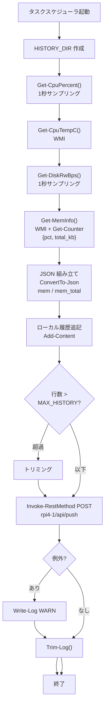

---

## 5. register_task.ps1

### 5.1 概要

push_metrics.ps1をWindowsタスクスケジューラに登録するスクリプト。  
管理者権限（Run as Administrator）で実行する。

### 5.2 配置情報

| 項目 | 値 |
|---|---|
| ソース | inventory/client/win/register_task.ps1 |
| 配置先 | C:\SecurityMonitor\register_task.ps1（任意） |

### 5.3 タスク登録内容

| 項目 | 設定値 |
|---|---|
| タスク名 | push_metrics |
| タスクフォルダ | \SecurityMonitor |
| 実行ファイル | wscript.exe "$PSScriptRoot\run_hidden.vbs" |
| 実行間隔 | 1分（RepetitionInterval）※タスクスケジューラ最小値 |
| トリガー1 | Once: 登録15秒後に起動・以降1分ごとに繰り返し（登録直後から動作させるため） |
| トリガー2 | AtLogOn: ログオン時に起動・以降1分ごとに繰り返し（再起動後に自動再開するため） |
| 実行レベル | Highest（管理者権限） |
| 実行時間上限 | 2分（ExecutionTimeLimit） |
| バッテリー動作 | 可（AllowStartIfOnBatteries） |
| 多重起動 | IgnoreNew（既に実行中なら新規起動を無視） |

> **run_hidden.vbs の役割**: タスクスケジューラが `powershell.exe -WindowStyle Hidden` で直接起動すると、  
> 実行のたびに画面が一瞬フラッシュする。`wscript.exe` 経由で `WScript.Shell.Run(..., 0, True)` を  
> 使うことで PowerShell を完全に不可視で起動できる。  
>
> **デュアルトリガーの理由**: AtLogOn トリガーは次回ログイン時に初めて発火する。  
> タスク登録直後（すでにログイン済みの場合）は Once トリガーが15秒後に発火し、繰り返しを開始する。  
> 両トリガーの Repetition に同一の RepetitionPattern を共有することで1分間隔が維持される。

### 5.4 処理フロー

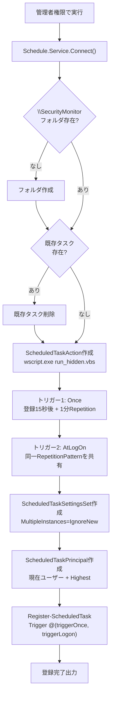

---

## 6. release.sh

### 6.1 概要

`release.txt` に定義されたファイルリストに基づき、ローカルからリモートへファイルをデプロイするスクリプト。  
差分チェックを行い、差分がある場合は必ずユーザー確認のうえで転送する。  
`/etc/` 等のルート権限が必要なパスへは `/tmp` 経由で `sudo mv` で配置する。

### 6.2 配置情報

| 項目 | 値 |
|---|---|
| ソース | inventory/release.sh |
| 実行方法 | 各インベントリディレクトリから `../release.sh user@host` |

### 6.3 使用方法

```bash
# rpi4-1 へのデプロイ
cd /home/indo/Public/security_monitor_2/inventory/rpi4-1
../release.sh indo@rpi4-1

# Linux クライアント（vostro）へのデプロイ
cd /home/indo/Public/security_monitor_2/inventory/client/lin
../../release.sh indou@vostro

# 別定義ファイルを使う場合
../release.sh -c my_release.txt indo@rpi4-1
```

### 6.4 release.txt フォーマット

```
# コメント行（# で始まる行はスキップ）
# local_path  remote_path
push_daemon.py /home/indo/bin/push_daemon.py
@etc@systemd@system@push-daemon.service /etc/systemd/system/push-daemon.service
```

- ローカルパスの `/` を `@` に置換した名前のファイルを配置することで、ディレクトリ構造を1階層で管理
- ローカルパスに `/` が含まない場合はカレントディレクトリのファイルとして扱う

### 6.5 関数一覧

| 関数 | 概要 |
|---|---|
| `info()` | タイムスタンプ付きでメッセージを標準出力に書き出す（ログにも記録） |
| `usage()` | 使用方法を標準エラーに表示する |
| `on_err()` | ERRトラップ。エラー行番号とステータスをログに記録する |
| `on_signal()` | SIGINT/SIGTERM/SIGQUITトラップ。シグナル受信時に終了する |
| `on_exit()` | EXITトラップ。一時ディレクトリを削除し終了コードを記録する |
| `parse_line()` | リリストの1行をパースしてローカル・リモートパスを設定する |
| `confirm()` | ユーザーにS/Y/C(/D)の選択を求める（/dev/tty経由）。差分ありの分岐ではD)iffを選択肢に追加し、`d` 入力で `diff -u remote local` を `${PAGER:-less}` 経由で表示してプロンプトに戻る |
| `do_scp()` | ローカル→リモートへファイルを転送する（/tmp経由sudo mv対応） |
| `main()` | 主処理。release.txtを読み込み各ファイルを処理する |

### 6.6 処理フロー

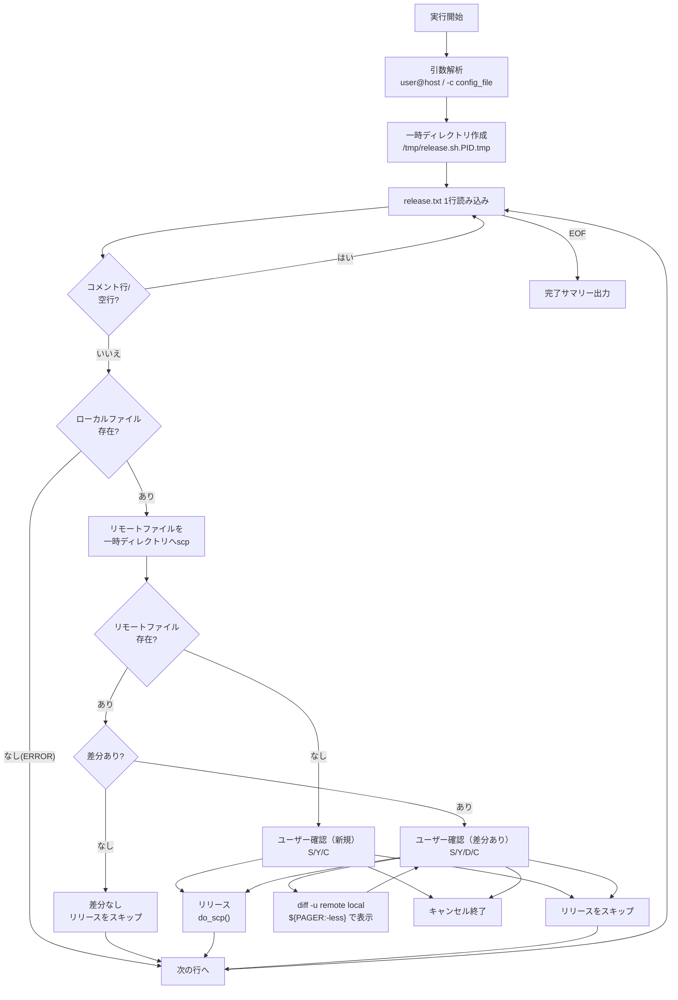

### 6.7 do_scp() の動作

| リモートパス | 転送方法 |
|---|---|
| `/home/` または `~/` 始まり | 直接 `scp -p` |
| それ以外（/etc/, /usr/ 等） | リモートの /tmp に scp → `ssh sudo mv` で正式パスへ移動 |

### 6.8 ログ出力

- ログは `/tmp/YYYYMMDD.HHMMSS.hostname.release.sh.PID.log` に保存
- 画面と同じ内容を `tee` でログファイルにも記録
- 統計情報（リリース件数・スキップ件数・エラー件数）を最後に出力

---

## 7. backup.sh

### 7.1 概要

`backup.txt` に定義されたファイルリストに基づき、リモートからローカルへファイルをバックアップするスクリプト。  
release.sh の逆方向（remote → local）の転送を担当する。  
差分チェックを行い、差分がある場合は必ずユーザー確認のうえでローカルへ取得する。

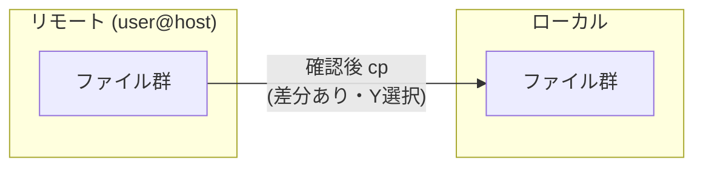

### 7.2 配置情報

| 項目 | 値 |
|---|---|
| ソース | inventory/backup.sh |
| 実行方法 | 各インベントリディレクトリから `../backup.sh user@host` |

### 7.3 使用方法

```bash
# rpi4-1 からバックアップ
cd /home/indo/Public/security_monitor_2/inventory/rpi4-1
../backup.sh indo@rpi4-1

# Linux クライアント（vostro）からバックアップ
cd /home/indo/Public/security_monitor_2/inventory/client/lin
../../backup.sh indou@vostro

# 別定義ファイルを使う場合
../backup.sh -c my_backup.txt indo@rpi4-1
```

### 7.4 backup.txt フォーマット

```
# コメント行（# で始まる行はスキップ）
# local_path  remote_path
@var@www@html@app.js     /var/www/html/app.js
@var@www@html@index.html /var/www/html/index.html
```

- ローカルパスの `/` を `@` に置換した名前のファイルで管理（ディレクトリ構造を1階層で表現）
- ローカルパスに `/` を含まない場合はカレントディレクトリのファイルとして扱う
- 空白を含むパスはダブルクォートで囲む

### 7.5 関数一覧

| 関数 | 概要 |
|---|---|
| `info()` | タイムスタンプ付きでメッセージを標準出力に書き出す（ログにも記録） |
| `usage()` | 使用方法を標準エラーに表示する |
| `on_err()` | ERRトラップ。エラー行番号とステータスをログに記録する |
| `on_signal()` | SIGINT/SIGTERM/SIGQUITトラップ。シグナル受信時に終了する |
| `on_exit()` | EXITトラップ。一時ディレクトリを削除し終了コードを記録する |
| `parse_line()` | backup.txtの1行をパースしてローカル・リモートパスを設定する |
| `confirm()` | ユーザーにS/Y/Cの選択を求める（/dev/tty経由） |
| `main()` | 主処理。backup.txtを読み込み各ファイルを処理する |

### 7.6 処理フロー

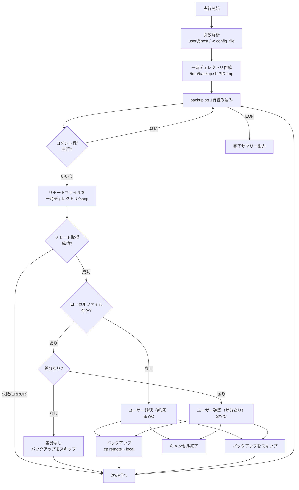

### 7.7 confirm() の動作

リモートとローカルに差分がある場合、または新規取得（ローカル未存在）の場合にユーザー確認プロンプトを表示する。

| 選択 | 動作 |
|---|---|
| `Y` | リモート → ローカルへ取得（ローカルを上書き） |
| `S` | スキップ（このファイルを無視して次へ） |
| `C` | キャンセル（スクリプトを exit 0 で終了） |

### 7.8 ログ出力

- ログは `/tmp/YYYYMMDD.HHMMSS.hostname.backup.sh.PID.log` に保存
- 画面と同じ内容を `tee` でログファイルにも記録
- 統計情報（バックアップ件数・スキップ件数・エラー件数）を最後に出力

---

## 8. app.js（WebUIメインスクリプト）

### 8.1 概要

WebUIのメインJavaScriptファイル。rpi4-1のnginxから配信され、vostroのChromeキオスクモードで実行される。  
AtomCam 3台へのWHEP接続・映像表示を主機能とし、リソースグラフ表示を副機能として持つ。

### 8.2 配置情報

| 項目 | 値 |
|---|---|
| ソース | inventory/rpi4-1/@var@www@html@app.js |
| 配置先 | /var/www/html/app.js |
| 実行環境 | Chrome（vostroキオスクモード）またはブラウザ |

### 8.3 WHEPエンドポイント設定

| カメラ | MediaMTXパス | WHEPエンドポイント |
|---|---|---|
| AtomCam Swing #1（二階左） | swing1 | http://rpi4-1.tsystem.gr.jp/webrtc/swing1/whep |
| AtomCam 2（玄関） | atomcam2 | http://rpi4-1.tsystem.gr.jp/webrtc/atomcam2/whep |
| AtomCam Swing #2（二階右） | swing2 | http://rpi4-1.tsystem.gr.jp/webrtc/swing2/whep |

### 8.4 機能一覧

| 機能 | 関数/処理 | 詳細 |
|---|---|---|
| WHEP接続 | connectWhep() | SDP offer生成→ICEギャザリング待機→POST→SDP answer設定 |
| 映像stall検出 | startStallDetector() | currentTime停止を1秒ごとに監視（3秒閾値） |
| stall時再接続 | reconnect() | 5秒待機後にWHEP接続を再試行 |
| 全画面表示 | openFullscreen() | CSSオーバーレイ方式（srcObject共有） |
| 全画面解除 | closeFullscreen() | srcObject解放・グリッド継続再生 |
| 時計表示 | updateClock() | YYYY-MM-DD HH:MM:SS 形式（固定フォーマット） |
| リソースグラフ | initChart() / updateChart() | Chart.js v4 でCPU・温度・ディスク・メモリを表示 |
| グラフデータ取得 | fetchMetrics() | /api/my-history と /data/rpi4-1-history.ndjson を30秒ごとに取得 |

### 8.5 WHEP接続フロー

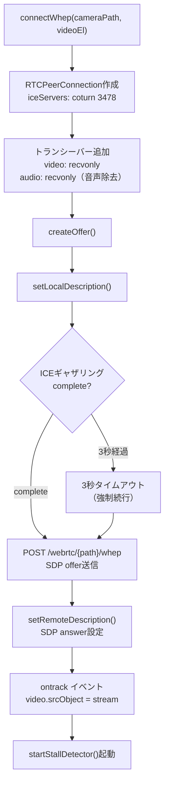

> **ICEギャザリング待機の理由**: ICE候補が揃う前にSDP POSTすると `no ice-ufrag` エラーが発生する。  
> coturnのSTUN応答を待ってからPOSTすることでLAN内ICE候補を確実に含める。

### 8.6 映像stall検出フロー（startStallDetector）

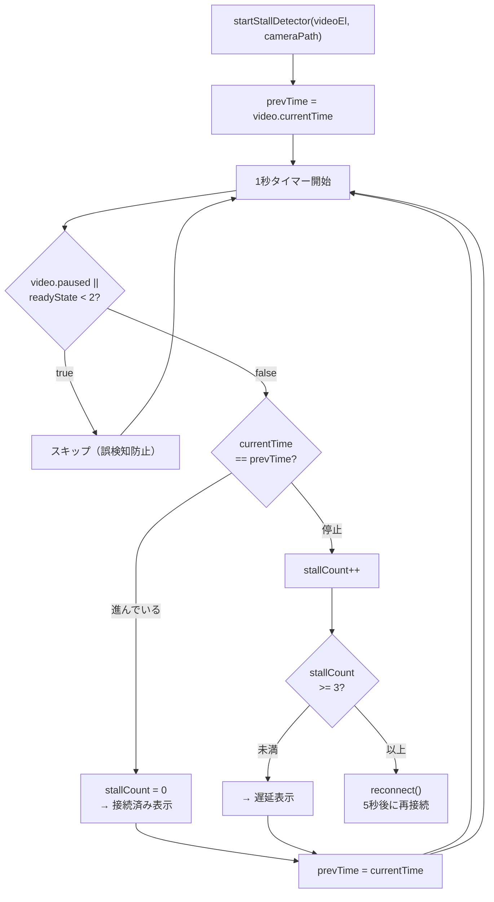

### 8.7 全画面表示実装（CSSオーバーレイ方式）

Chromeキオスクモードでは `requestFullscreen()` が制限されるため、`position: fixed` のオーバーレイ要素で全画面表示を実現する。

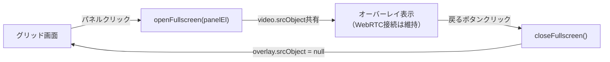

| 要素 | 役割 |
|---|---|
| `#fullscreen-overlay` | `position: fixed` の全面オーバーレイ |
| `#overlay-video` | グリッド側 srcObject を共有する video 要素 |
| `#overlay-back-btn` | 戻るボタン |

WebRTC接続は1本のまま。オーバーレイを閉じると `srcObject = null` で解放し、グリッド側は継続再生する。

### 8.8 リソースグラフ（Chart.js v4）

| 項目 | 詳細 |
|---|---|
| ライブラリ | Chart.js v4.x（CDN経由） |
| 表示データ | CPU使用率・温度・ディスクI/O・メモリ使用率 |
| X軸 | Unixタイムスタンプ（秒）。5分間隔（300秒）でHH:MM形式ラベル表示 |
| 系列 | ブラウザクライアント（/api/my-history）とrpi4-1（/data/rpi4-1-history.ndjson）の2系列 |
| 更新間隔 | 30秒ごとにfetch |
| X軸実装 | `afterBuildTicks` でtickを明示生成（300秒刻み）+ `callback` で `HH:MM` 形式に変換 |

> **実装上の注意**:  
> Chart.js v4 でUnixタイムスタンプ（秒）を linear スケールで使うとき、`stepSize:300` を設定すると  
> エポック(0)を起点に tick が生成されるため、現在時刻付近では約50億個の tick が生成され  
> `maxTicksLimit` によるダウンサンプリングで5分刻みの tick が消える問題がある。  
> これを回避するため `afterBuildTicks` で `Math.ceil(axis.min / 300) * 300` を起点に  
> 300秒刻みの tick を手動生成し、`stepSize` と `maxTicksLimit` は使用しない。  
>
> また `callback` で `null` を返すと tick のラベルだけでなくグリッド線も消えるため、  
> グリッド線は `grid: { color: '#333' }` を設定しつつ callback は常に文字列を返す。

---

## 付録: systemdユニットファイル一覧

### rpi4-1 ユニット

| ユニット | Type | ExecStart | 役割 |
|---|---|---|---|
| push-daemon.service | simple | python3 /home/indo/bin/push_daemon.py | メトリクス受信デーモン（常駐） |
| collect-metrics.service | oneshot | bash /home/indo/bin/collect_metrics.sh | rpi4-1自己収集（タイマーから起動） |
| collect-metrics.timer | - | OnCalendar: *:*:00/30 | 30秒間隔で collect-metrics.service を起動 |

### Linuxクライアント（vostro）ユニット

| ユニット | Type | ExecStart | 役割 |
|---|---|---|---|
| push-metrics.service | oneshot | bash /home/indou/bin/push_metrics.sh | メトリクス収集・送信（タイマーから起動） |
| push-metrics.timer | - | OnCalendar: *:*:00/30 | 30秒間隔で push-metrics.service を起動 |
