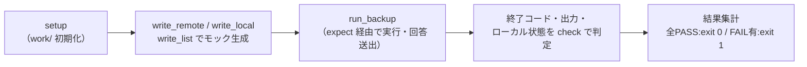

# backup.sh 単体テスト仕様書

作成日: 2026-05-22
対象: `inventory/backup.sh`（backup.txt に基づきリモートからローカルへファイルをバックアップするスクリプト）

---

## 1. 概要

> **ID 表記**: 本書のテストケース ID `TC-NNN` は **Test Case**（テストケース）の略。

`backup.sh` は、バックアップリスト `backup.txt` の各行（`ローカルパス リモートパス`）を読み込み、
リモートファイルを取得してローカルファイルと比較し、差分があれば確認のうえ
リモート→ローカルへコピー（`cp -p`）する。差分なしはスキップ、ローカル未存在は
新規バックアップとして扱う。`release.sh`（local→remote リリース）と対をなす鏡像スクリプトである。
本仕様書は、その行解析・取得・差分判定・確認分岐・コピー・件数集計の動作を検証する単体テストを定義する。

---

## 2. テスト構成

```
ut/backup.sh/
├── 単体テスト仕様書.md      本書
├── init.sh                  試験環境の初期化（試験対象の存在・構文確認、expect 確認、work/ 作成）
├── testlib.sh               共通ライブラリ（モック生成・実行・判定・ログ）
├── drive.exp                expect ドライバ（擬似端末で confirm プロンプトへ回答送出）
├── bin/scp                   フェイク scp（モックリモートFS からダウンロード）
├── TC-010.sh 〜 TC-120.sh    テストケース（計12件）
├── run_all.sh               一括実行（init.sh + 全TC実行 + 集計）
├── .gitignore               work/・*.log を除外
└── work/                    各TCが生成（ローカル/モックリモートFS/出力/呼び出し記録）
```

| ファイル | 役割 |
|---|---|
| init.sh | 試験対象の存在・構文と expect の有無を確認し、フェイクコマンドへ実行権限を付与、`work/` を作り直す |
| testlib.sh | ローカル/モックリモートFS/backup.txt の生成、試験対象の実行、確認事項判定、ログ採取 |
| drive.exp | 擬似端末(pty)を供給して backup.sh を起動し、`confirm()` プロンプトへ S/Y/C を順に送出 |
| bin/scp | フェイク scp。`user@host:path` をモックリモートFSからダウンロード、呼び出しを記録 |
| TC-NNN.sh | 1テストケース。確認事項を `check`/`check_eq` で判定し、`TC-NNN.sh.log` へ全出力を記録 |
| run_all.sh | init.sh と全 TC を実行し、TC単位の成否を集計 |

---

## 3. テスト方式

### 3.1 無改修テスト（expect + フェイクコマンド）

`backup.sh` はバックアップ確認を `/dev/tty` 経由で対話的に行うため、`confirm()` の入出力には
擬似端末(pty)が必要である。本テストは試験対象を改修せず、`drive.exp`（expect ドライバ）で
pty を供給して起動し、`C)ancel]:` プロンプトを検出するたびに回答列の S/Y/C を順に送出する。

実ネットワーク・実リモートを使わないため、`scp` をフェイクコマンドへ差し替える。
`PATH` 先頭に `bin/` を注入し、backup.sh から実コマンドの代わりに呼ばせる。
`backup.sh` はリモート→ローカルのダウンロードしか行わないため、フェイク `scp` は
ダウンロード専用とし、`ssh` のフェイクは不要である。

| 環境変数 / 仕組み | 役割 |
|---|---|
| `drive.exp` | pty 供給と confirm プロンプトへの回答送出。backup.sh の終了コードをそのまま返す |
| `PATH=bin/:$PATH` | フェイク scp を実コマンドより優先させる |
| `REMOTE_ROOT` | モックリモートFS のルート（`work/remote/`）。フェイク scp が参照（export 済み） |
| `CALL_LOG` | フェイク scp の呼び出し記録先（`work/calls.log`）（export 済み） |
| `LOG_DIR` | backup.sh のログ出力先を `work/` に差し替える |

`run_backup` は CWD を `work/local/` にして実行する。これにより backup.txt の
スラッシュ無しローカルパスが `./` 付与で `work/local/` 配下に解決される（TC-100 で検証）。

### 3.2 モックリモートFS

`bin/scp` はダウンロード時に `REMOTE_ROOT` 配下の実体を参照し、不在なら失敗（exit 1）する。
これにより backup.sh の「リモートファイル取得失敗＝エラー計上」分岐を検証できる（TC-070）。
テストケースは `write_remote` で事前にリモート状態を、`write_local` でローカル状態を作り、
実行後に `local_content` / `local_exists` でバックアップ先ローカルの更新結果を検証する。

### 3.3 各テストケースの流れ



各 TC は `setup` で `work/` を初期化するため、テストケース間の干渉はない。

### 3.4 ログ

- 各 TC の全出力を `TC-NNN.sh.log` に記録する（毎回上書き）
- 確認事項に1件でも FAIL があれば、その TC は終了コード `1` で終了する

---

## 4. テストケース一覧

| TC | 確認内容 | 対象 |
|---|---|---|
| TC-010 | リモートとローカルが同一内容の行はスキップされる | 差分判定 |
| TC-020 | 差分あり + Y 回答でローカルが更新される | 確認分岐・コピー |
| TC-030 | 差分あり + S 回答でスキップされローカルは更新されない | 確認分岐 |
| TC-040 | C 回答でキャンセルされ後続行は処理されない | 確認分岐 |
| TC-050 | ローカル未存在のファイルは Y 回答で新規バックアップされる | 新規判定・コピー |
| TC-060 | ローカル未存在のファイルは S 回答でスキップされる | 新規判定 |
| TC-070 | リモートファイル取得失敗の行はエラーとして計上される | エラー処理 |
| TC-080 | フィールド不足の行は警告されエラー計上される | 行解析 |
| TC-090 | コメント行・空行は無視され処理対象にならない | 行解析 |
| TC-100 | スラッシュ無しローカルパスはカレント基準で解決される | 行解析 |
| TC-110 | ローカルへの書き込み失敗の行はエラーとして計上される | エラー処理 |
| TC-120 | 複数行混在時の完了カウントが正しく集計される | 件数集計 |

---

## 5. 各テストケース詳細

### TC-010: 差分なしのスキップ
- **目的**: リモートとローカルが同一内容のとき、確認なしでスキップされることを確認する
- **手順**: リモート・ローカルとも `SAME-CONTENT` のファイルで実行（回答列なし）
- **確認事項**: ① exit 0 で終了する ② 「差分なし」と判定され出力される ③ 集計がスキップ1件である

### TC-020: 差分あり + Y 回答でバックアップ
- **目的**: 差分のあるファイルに Y と回答するとローカルがリモート内容で更新されることを確認する
- **手順**: リモート `NEW-VERSION`・ローカル `OLD-VERSION` で Y 回答実行
- **確認事項**: ① exit 0 ② ローカルがリモート内容で更新される ③ 集計がバックアップ1件である

### TC-030: 差分あり + S 回答でスキップ
- **目的**: 差分のあるファイルに S と回答するとローカルが更新されないことを確認する
- **手順**: リモート `NEW-VERSION`・ローカル `OLD-VERSION` で S 回答実行
- **確認事項**: ① exit 0 ② ローカルは元の内容のままである ③ 集計がスキップ1件である

### TC-040: C 回答でキャンセル
- **目的**: 1行目に C と回答すると即終了し、2行目が処理されないことを確認する
- **手順**: 2行のリストで1行目に C 回答実行
- **確認事項**: ① exit 0 ② キャンセルメッセージが出力される ③ 2行目が処理されない
  ④ 2行目のローカルは更新されない

### TC-050: ローカル未存在 + Y 回答で新規バックアップ
- **目的**: ローカルに無いファイルが「新規バックアップ」として確認され、Y で取得されることを確認する
- **手順**: ローカルを作成せず、リモート `BRAND-NEW` で Y 回答実行
- **確認事項**: ① exit 0 ② 新規バックアップとして確認される ③ ローカルに新規ファイルが作成される
  ④ 集計がバックアップ1件である

### TC-060: ローカル未存在 + S 回答でスキップ
- **目的**: 新規バックアップの確認に S と回答すると、ローカルに作成されないことを確認する
- **手順**: ローカルを作成せず、リモート `BRAND-NEW` で S 回答実行
- **確認事項**: ① exit 0 ② ローカルにファイルが作成されない ③ 集計がスキップ1件である

### TC-070: リモートファイル取得失敗のエラー計上
- **目的**: backup.txt が指すリモートファイルが無いとき、取得失敗でエラー扱いとなることを確認する
- **手順**: リモートファイルを作成せずに実行
- **確認事項**: ① エラーありで exit 1 する ② リモート取得失敗のエラーが出力される ③ 集計がエラー1件である

### TC-080: フィールド不足のエラー計上
- **目的**: backup.txt の行にリモートパスが無いとき、警告されエラー扱いとなることを確認する
- **手順**: ローカルパスのみの行（リモートパス無し）で実行
- **確認事項**: ① エラーありで exit 1 する ② フィールド不足の警告が出力される ③ 集計がエラー1件である

### TC-090: コメント行・空行の無視
- **目的**: backup.txt のコメント行と空行が処理対象から除外されることを確認する
- **手順**: コメント行・空行・先頭空白付きコメントのみのリストで実行
- **確認事項**: ① exit 0 ② コメント・空行は集計されない（バックアップ0/スキップ0/エラー0）

### TC-100: スラッシュ無しローカルパスの解決
- **目的**: ローカルパスがファイル名のみのとき、`./` 付与でカレント基準に解決されることを確認する
- **手順**: ローカルパスを `app.js`（スラッシュ無し）と記述したリストで Y 回答実行
- **確認事項**: ① exit 0 ② ファイル名のみの指定でもバックアップされる ③ 集計がバックアップ1件である

### TC-110: ローカル書き込み失敗のエラー計上
- **目的**: ローカルへの `cp` が失敗したとき、エラー扱いとなることを確認する
  （backup.sh 固有の cp 失敗分岐。release.sh には無い）
- **手順**: 親ディレクトリが存在しないローカルパスを指定して Y 回答実行（`cp -p` が失敗する）
- **確認事項**: ① エラーありで exit 1 する ② ローカル書き込み失敗のエラーが出力される
  ③ 集計がエラー1件である

### TC-120: 複数行混在の件数集計
- **目的**: 差分あり・差分なし・リモート取得失敗を1リストに混在させ、集計が正しいことを確認する
- **手順**: バックアップ対象・スキップ対象・リモート不在の3行リストで Y 回答実行
- **確認事項**: ① エラーありで exit 1 する ② 集計がバックアップ1/スキップ1/エラー1である
  ③ バックアップ対象は更新される

---

## 6. 実行方法

### 一括実行

```bash
cd ut/backup.sh
./run_all.sh
```

`init.sh` による試験環境準備の後、全 TC を実行し、末尾に `集計: TC成功=N件 TC失敗=N件`
を出力する。全 TC 成功で終了コード `0`、1件でも失敗で `1`。

### 個別実行

```bash
cd ut/backup.sh
./init.sh            # 初回のみ（フェイクコマンドへ実行権限付与、work/ 作成）
./TC-110.sh          # 任意の TC を個別実行
```

### 前提

`expect` がインストールされていること（`init.sh` が存在を確認する）。

### ログ確認

実行ログは各スクリプトと同じ場所に出力される（毎回上書き）。

| ログ | 内容 |
|---|---|
| `TC-NNN.sh.log` | 当該テストケースの全出力（確認結果） |
| `init.sh.log` | 試験環境初期化の全出力 |
| `run_all.sh.log` | 一括実行の全出力 |

---

## 7. テスト結果

| 実施日 | 結果 | 備考 |
|---|---|---|
| 2026-05-22 | 全12 TC・37確認事項 PASS | 初回実施。release.sh 単体テストの枠組みを流用 |
