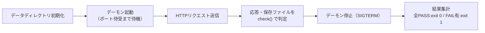

# push_daemon.py 単体テスト仕様書

作成日: 2026-05-18
対象: `inventory/rpi4-1/push_daemon.py`（メトリクス受信デーモン）

---

## 1. 概要

> **ID 表記**: 本書のテストケース ID `TC-NNN` は **Test Case**（テストケース）の略。

`push_daemon.py` は、クライアントから `POST /api/push` を受信し、送信元IPごとに
最新値JSON（`{IP}.json`）と履歴NDJSON（`{IP}-history.ndjson`）を保存するHTTPデーモンである。
本仕様書は、その受信・保存・入力検証の動作を検証する単体テストを定義する。

---

## 2. テスト構成

```
ut/push_daemon.py/
├── 単体テスト仕様書.md      本書
├── init.sh                  試験環境の初期化（push_daemon.py のコピー・sed改変）
├── testlib.py               共通ライブラリ（デーモン制御・HTTP送信・判定・ログ）
├── TC-010.py 〜 TC-120.py    テストケース（計12件）
├── run_all.sh               一括実行（init.sh + 全TC実行 + 集計）
├── .gitignore               work/・*.log・__pycache__/ を除外
└── work/                    init.sh が生成（改変済みコピー・試験データ）
```

| ファイル | 役割 |
|---|---|
| init.sh | `inventory/rpi4-1/push_daemon.py` を `work/` へコピーし、試験用に sed 改変する |
| testlib.py | デーモン起動停止・HTTPリクエスト・確認事項判定・ログ採取の共通処理 |
| TC-0X0.py | 1テストケース。確認事項を `check()` で判定し、`TC-0X0.py.log` へ全出力を記録 |
| run_all.sh | init.sh と全 TC を実行し、TC単位の成否を集計 |

---

## 3. テスト方式

### 3.1 init.sh による sed 改変

`push_daemon.py` は保存先・ポートが固定のため、試験用に以下を改変したコピーを `work/` に作る。

| 改変対象 | 元の値 | 改変後 | 理由 |
|---|---|---|---|
| `DATA_DIR` | `/var/www/html/data` | `work/data` | 試験用の書き込み可能なパスにするため |
| `PORT` | `9091` | `19091` | 本番デーモンとのポート競合を避けるため |
| `MAX_HISTORY`（変種のみ） | `2880` | `5` | 履歴トリミングを少数のPOSTで検証するため |

生成物:
- `work/push_daemon.py` — 標準コピー（DATA_DIR・PORT 改変）
- `work/push_daemon_smallhist.py` — 履歴トリミング試験用変種（MAX_HISTORY=5 を追加改変）

### 3.2 各テストケースの流れ



各 TC はデーモンを毎回 fresh 起動（データディレクトリをクリアして起動）するため、
テストケース間の干渉はない。

### 3.3 ログ

- 各 TC の全出力（デーモン出力・確認結果・例外）を `TC-0X0.py.log` に記録する
- ログは毎回上書き（直近の実行分のみ保持）
- 確認事項に1件でも FAIL があれば、その TC は終了コード `1` で終了する

---

## 4. テストケース一覧

| TC | 確認内容 | 使用デーモン |
|---|---|---|
| TC-010 | 正常POSTでHTTP 200 / `ok` が返る | 標準 |
| TC-020 | 最新値ファイル `{IP}.json` が生成され送信値が保存される | 標準 |
| TC-030 | 履歴ファイル `{IP}-history.ndjson` に複数POSTで追記される | 標準 |
| TC-040 | 最新値ファイルは毎回上書きされ直近POSTの値のみ保持する | 標準 |
| TC-050 | `ts` 未指定POSTでサーバ側が `ts` を自動付与する | 標準 |
| TC-060 | `X-Real-IP` ヘッダーのIPでファイル名が決まる | 標準 |
| TC-070 | `/api/push` 以外のパスへのPOSTは404を返す | 標準 |
| TC-080 | 不正なJSONボディは400を返す | 標準 |
| TC-090 | 必須フィールド欠落のPOSTは400を返す | 標準 |
| TC-100 | Content-Length が上限(4096)超過のPOSTは400を返す | 標準 |
| TC-110 | 履歴がMAX_HISTORY行に収まるよう古い行が削除される | 変種(smallhist) |
| TC-120 | GETリクエストは501を返す（do_POSTのみ実装） | 標準 |

---

## 5. 各テストケース詳細

### TC-010: 正常POSTでHTTP 200/okが返る
- **目的**: 正常な JSON の受信が成功することを確認する
- **手順**: 全必須フィールドを含む JSON を `POST /api/push`
- **確認事項**: ① HTTPステータスが 200 ② レスポンスボディが `ok`

### TC-020: 最新値ファイルが生成され送信値が保存される
- **目的**: 受信データが最新値ファイルへ正しく保存されることを確認する
- **手順**: 正常な JSON を1回 POST し `127.0.0.1.json` を読み込む
- **確認事項**: ① ファイルが生成される ② hostname ③ cpu ④ mem が送信値と一致

### TC-030: 履歴ファイルに複数POSTで追記される
- **目的**: 履歴ファイルが追記方式であることを確認する
- **手順**: 正常な JSON を3回 POST し履歴ファイルの行数を数える
- **確認事項**: ① 履歴ファイルが生成される ② 行数が3行

### TC-040: 最新値ファイルは毎回上書きされる
- **目的**: 最新値ファイルが上書き方式で常に1件であることを確認する
- **手順**: 異なる値で2回 POST し最新値ファイルを確認する
- **確認事項**: ① ファイルが存在する ② 直近POSTの値で上書きされる ③ 1件のみ

### TC-050: ts未指定POSTでサーバ側がtsを自動付与する
- **目的**: `ts` 欠落時のサーバ側補完を確認する
- **手順**: `ts` を含めない JSON を POST し保存データを確認する
- **確認事項**: ① POST成功(200) ② ファイル存在 ③ 保存データに `ts` が付与される

### TC-060: X-Real-IPヘッダーで送信元IPが決まる
- **目的**: nginx 経由を想定した `X-Real-IP` 優先処理を確認する
- **手順**: `X-Real-IP: 10.20.30.40` を付けて POST する
- **確認事項**: ① POST成功(200) ② `10.20.30.40.json` が作られる ③ 接続元IPのファイルは作られない

### TC-070: 不正パスへのPOSTは404を返す
- **目的**: `/api/push` 以外のパスを拒否することを確認する
- **手順**: `/api/wrong` へ POST する
- **確認事項**: ① HTTPステータスが 404 ② ボディが `not found`

### TC-080: 不正なJSONボディは400を返す
- **目的**: JSON パース失敗時の入力検証を確認する
- **手順**: JSON として不正なボディを POST する
- **確認事項**: ① HTTPステータスが 400 ② ボディが `invalid JSON`

### TC-090: 必須フィールド欠落は400を返す
- **目的**: 必須フィールド検証を確認する
- **手順**: 必須フィールド `mem` を欠落させた JSON を POST する
- **確認事項**: ① HTTPステータスが 400 ② ボディに `missing fields` を含む

### TC-100: Content-Length上限超過のPOSTは400を返す
- **目的**: ボディサイズ上限（MAX_BODY=4096）の検証を確認する
- **手順**: `Content-Length` ヘッダーに 5000 を指定して POST する
- **確認事項**: ① HTTPステータスが 400 ② ボディが `invalid Content-Length`

### TC-110: 履歴がMAX_HISTORY行に収まる
- **目的**: 履歴ファイルのトリミング（古い行の削除）を確認する
- **前提**: `MAX_HISTORY=5` に改変した変種デーモンを使用する
- **手順**: 正常な JSON を7回 POST し履歴ファイルの行数を数える
- **確認事項**: ① 履歴ファイルが存在する ② 行数が MAX_HISTORY(5) 行に収まる

### TC-120: GETリクエストは501を返す
- **目的**: 未実装メソッド（GET）の扱いを確認する
- **手順**: `GET /api/push` を送信する
- **確認事項**: ① HTTPステータスが 501

---

## 6. 実行方法

### 一括実行

```bash
cd ut/push_daemon.py
./run_all.sh
```

`init.sh` による試験環境準備の後、全 TC を実行し、末尾に `集計: TC成功=N件 TC失敗=N件`
を出力する。全 TC 成功で終了コード `0`、1件でも失敗で `1`。

### 個別実行

```bash
cd ut/push_daemon.py
./init.sh            # 初回または push_daemon.py 更新時のみ
python3 TC-010.py    # 任意の TC を個別実行
```

### ログ確認

実行ログは各スクリプトと同じ場所に出力される（毎回上書き）。

| ログ | 内容 |
|---|---|
| `TC-0X0.py.log` | 当該テストケースの全出力（デーモン出力・確認結果） |
| `init.sh.log` | 試験環境初期化の全出力 |
| `run_all.sh.log` | 一括実行の全出力 |
