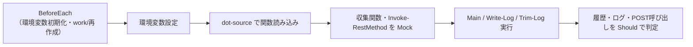

# push_metrics.ps1 単体テスト仕様書

作成日: 2026-05-22
対象: `inventory/client/win/push_metrics.ps1`（Windows クライアントのメトリクス収集・送信スクリプト）

---

## 1. 概要

> **ID 表記**: 本書のテストケース ID `TC-NNN` は **Test Case**（テストケース）の略。

`push_metrics.ps1` は、Windows クライアント自身の CPU使用率・CPU温度・DiskI/O・メモリ使用率を
収集し、ローカル履歴NDJSON（`history.ndjson`）へ保存したうえで rpi4-1 へ HTTP POST する。
タスクスケジューラから30秒間隔で呼び出す想定である。
本仕様書は、その履歴保存・JSON生成・POST送信・ログ管理の動作を検証する単体テストを定義する。

---

## 2. テスト構成

```
ut/push_metrics.ps1/
├── 単体テスト仕様書.md       本書
├── init.sh                   試験環境の初期化（pwsh・Pester の確認、構文確認、work/ 作成）
├── push_metrics.Tests.ps1    Pester テスト（TC-010〜TC-120 を It ブロックで定義）
├── run_all.sh                一括実行（init.sh + Pester 実行 + 集計）
├── .gitignore                work/・*.log を除外
└── work/                     各テストが生成（履歴・ログの出力先）
```

| ファイル | 役割 |
|---|---|
| init.sh | `pwsh`・`Pester` モジュールの存在と試験対象の構文を確認し、`work/` を作り直す |
| push_metrics.Tests.ps1 | Pester テスト本体。12 件の `It`（TC-010〜TC-120）を1ファイルに定義 |
| run_all.sh | init.sh を実行後、Pester でテストを実行し結果を集計する |

### 2.1 テストフレームワーク

PowerShell の標準テストフレームワーク **Pester 5** を用いる。
他スクリプト（bash/python）の単体テストは独自フレームワーク（TC-NNN ファイル分割）だが、
PowerShell では Pester が事実上の標準であり、関数の差し替え（Mock）が必須となるため、
Pester を採用し12件のテストケースを1ファイルの `It` ブロックとして記述する。
各 `It` の名称を `TC-0X0:` 始まりとし、他スクリプトの TC 番号体系と対応づける。

本テストは Linux 上の PowerShell 7（`pwsh`）+ Pester で実行・検証する。

---

## 3. テスト方式

### 3.1 dot-source とメトリクス収集関数の Mock

`push_metrics.ps1` のメトリクス収集（`Get-CpuPercent` 等）は `Get-Counter`・WMI など
Windows 専用の仕組みに直結しており、Linux では実行できない。
そこでテストは試験対象を **dot-source**（`. $SUT`）して関数定義のみを読み込み、
収集関数 4 種を Pester の `Mock` で固定値に差し替えたうえで `Main` を実行する。

| Mock 対象 | 役割 | テスト時の戻り値 |
|---|---|---|
| `Get-CpuPercent` | CPU使用率収集 | `12.3` |
| `Get-CpuTempC` | CPU温度収集 | `47.5` |
| `Get-DiskRwBps` | DiskI/O収集 | `204800` |
| `Get-MemInfo` | メモリ情報収集 | `@{ pct = 31.4; total_kb = 16384000 }` |
| `Invoke-RestMethod` | POST送信 | 成功時は無応答 / 失敗時は例外送出 |

OS依存の収集関数そのもの（`Get-Counter`/WMI の呼び出し）は Windows 実機でのみ
検証可能なため本テストの対象外とし、本テストは収集値を受け取った後の
**履歴保存・JSON生成・POST送信・ログ管理**を検証する。

### 3.2 試験対象の改修（単体テスト対応）

dot-source とモック差し替えを可能にするため、`push_metrics.ps1` に以下の改修を行った
（Windows 実機での動作は不変）。

| 改修 | 内容 |
|---|---|
| Main 実行ガード | 末尾の `Main` 呼び出しを `if ($MyInvocation.InvocationName -ne '.')` で囲み、dot-source 時は関数定義のみ読み込むようにした |
| `MAX_HISTORY`/`MAX_LOG` の環境変数化 | `PUSH_MAX_HISTORY`・`PUSH_MAX_LOG` で上書き可能にし、少数でのトリミング検証を可能にした |
| パス結合の `Join-Path` 化 | 履歴・ログのパス結合を文字列連結（`\` 固定）から `Join-Path` に変更し、Windows・Linux 双方で正しいパスになるようにした |

### 3.3 環境変数によるモック差し替え

`push_metrics.ps1` は送信先・保存先・上限値を環境変数で差し替え可能（既定値は本番値）。

| 環境変数 | 本番既定値 | テスト時 |
|---|---|---|
| `PUSH_ENDPOINT` | `http://rpi4-1.tsystem.gr.jp/api/push` | TC-090 のみ `http://mock.example/api/push` |
| `PUSH_HISTORY_DIR` | `%APPDATA%\push_metrics` | `work/` 配下 |
| `PUSH_MAX_HISTORY` | `2880` | TC-040 のみ `5`（少数実行でトリミング検証） |
| `PUSH_MAX_LOG` | `5000` | TC-110 のみ `5`（少数実行でトリミング検証） |

Linux テストホストには `COMPUTERNAME` 環境変数が無いため、`Main` の `hostname` 取得用に
テスト側で `COMPUTERNAME=TESTHOST` を設定する。

### 3.4 各テストケースの流れ



各 TC は `BeforeEach` で環境変数と `work/` を初期化するため、テストケース間の干渉はない。

### 3.5 ログ

- 一括実行の全出力を `run_all.sh.log`・`init.sh.log` に記録する（毎回上書き）
- Pester は各 `It` の成否と末尾に `Tests Passed: N, Failed: N` を出力する
- 失敗テストがあれば `run_all.sh` は終了コード 0 以外で終了する

---

## 4. テストケース一覧

| TC | 確認内容 | 対象 |
|---|---|---|
| TC-010 | 履歴ファイルに7フィールドの JSON が1行追記される | Main・履歴保存 |
| TC-020 | 履歴 JSON の各フィールドが収集値を反映する | Main・JSON生成 |
| TC-030 | 複数回実行で履歴が追記される | Main・履歴保存 |
| TC-040 | 履歴が MAX_HISTORY 行を超えないようトリミングされる | Main・履歴トリミング |
| TC-050 | HISTORY_DIR が存在しない場合は作成される | Main・初期化 |
| TC-060 | 収集した JSON が ENDPOINT へ POST される | Main・POST送信 |
| TC-070 | POST 失敗時も例外で落ちず処理が完了する | Main・POST失敗処理 |
| TC-080 | POST 失敗時も履歴は保存され警告がログに記録される | Main・POST失敗処理 |
| TC-090 | ENDPOINT 環境変数の上書きが POST 先に反映される | Main・送信先設定 |
| TC-100 | Write-Log がタイムスタンプ付きでログ行を追記する | Write-Log |
| TC-110 | Trim-Log が MAX_LOG 超過時にログをトリミングする | Trim-Log |
| TC-120 | Trim-Log はログファイルが無い場合に何もせずエラーにならない | Trim-Log |

---

## 5. 各テストケース詳細

### TC-010: 履歴への JSON 追記
- **目的**: 履歴ファイルに必須7フィールドを含む JSON が1行追記されることを確認する
- **手順**: 収集関数をモックして `Main` を1回実行する
- **確認事項**: ① 履歴が1行になる ② 各レコードに hostname/ts/cpu/temp/disk_rw/mem/mem_total が存在する

### TC-020: 履歴 JSON の値反映
- **目的**: 収集した各値が履歴 JSON に正しく反映されることを確認する
- **手順**: 収集関数をモック（cpu=12.3 等）して `Main` を実行する
- **確認事項**: ① hostname が `testhost` ② cpu が `12.3` ③ temp が `47.5` ④ disk_rw が `204800`
  ⑤ mem が `31.4` ⑥ mem_total が `16384000` ⑦ ts が `yyyy-MM-ddTHH:mm:ss` 形式

### TC-030: 履歴への追記
- **目的**: 履歴ファイルが追記方式で、実行ごとに行が増えることを確認する
- **手順**: `Main` を3回実行し履歴ファイルの行数を確認する
- **確認事項**: ① 履歴が3行になる

### TC-040: 履歴のトリミング
- **目的**: 履歴ファイルが MAX_HISTORY 行に収まるよう古い行が削除されることを確認する
- **前提**: `PUSH_MAX_HISTORY=5` に差し替えて実行する
- **手順**: `Main` を7回実行し履歴ファイルの行数を数える
- **確認事項**: ① 履歴が MAX_HISTORY(5) 行に収まる

### TC-050: HISTORY_DIR の作成
- **目的**: 保存先ディレクトリが存在しない場合に `Main` が作成することを確認する
- **手順**: 未存在のディレクトリを `PUSH_HISTORY_DIR` に指定して `Main` を実行する
- **確認事項**: ① 実行前は HISTORY_DIR が未存在 ② 実行後は HISTORY_DIR が存在する

### TC-060: メトリクス JSON の POST 送信
- **目的**: 収集したメトリクスが ENDPOINT へ POST されることを確認する
- **手順**: `Invoke-RestMethod` をモックして `Main` を実行する
- **確認事項**: ① `Invoke-RestMethod` が Method=Post・収集 JSON を Body として1回呼ばれる

### TC-070: POST 失敗時の継続
- **目的**: POST 失敗が例外でスクリプトを停止させないことを確認する
- **手順**: `Invoke-RestMethod` が例外を送出するモックで `Main` を実行する
- **確認事項**: ① `Main` が例外を送出せず完了する

### TC-080: POST 失敗時の履歴保存とログ
- **目的**: POST 失敗時もローカル履歴は保存され、警告がログに残ることを確認する
- **手順**: `Invoke-RestMethod` が例外を送出するモックで `Main` を実行する
- **確認事項**: ① 履歴が1行保存される ② エラーログに `POST failed` の警告が記録される

### TC-090: ENDPOINT 環境変数の上書き
- **目的**: `PUSH_ENDPOINT` による送信先の上書きが反映されることを確認する
- **手順**: `PUSH_ENDPOINT` を差し替えて `Main` を実行する
- **確認事項**: ① `Invoke-RestMethod` が差し替えた URI で呼ばれる

### TC-100: Write-Log の追記
- **目的**: `Write-Log` がタイムスタンプ付きでログ行を追記することを確認する
- **手順**: `Write-Log` でメッセージを1件出力する
- **確認事項**: ① ログ行が `yyyyMMdd.HHmmss: <メッセージ>` 形式である

### TC-110: Trim-Log のトリミング
- **目的**: `Trim-Log` がログを MAX_LOG 行に収めることを確認する
- **前提**: `PUSH_MAX_LOG=5` に差し替えて実行する
- **手順**: `Write-Log` を8回実行後、`Trim-Log` を呼ぶ
- **確認事項**: ① トリミング前は8行 ② `Trim-Log` 後は MAX_LOG(5) 行に収まる

### TC-120: Trim-Log のログ無し時の挙動
- **目的**: ログファイルが無い状態で `Trim-Log` がエラーにならないことを確認する
- **手順**: ログファイルが無い状態で `Trim-Log` を呼ぶ
- **確認事項**: ① ログファイルが未存在 ② `Trim-Log` が例外を送出しない

---

## 6. 実行方法

### 前提

- PowerShell 7（`pwsh`）がインストールされていること（`snap install powershell --classic` 等）
- Pester モジュールがインストールされていること（`Install-Module Pester -Scope CurrentUser`）

`init.sh` が両者の存在を確認する。

### 一括実行

```bash
cd ut/push_metrics.ps1
./run_all.sh
```

`init.sh` による試験環境準備の後、Pester で全 TC を実行し、末尾に
`Tests Passed: N, Failed: N` を出力する。全 TC 成功で終了コード `0`、1件でも失敗で非ゼロ。

### 個別実行

```bash
pwsh -Command "Invoke-Pester -Path ut/push_metrics.ps1/push_metrics.Tests.ps1 -Output Detailed"
```

特定の TC のみ実行する場合は `-FullNameFilter '*TC-060*'` を付与する。

### ログ確認

実行ログは各スクリプトと同じ場所に出力される（毎回上書き）。

| ログ | 内容 |
|---|---|
| `init.sh.log` | 試験環境初期化の全出力 |
| `run_all.sh.log` | 一括実行（init.sh + Pester）の全出力 |

---

## 7. テスト結果

| 実施日 | 結果 | 備考 |
|---|---|---|
| 2026-05-22 | 全12 TC・29アサーション PASS | 初回実施。Linux + pwsh 7.6.1 + Pester 5.7.1 で検証 |
