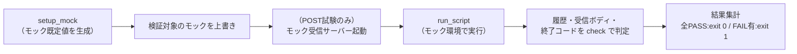

# push_metrics.sh 単体テスト仕様書

作成日: 2026-05-21
対象: `inventory/client/lin/push_metrics.sh`（Linux クライアントのメトリクス収集・送信スクリプト）

---

## 1. 概要

> **ID 表記**: 本書のテストケース ID `TC-NNN` は **Test Case**（テストケース）の略。

`push_metrics.sh` は、Linux クライアント自身の CPU使用率・CPU温度・DiskI/O・メモリ使用率を
`/proc`・`/sys` から収集し、ローカル履歴NDJSON（`history.ndjson`）へ保存したうえで
rpi4-1 へ HTTP POST する。systemd timer / cron から30秒間隔で呼び出す想定である。
本仕様書は、その収集・算出・ローカル保存・POST 送信の動作を検証する単体テストを定義する。

---

## 2. テスト構成

```
ut/push_metrics.sh/
├── 単体テスト仕様書.md      本書
├── init.sh                  試験環境の初期化（試験対象の存在・構文確認、work/ 作成）
├── testlib.sh               共通ライブラリ（モック生成・受信サーバー制御・実行・判定・ログ）
├── mock_recv.py             モック受信サーバー（POST を受信しボディを保存）
├── TC-010.sh 〜 TC-120.sh    テストケース（計12件）
├── run_all.sh               一括実行（init.sh + 全TC実行 + 集計）
├── .gitignore               work/・*.log・__pycache__/ を除外
└── work/                    init.sh が生成（モックファイル・試験出力・受信ボディ）
```

| ファイル | 役割 |
|---|---|
| init.sh | 試験対象の存在・構文と python3 の有無を確認し、`work/` を作り直す |
| testlib.sh | モックファイル生成・受信サーバー起動停止・試験対象の実行・確認事項判定・ログ採取 |
| mock_recv.py | POST を受信しボディを保存して 200/ok を返す最小 HTTP サーバー |
| TC-NNN.sh | 1テストケース。確認事項を `check`/`check_eq` で判定し、`TC-NNN.sh.log` へ全出力を記録 |
| run_all.sh | init.sh と全 TC を実行し、TC単位の成否を集計 |

---

## 3. テスト方式

### 3.1 環境変数によるモック差し替え

`push_metrics.sh` はメトリクス取得元・送信先を環境変数で差し替え可能（既定値は実カーネル）。
本テストはモックファイルを用意し、以下の環境変数で取得元・送信先を差し替える。

| 環境変数 | 本番既定値 | テスト時 |
|---|---|---|
| `PROC_STAT` / `PROC_STAT_2` | `/proc/stat` | `work/mock/stat1` / `stat2` |
| `PROC_DISKSTATS` / `PROC_DISKSTATS_2` | `/proc/diskstats` | `work/mock/diskstats1` / `diskstats2` |
| `PROC_MEMINFO` | `/proc/meminfo` | `work/mock/meminfo` |
| `THERMAL_GLOB` | `/sys/class/thermal/thermal_zone*/temp` | `work/mock/thermal/thermal_zone*/temp` |
| `HWMON_GLOB` | `/sys/class/hwmon/hwmon*/temp*_input` | `work/mock/hwmon/hwmon*/temp*_input` |
| `HISTORY_DIR` | `~/.local/share/push_metrics` | `work/hist` |
| `ENDPOINT` | `http://rpi4-1.tsystem.gr.jp/api/push` | モック受信サーバー or 到達不能URL |
| `SAMPLE_DELAY` | `1` | `0`（2サンプル間待機を省き高速化） |
| `MAX_HISTORY` | `2880` | TC-100 のみ `5`（少数実行でトリミング検証） |

`collect_cpu_disk()` は2サンプルの差分を取るため、取得元を `PROC_STAT`（1回目）と
`PROC_STAT_2`（2回目）に分離している。本番では `_2` 系の既定値が1回目と同一パスのため、
従来通り同一ファイルを2回読む。`collect_temp()` は thermal_zone（RPi等）と hwmon
（x86 PC等）の両方を参照するため、取得元を `THERMAL_GLOB`・`HWMON_GLOB` に分離している。

### 3.2 POST 送信の検証（モック受信サーバー）

POST 送信先の検証には、本番受信側 `push_daemon.py` の代用となる最小 HTTP サーバー
`mock_recv.py` を用いる。`mock_recv.py` は POST を受信するとボディを `work/received.json`
へ保存し 200/ok を返す。テストケースは `ENDPOINT` を `mock_recv.py` へ向けて実行し、
受信ボディの内容を検証する（TC-110）。POST 失敗時の挙動は到達不能 URL で検証する（TC-120）。

### 3.3 各テストケースの流れ



各 TC は `setup_mock` で全メトリクスの既定正常値を生成し、検証対象のモックのみ
上書きする。TC ごとに `work/` を初期化するため、テストケース間の干渉はない。

### 3.4 ログ

- 各 TC の全出力を `TC-NNN.sh.log` に記録する（毎回上書き）
- 確認事項に1件でも FAIL があれば、その TC は終了コード `1` で終了する

---

## 4. テストケース一覧

| TC | 確認内容 | 対象 |
|---|---|---|
| TC-010 | 複数 thermal_zone の最大値を milli→℃ 変換して取得する | collect_temp |
| TC-020 | hwmon センサーも参照し全体の最大値を取得する | collect_temp |
| TC-030 | 温度センサーが無い場合は 0.0 を返す | collect_temp |
| TC-040 | メモリ使用率と総メモリ量を meminfo から算出する | collect_mem |
| TC-050 | 2サンプルの差分から CPU 使用率を算出する | collect_cpu_disk |
| TC-060 | 2サンプルの差分から DiskI/O 量を算出する | collect_cpu_disk |
| TC-070 | CPU統計の差分が0のとき0除算せず 0.0 を返す | collect_cpu_disk |
| TC-080 | DISK_PAT に合致しないデバイスを集計から除外する | collect_cpu_disk |
| TC-090 | ローカル履歴に実行ごとに7フィールドの JSON が追記される | main |
| TC-100 | ローカル履歴が MAX_HISTORY 行を超えないようトリミングされる | main |
| TC-110 | 収集したメトリクス JSON をエンドポイントへ POST する | main |
| TC-120 | POST 失敗時も警告ログのみで正常終了(exit 0)する | main |

---

## 5. 各テストケース詳細

### TC-010: 複数 thermal_zone の最大値取得
- **目的**: 複数 thermal_zone のうち最大温度が選ばれ、milli→℃ 変換されることを確認する
- **手順**: zone0=42000・zone1=58000（milli-celsius）のモックで実行
- **確認事項**: ① 温度が最大ゾーンの `58.0` である

### TC-020: hwmon センサーの参照
- **目的**: x86 PC 等の hwmon センサーが thermal_zone と共に参照されることを確認する
- **手順**: thermal_zone=45000・hwmon=62000 のモックで実行
- **確認事項**: ① 温度が hwmon の `62.0` である

### TC-030: 温度センサー無しのフォールバック
- **目的**: thermal_zone・hwmon いずれも無いとき 0.0 にフォールバックすることを確認する
- **手順**: 温度センサーモックを全削除して実行
- **確認事項**: ① 温度が `0.0` である

### TC-040: メモリ使用率・総メモリ量の算出
- **目的**: meminfo の MemTotal・MemAvailable から使用率(%)と総量(KB)が算出されることを確認する
- **手順**: MemTotal=8000000・MemAvailable=6000000 のモックで実行
- **確認事項**: ① メモリ使用率が `25.0` ② 総メモリ量が `8000000`

### TC-050: CPU 使用率の算出
- **目的**: /proc/stat の2サンプル差分から CPU 使用率が算出されることを確認する
- **手順**: 1回目=全0、2回目=user100・idle300 のモックで実行（(400-300)/400×100 = 25.0）
- **確認事項**: ① CPU 使用率が `25.0` である

### TC-060: DiskI/O 量の算出
- **目的**: /proc/diskstats の2サンプル差分から DiskI/O 量(bytes)が算出されることを確認する
- **手順**: 1回目=sda 読0/書0、2回目=sda 読100/書100（セクタ）のモックで実行
- **確認事項**: ① DiskI/O 量が `102400` である

### TC-070: 0除算ガード
- **目的**: 2サンプルが同値で総差分が0でも、0除算せず 0.0 を返すことを確認する
- **手順**: 1回目と2回目を同値にしたモックで実行
- **確認事項**: ① CPU 使用率が `0.0` である

### TC-080: DISK_PAT による集計対象フィルタ
- **目的**: 集計対象パターン（sd/nvme/mmcblk/vd/hd）外のデバイスが除外されることを確認する
- **手順**: sda・nvme0n1・loop0 を含むモックで実行（loop0 を誤って含めると算出値が負になる）
- **確認事項**: ① DiskI/O 量が対象デバイスのみの `15360` である

### TC-090: ローカル履歴への追記
- **目的**: 履歴ファイルが追記方式で、各レコードが必須フィールドを含むことを確認する
- **手順**: 3回実行し履歴ファイルの行数とキーを確認する
- **確認事項**: ① 履歴が3行になる ②〜⑧ 各レコードに hostname/ts/cpu/temp/disk_rw/mem/mem_total が存在する

### TC-100: ローカル履歴のトリミング
- **目的**: 履歴ファイルが MAX_HISTORY 行に収まるよう古い行が削除されることを確認する
- **前提**: `MAX_HISTORY=5` に差し替えて実行する
- **手順**: 7回実行し履歴ファイルの行数を数える
- **確認事項**: ① 履歴が MAX_HISTORY(5) 行に収まる

### TC-110: メトリクス JSON の POST 送信
- **目的**: 収集したメトリクスが正しくエンドポイントへ POST されることを確認する
- **手順**: モック受信サーバーを起動し、温度55000・MemAvailable6000000 のモックで実行する
- **確認事項**: ① 受信サーバーが POST ボディを受信する ②〜⑧ 受信 JSON に必須7フィールドが存在する
  ⑨ 受信 JSON の温度が収集値 `55.0` ⑩ 受信 JSON のメモリ使用率が収集値 `25.0`
  ⑪ POST 成功時もローカル履歴が1行保存される

### TC-120: POST 失敗時の挙動
- **目的**: POST 失敗が「警告のみ」で扱われ、スクリプトが正常終了することを確認する
  （ERRトラップ無効化漏れによる exit 7 バグの回帰防止を兼ねる）
- **手順**: 到達不能な ENDPOINT で実行する
- **確認事項**: ① スクリプトが exit 0 で終了する ② エラーログに POST 失敗の警告が記録される
  ③ POST 失敗時もローカル履歴は保存される

---

## 6. 実行方法

### 一括実行

```bash
cd ut/push_metrics.sh
./run_all.sh
```

`init.sh` による試験環境準備の後、全 TC を実行し、末尾に `集計: TC成功=N件 TC失敗=N件`
を出力する。全 TC 成功で終了コード `0`、1件でも失敗で `1`。

### 個別実行

```bash
cd ut/push_metrics.sh
./init.sh            # 初回のみ（work/ 作成）
./TC-110.sh          # 任意の TC を個別実行
```

### ログ確認

実行ログは各スクリプトと同じ場所に出力される（毎回上書き）。

| ログ | 内容 |
|---|---|
| `TC-NNN.sh.log` | 当該テストケースの全出力（確認結果） |
| `init.sh.log` | 試験環境初期化の全出力 |
| `run_all.sh.log` | 一括実行の全出力 |

---

## 7. テスト結果

| 実施日 | 結果 | 備考 |
|---|---|---|
| 2026-05-21 | 全12 TC・33確認事項 PASS | 初回実施。事前に POST 失敗時 exit 7 バグを修正 |
