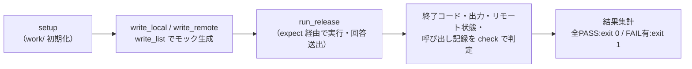

# release.sh 単体テスト仕様書

作成日: 2026-05-21
対象: `inventory/release.sh`（release.txt に基づきローカル→リモートへファイルをリリースするスクリプト）

---

## 1. 概要

> **ID 表記**: 本書のテストケース ID `TC-NNN` は **Test Case**（テストケース）の略。

`release.sh` は、リリースリスト `release.txt` の各行（`ローカルパス リモートパス`）を読み込み、
ローカルファイルとリモートファイルを比較して、差分があれば確認のうえ scp で転送する。
リモートパスがホームディレクトリ（`/home/` または `~/`）以外の場合は、
リモート `/tmp` 経由で `sudo mv` する。差分なしはスキップ、リモート未存在は新規リリースとして扱う。
本仕様書は、その行解析・差分判定・確認分岐・転送経路・件数集計の動作を検証する単体テストを定義する。

---

## 2. テスト構成

```
ut/release.sh/
├── 単体テスト仕様書.md      本書
├── init.sh                  試験環境の初期化（試験対象の存在・構文確認、expect 確認、work/ 作成）
├── testlib.sh               共通ライブラリ（モック生成・実行・判定・ログ）
├── drive.exp                expect ドライバ（擬似端末で confirm プロンプトへ回答送出）
├── bin/ssh, bin/scp          フェイク ssh/scp（モックリモートFS で動作・呼び出しを記録）
├── TC-010.sh 〜 TC-130.sh    テストケース（計13件）
├── run_all.sh               一括実行（init.sh + 全TC実行 + 集計）
├── .gitignore               work/・*.log を除外
└── work/                    各TCが生成（ローカル/モックリモートFS/出力/呼び出し記録）
```

| ファイル | 役割 |
|---|---|
| init.sh | 試験対象の存在・構文と expect の有無を確認し、フェイクコマンドへ実行権限を付与、`work/` を作り直す |
| testlib.sh | ローカル/モックリモートFS/release.txt の生成、試験対象の実行、確認事項判定、ログ採取 |
| drive.exp | 擬似端末(pty)を供給して release.sh を起動し、`confirm()` プロンプトへ S/Y/C を順に送出 |
| bin/ssh | フェイク ssh。`mkdir -p` / `sudo mv` をモックリモートFS上で実行し、呼び出しを記録 |
| bin/scp | フェイク scp。`user@host:path` をモックリモートFSへ写像してコピー、呼び出しを記録 |
| TC-NNN.sh | 1テストケース。確認事項を `check`/`check_eq` で判定し、`TC-NNN.sh.log` へ全出力を記録 |
| run_all.sh | init.sh と全 TC を実行し、TC単位の成否を集計 |

---

## 3. テスト方式

### 3.1 無改修テスト（expect + フェイクコマンド）

`release.sh` はリリース確認を `/dev/tty` 経由で対話的に行うため、`confirm()` の入出力には
擬似端末(pty)が必要である。本テストは試験対象を改修せず、`drive.exp`（expect ドライバ）で
pty を供給して起動し、`C)ancel]:` プロンプトを検出するたびに回答列の S/Y/C/D を順に送出する。
また `D)iff` 選択時のページャー起動を回避するため、`drive.exp` 内で `env(PAGER)=cat` を
設定し、diff 出力を直接 OUT へ流す（テスト中はページャー無効化）。

実ネットワーク・実リモートを使わないため、`ssh`・`scp` をフェイクコマンドへ差し替える。
`PATH` 先頭に `bin/` を注入し、release.sh から実コマンドの代わりに呼ばせる。
フェイクコマンドはモックリモートFS（`work/remote/` をリモート `/` に見立てたディレクトリ）上で
ファイル操作を行い、すべての呼び出しを `work/calls.log` に記録する。

| 環境変数 / 仕組み | 役割 |
|---|---|
| `drive.exp` | pty 供給と confirm プロンプトへの回答送出。release.sh の終了コードをそのまま返す |
| `PATH=bin/:$PATH` | フェイク ssh/scp を実コマンドより優先させる |
| `REMOTE_ROOT` | モックリモートFS のルート（`work/remote/`）。フェイク ssh/scp が参照（export 済み） |
| `CALL_LOG` | フェイク ssh/scp の呼び出し記録先（`work/calls.log`）（export 済み） |
| `LOG_DIR` | release.sh のログ出力先を `work/` に差し替える |

`run_release` は CWD を `work/local/` にして実行する。これにより release.txt の
スラッシュ無しローカルパスが `./` 付与で `work/local/` 配下に解決される（TC-100 で検証）。

### 3.2 モックリモートFS

`bin/scp` はダウンロード時に `REMOTE_ROOT` 配下の実体を参照し、不在なら失敗する
（release.sh の「リモート未存在＝新規リリース」判定に利用される）。アップロード時は
`REMOTE_ROOT` 配下へコピーする。`bin/ssh` は `mkdir -p` と `sudo mv`（sudo は無視）を
`REMOTE_ROOT` 配下で実行する。テストケースは `write_remote` で事前にリモート状態を作り、
実行後に `remote_content` / `remote_exists` でリモートの更新結果を検証する。

### 3.3 各テストケースの流れ



各 TC は `setup` で `work/` を初期化するため、テストケース間の干渉はない。

### 3.4 ログ

- 各 TC の全出力を `TC-NNN.sh.log` に記録する（毎回上書き）
- 確認事項に1件でも FAIL があれば、その TC は終了コード `1` で終了する

---

## 4. テストケース一覧

| TC | 確認内容 | 対象 |
|---|---|---|
| TC-010 | ローカルとリモートが同一内容の行はスキップされる | 差分判定 |
| TC-020 | 差分あり + Y 回答でリリースされる（ホーム宛は直接 scp） | 確認分岐・転送 |
| TC-030 | 差分あり + S 回答でスキップされリモートは更新されない | 確認分岐 |
| TC-040 | C 回答でキャンセルされ後続行は処理されない | 確認分岐 |
| TC-050 | リモート未存在のファイルは Y 回答で新規リリースされる | 新規判定・転送 |
| TC-060 | リモート未存在のファイルは S 回答でスキップされる | 新規判定 |
| TC-070 | ローカルファイル不在の行はエラーとして計上される | エラー処理 |
| TC-080 | フィールド不足の行は警告されエラー計上される | 行解析 |
| TC-090 | コメント行・空行は無視され処理対象にならない | 行解析 |
| TC-100 | スラッシュ無しローカルパスはカレント基準で解決される | 行解析 |
| TC-110 | 非ホーム宛は リモート /tmp 経由 sudo mv で転送される | 転送経路 |
| TC-120 | 複数行混在時の完了カウントが正しく集計される | 件数集計 |
| TC-130 | 差分あり + D 回答で diff 表示 → 再プロンプト → Y でリリース | 確認分岐・diff表示 |

---

## 5. 各テストケース詳細

### TC-010: 差分なしのスキップ
- **目的**: ローカルとリモートが同一内容のとき、確認なしでスキップされることを確認する
- **手順**: ローカル・リモートとも `SAME-CONTENT` のファイルで実行（回答列なし）
- **確認事項**: ① exit 0 で終了する ② 「差分なし」と判定され出力される ③ 集計がスキップ1件である

### TC-020: 差分あり + Y 回答でリリース
- **目的**: 差分のあるファイルに Y と回答するとリモートが更新されることを確認する
- **手順**: ローカル `NEW-VERSION`・リモート `OLD-VERSION`（ホーム宛）で Y 回答実行
- **確認事項**: ① exit 0 ② リモートが新内容で更新される ③ 集計がリリース1件である
  ④ ホーム宛は直接 scp され sudo mv は使われない

### TC-030: 差分あり + S 回答でスキップ
- **目的**: 差分のあるファイルに S と回答するとリモートが更新されないことを確認する
- **手順**: ローカル `NEW-VERSION`・リモート `OLD-VERSION` で S 回答実行
- **確認事項**: ① exit 0 ② リモートは元の内容のままである ③ 集計がスキップ1件である

### TC-040: C 回答でキャンセル
- **目的**: 1行目に C と回答すると即終了し、2行目が処理されないことを確認する
- **手順**: 2行のリストで1行目に C 回答実行
- **確認事項**: ① exit 0 ② キャンセルメッセージが出力される ③ 2行目が処理されない
  ④ 2行目のリモートは更新されない

### TC-050: リモート未存在 + Y 回答で新規リリース
- **目的**: リモートに無いファイルが「新規リリース」として確認され、Y で転送されることを確認する
- **手順**: リモートを作成せず、ローカル `BRAND-NEW` で Y 回答実行
- **確認事項**: ① exit 0 ② 新規リリースとして確認される ③ リモートに新規ファイルが作成される
  ④ 集計がリリース1件である

### TC-060: リモート未存在 + S 回答でスキップ
- **目的**: 新規リリースの確認に S と回答すると、リモートに作成されないことを確認する
- **手順**: リモートを作成せず、ローカル `BRAND-NEW` で S 回答実行
- **確認事項**: ① exit 0 ② リモートにファイルが作成されない ③ 集計がスキップ1件である

### TC-070: ローカルファイル不在のエラー計上
- **目的**: release.txt が指すローカルファイルが無いとき、エラー扱いとなることを確認する
- **手順**: ローカルファイルを作成せずに実行
- **確認事項**: ① エラーありで exit 1 する ② ローカル不在のエラーが出力される ③ 集計がエラー1件である

### TC-080: フィールド不足のエラー計上
- **目的**: release.txt の行にリモートパスが無いとき、警告されエラー扱いとなることを確認する
- **手順**: ローカルパスのみの行（リモートパス無し）で実行
- **確認事項**: ① エラーありで exit 1 する ② フィールド不足の警告が出力される ③ 集計がエラー1件である

### TC-090: コメント行・空行の無視
- **目的**: release.txt のコメント行と空行が処理対象から除外されることを確認する
- **手順**: コメント行・空行・先頭空白付きコメントのみのリストで実行
- **確認事項**: ① exit 0 ② コメント・空行は集計されない（リリース0/スキップ0/エラー0）

### TC-100: スラッシュ無しローカルパスの解決
- **目的**: ローカルパスがファイル名のみのとき、`./` 付与でカレント基準に解決されることを確認する
- **手順**: ローカルパスを `app.js`（スラッシュ無し）と記述したリストで Y 回答実行
- **確認事項**: ① exit 0 ② ファイル名のみの指定でもリリースされる ③ 集計がリリース1件である

### TC-110: 非ホーム宛の転送経路
- **目的**: `/home` 以外のリモートパスが mkdir -p → scp → sudo mv の経路を通ることを確認する
- **手順**: リモートパス `/etc/nginx/nginx.conf` 宛のリストで Y 回答実行
- **確認事項**: ① exit 0 ② リモート一時ディレクトリ作成(ssh mkdir -p)が呼ばれる
  ③ sudo mv による正式パスへの移動が呼ばれる ④ 非ホーム宛のリモートが更新される

### TC-120: 複数行混在の件数集計
- **目的**: 差分あり・差分なし・ローカル不在を1リストに混在させ、集計が正しいことを確認する
- **手順**: リリース対象・スキップ対象・不在ファイルの3行リストで Y 回答実行
- **確認事項**: ① エラーありで exit 1 する ② 集計がリリース1/スキップ1/エラー1である
  ③ リリース対象は更新される

### TC-130: 差分あり + D 回答で diff 表示 → 再プロンプト → Y でリリース
- **目的**: 差分のあるファイルに D と回答すると `diff -u remote local` が表示され、
  終了後に同じプロンプトが再表示されて改めて選択できることを確認する
- **手順**: ローカル `NEW-VERSION`・リモート `OLD-VERSION`（ホーム宛）で回答列 `"D Y"` を実行
  （drive.exp は `PAGER=cat` を設定するため、ページャーを介さず diff 出力が OUT に流れる）
- **確認事項**: ① exit 0 ② プロンプトに `S)kip / Y)es / D)iff / C)ancel` が含まれる
  ③ diff 出力に `+NEW-VERSION` が含まれる ④ diff 出力に `-OLD-VERSION` が含まれる
  ⑤ リモートが新内容で更新される ⑥ リリース成功メッセージが出力される
  ⑦ 集計がリリース1件である

---

## 6. 実行方法

### 一括実行

```bash
cd ut/release.sh
./run_all.sh
```

`init.sh` による試験環境準備の後、全 TC を実行し、末尾に `集計: TC成功=N件 TC失敗=N件`
を出力する。全 TC 成功で終了コード `0`、1件でも失敗で `1`。

### 個別実行

```bash
cd ut/release.sh
./init.sh            # 初回のみ（フェイクコマンドへ実行権限付与、work/ 作成）
./TC-110.sh          # 任意の TC を個別実行
```

### 前提

`expect` がインストールされていること（`init.sh` が存在を確認する）。

### ログ確認

実行ログは各スクリプトと同じ場所に出力される（毎回上書き）。

| ログ | 内容 |
|---|---|
| `TC-NNN.sh.log` | 当該テストケースの全出力（確認結果） |
| `init.sh.log` | 試験環境初期化の全出力 |
| `run_all.sh.log` | 一括実行の全出力 |

---

## 7. テスト結果

| 実施日 | 結果 | 備考 |
|---|---|---|
| 2026-05-22 | 全12 TC・39確認事項 PASS | 初回実施。testlib.sh の readonly 変数を export 方式に修正後 PASS |
| 2026-05-24 | 全13 TC・46確認事項 PASS | TC-130（D)iff 対応）追加後の再実施 |
